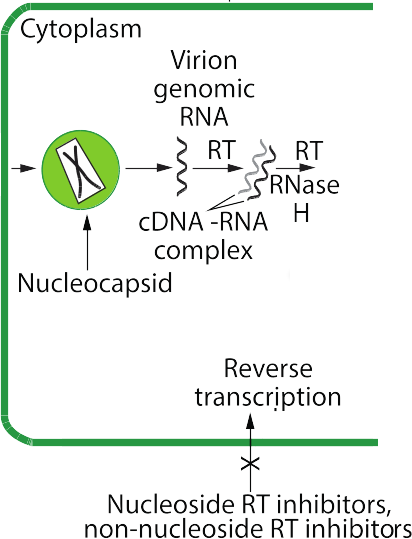

## Pharmacology 
----
# Anti-HIV & Antiviral Agents
----

Dr. Hao Chen 

Dept. Pharmacology, UTHSC

hchen@uthsc.edu

short URL: https://goo.gl/VXnkZL

full URL: http://chen42.github.io/presentations/antiviral.html

January 25, 2017

---
### Agents for the treatment of virus infections 
* Retrovirus (HIV)
	* Fusion inhibitors Enfuvirtide, Maraviroc
	* Nucleoside reverse transcriptase inhibitors Zidovudine, Didanosine, Stavudine, Lamivudine, Abacavir, Emtricitabine
	* Non-nucleoside reverse transcriptase inhibitors Nevirapine, Delavirdine, Efavirenz
	* Nucleotide inhibitors Tenofovir
	* Integrase inhibitor Raltegravir, Dolutegravir, Elvitegravir 
	* Protease inhibitors  Atazanavir, Saquinavir, Ritonavir, Lopinavir, Indinavir, Nelfinavir, Darunavir  

---
### Agents for the treatment of virus infections 
* Herpes Simplex Virus and Varicella Zoster Virus
	* Acyclovir, Valacyclovir, Famciclovir, Penciclovir
* Cytomegalovirus
	* Ganciclovir, Valganciclovir, Cidofovir, Foscarnet
* Hepatitis Virus B and C
	*  Lamivudine, Adefovir, Interferon alpha, Ribavirin
* Influenza Virus
	* Uncoating inhibitors  Amantadine, Rimantadine
	* Viral release inhibitors  Zanamivir, Oseltamivir

---
### Objectives

#### At the completion of this unit, the student should be able to:
1. Recognize the clinical characteristics and goals of therapy for HIV/AIDS
2. Identify the steps in the viral replication process that provide targets for antiviral therapy
3. Recall which drugs act at each of the target steps in the replication process for both RNA and DNA viruses
4. Recall the primary drugs that are effective for each major class of viral infection
5. Describe the mechanism of action and significant pharmacological properties of the five major classes of antiretroviral (anti-HIV) agents

---
### Objectives (Cont.)

6. Understand the drug interactions involved in multidrug antiretroviral therapy and the effect of these antiviral agents on other concurrent drug therapies
7. Understand the basis for the viral selectivity of the antiviral agents
8. Describe the common and unique adverse effects of the distinct classes of antiviral agents
9. Describe the mechanisms of action for HSV, CMV, and HBV antiviral agents and mechanisms of viral resistance to these agents 
10. Identify the significant characteristics of the anti-influenza drugs acting at viral uncoating and release

---
### AIDS background

1. **Primary infection.** About 90% of patients develop a flu-like illness, which coincides with [seroconversion](https://aidsinfo.nih.gov/education-materials/glossary/648/seroconversion), between 2 and 4 weeks post exposure. Symptoms include, fever, night sweats, sore throat, lymphadenopathy, diarrhea. The illness is self-limiting.
2. **Asymptomatic phase.** Of variable duration, from 2 to 10 years. Patients are clinically well, but infectious.
3. **Acquired Immunodeficiency Syndrome (AIDS).** Features:
	* Constitutional disease: 
		* fever, diarrhea, weight loss, skin rashes.
	* Neurological disease:
		* [dementia](https://aidsinfo.nih.gov/education-materials/glossary/21/aids-dementia-complex), [myelopathy](https://aidsinfo.nih.gov/education-materials/glossary/3303/vacuolar-myelopathy), [peripheral neuropathy](https://aidsinfo.nih.gov/education-materials/glossary/563/peripheral-neuropathy).
	* Immunodeficiency: 
		* increased susceptibility to [opportunistic infections]( https://aidsinfo.nih.gov/education-materials/glossary/531/opportunistic-infection).
	* Rare malignancies:
		* [Kaposi sarcoma](https://aidsinfo.nih.gov/education-materials/glossary/531/opportunistic-infection), [oral hairy leukoplakia](https://aidsinfo.nih.gov/education-materials/glossary/532/oral-hairy-leukoplakia), or [lymphoma](https://aidsinfo.nih.gov/education-materials/glossary/435/lymphoma).

---
### Typical course of an untreated HIV patient

---
### Current [guideline](https://aidsinfo.nih.gov/guidelines/html/1/adult-and-adolescent-treatment-guidelines/0/)

for

#### The Initiation of Antiretroviral Therapy 

Last updated January 28, 2016

* Antiretroviral therapy (ART) is recommended for all HIV-infected individuals, regardless of CD4 T lymphocyte cell count, to reduce the morbidity and mortality associated with HIV infection (AI) and to
 prevent HIV transmission (AI).
* On a case-by-case basis, ART may be deferred because of clinical and/or psychosocial factors, but therapy should be initiated as soon as possible.

<small>Rating of Recommendations: A = Strong; B = Moderate; C = Optional </small>
<small>Rating of Evidence: I = Data from randomized controlled trials;</small>

[HAART - cART - ART](https://www.verywell.com/cart-hiv-combination-antiretroviral-therapy-48921)

---
### HIV Lifecycle

[Description](https://en.wikipedia.org/wiki/Discovery_and_development_of_HIV-protease_inhibitors#Life_cycle_of_HIV)

<small>
1) *Initiation*  
- attachment 
- penetration 
-Uncoating 
2) *replication* 
- genome synthesis 
- RNA production  
- protein synthesis 
3) *release*  
- assembly 
- maturation 
- exit from cell 
</small>

---

### HIV Life Cycle 

<iframe width="600" height="400" src="https://www.youtube.com/embed/eS1GODinO8w" frameborder="0" allowfullscreen></iframe>

---
### Fusion inhibitors
[Enfuvirtide (Fuzeon, T20)](https://www-clinicalkey-com.ezproxy.uthsc.edu/#!/content/drug_monograph/6-s2.0-2752)

 
**[Structure](https://www.drugbank.ca/drugs/DB00109)**
 
	Enfuvirtide is a 36 amino acid synthetic peptide. 
	

**Mechanism of action**  
	Binds to [gp41](https://en.wikipedia.org/wiki/Gp41#Function) of the viral envelope; prevents conformational change and impedes the fusion of the viral and host cell membranes. 

	

 

** Recommendations for use**  

Not part of 1st line ART (due to the self-injection method, injection site reaction, and high cost). Reserved as salvage therapy for treatment resistant patients. Prophylasis after occupational HIV exposure. 

---
### Enfuvirtide 
* [ADME](https://en.wikipedia.org/wiki/ADME)
	* Administered subcutaneously (synthetic peptide)
	* Bound to plasma protein
	* Metabolized by proteolytic hydrolysis
	* T&frac12; = 4 h 
* Adverse effect
	* Injection-site pain or infection 
	* Hypersensitivity reaction (rash, fever, peripheral edema, acute respiratory distress, etc.) 
	* Initial report of increased bacterial pneumonia (but no longer significant after adjusting for monitoring duration)
* Resistance 
	* gp41 mutations may develop when drug is given at suboptimal doses as monotherapy; No cross-resistance with other HIV Agents
	* Ineffective for HIV-2

---
### Fusion inhibitors

[Maraviroc (Selzentry) ](https://www-clinicalkey-com.ezproxy.uthsc.edu/#!/content/drug_monograph/6-s2.0-3567)

	

**Mechanisms of action** 

[Chemokine](https://www.ncbi.nlm.nih.gov/pubmed/7548618) receptor 5 antagonist 
Binds to CCR5 co-receptor 
Prevents virus from entering the host cell  

 
**ADME** 

	Oral 
	Substrate for both [CYP3A4](https://en.wikipedia.org/wiki/CYP3A4#Function) and P-glycoprotein  
	T&frac12;: 14~18 h 
	Both urine and feces

---
### Maraviroc (Selzentry)
 
* Indication
	* Treatment of CCR5-tropic HIV-1 (not CXCR4)
	* Coreceptor (i.e. CCR5 vs CXCR4) tropism assay must be performed 
	* In combination for patients failing other antiretroviral drugs
* Adverse effects
	* Elevated hepatic enzyme, hepatitis 
	* Systemic allergic reaction, cough, fever  
	* Myocardial infarction or ischemia (1.3%) 
* Drug interactions
	* CYP3A inhibitors or inducers
		* Reduce  dosage  when   ritonavir   or   cobicistat  is coadministered 
		* Increase  dosage with  efavirenz  

---
### [Nucleoside Reverse Transcriptase Inhibitors (NRTIs)](https://www-clinicalkey-com.ezproxy.uthsc.edu/#!/content/book/3-s2.0-B9781455702824000435?scrollTo=%23hl0000874)

* NRTIs
	* Zidovudine (Retrovir, azidothymidine [ZVD], Apo-Zidovudine, Novo-AZT)
	* Stavudine (Zerit, D4T)
	* Didanosine (Videx, dideoxyinosine, ddI)
	* Abacavir (Ziagen, ABC)
	* Lamivudine (Epivir, 3TC)
	* Emtricitabine (Emtriva, FTC)

---
### Mechanisms of Action - NRTIs 

 

* Analogs of naturally occurring [nucleosides](https://www.youtube.com/watch?v=vpqGRaiAX1I)
* Converted to their active triphosphate metabolites (i.e. a nucleotide) by host cell [kinases](https://www.britannica.com/science/kinase)
* Competitive inhibitor of viral reverse transcriptase
* Cause DNA chain termination 
* Also inhibit host cell DNA polymerase
</id>

---
### mechanisms of action - NRTIs 
<iframe width="560" height="315" src="https://www.youtube.com/embed/cC9kyoAo1ac?list=PLMO1589WRspykVPiy6SgKi3OPKbe9b0El" frameborder="0" allowfullscreen></iframe>

---
### NRTIs

* [Zidovudine](https://www-clinicalkey-com.ezproxy.uthsc.edu/#!/content/drug_monograph/6-s2.0-653) (ZDV, AZT), [Stavudine](https://www-clinicalkey-com.ezproxy.uthsc.edu/#!/content/drug_monograph/6-s2.0-573) 
	* Analogs of pyrimidine nucleoside (T) 
	* Phosphorylated to active triphosphate forms
	* Competes with deoxythymidine triphosphate for incorporation into DNA
* [Didanosine](https://www-clinicalkey-com.ezproxy.uthsc.edu/#!/content/drug_monograph/6-s2.0-186) (ddI)
	* Analog of purine nucleosides (A, G)
	* Active 2',3'-dideoxyadenosine 5'-triphosphate (ddATP) competes with cellular deoxyadenosine triphosphate for incorporation into viral DNA
* [Lamivudine ](https://www-clinicalkey-com.ezproxy.uthsc.edu/#!/content/drug_monograph/6-s2.0-339) (3TC), [Emtricitabine](https://www-clinicalkey-com.ezproxy.uthsc.edu/#!/content/drug_monograph/6-s2.0-2465) 
	* Analogs of pyrimidine nucleoside (C)
* [Abacavir](https://www-clinicalkey-com.ezproxy.uthsc.edu/#!/content/drug_monograph/6-s2.0-2332)
	* Analog of purine nucleosides (G) 

---
### Nucleoside Reverse Transcriptase Inhibitors (NRTIs)
* Indications
	* First line treatment of HIV infection as components of ART 
	* Prevent acute infection of susceptible cells
	* Little effect on cells already infected by HIV
	*  Zidovudine  
		* Only NRTI shown to reduce perinatal HIV transmission
* Resistance
	* Drugs select for different mutations of the reverse transcriptase gene at the level of specific codons 

---
### Pharmacological Properties of NRTIs
* Good oral absorption
* Crosses blood-brain barrier
* Metabolism plays limited role in clearance 
* Excreted unchanged in urine, except:
	*  Zidovudine  is metabolized to glucoronide
	*  Abacavir  metabolized by alcohol dehydrogenase
*  Didanosine  is acid labile
	* Take 1/2 h before or 2 h after meals
	* Choose extended release formulation 
	* Others taken without regard to meals
	

---
### Pharmacokinetics of NRTIs

| Parameter | Zidovudine | Lamivudine | Stavudine | Dadanosine | Abacavir |
|---|---|---|---|---|---|
|Oral bioavailability, %| 60 | 80 | 80-90| 40 | > 70 |  
|Effect of meals on AUC| &darr; 24 (high fat) | &mdash;  | &mdash; | &darr; 50% (acidity) | &mdash; | 
|Plasma t&frac12; emlim, h| 0.8-1.9 | 5-7 | 1.4 | 1.0 | 0.8-1.5| 
|Intracellular t&frac12; elim, triphosphate, h| 3-4 | 12 | 3.5 | 8-24 | 3 |   
|Plasma protein binding, %| 20-38 | < 35 | < 5 | < 5 | 50 | 
|Metabolism, %|  60-80   glucuronidation | 20-30 | 80 | 50  (purine metabolism) | > 80 | 
|Renal excretion, %, parent drug| 15 | 70 | 40 | 20-50 | < 5 |
||

AUC, area under plasma conc.-time curve; t1/2elim, half-life of elimination; , decrease; , no effect 

---

### Adverse Effects of NRTIs
* Common toxicities
	* Rash; Gastrointestinal distress
	* [Lactic acidosis](https://aidsinfo.nih.gov/education-materials/fact-sheets/22/68/hiv-and-lactic-acidosis), [hepatic steatosis](http://medical-dictionary.thefreedictionary.com/Hepatic+steatosis) 
		* higher incidence with  stavudine 
	* [Lipodystrophy](https://aidsinfo.nih.gov/education-materials/fact-sheets/22/61/hiv-and-lipodystrophy):  fat loss and/or buildup or both.  
		* Including central obesity, dorsocervical fat enlargement ([buffalo hump](https://www.ncbi.nlm.nih.gov/pubmed/10509567)), peripheral wasting, accumulation of facial fat, [lipomas](http://www.mayoclinic.org/diseases-conditions/lipoma/basics/definition/con-20024646), breast enlargement, [gynecomastia](http://www.mayoclinic.org/diseases-conditions/gynecomastia/home/ovc-20257576)
		* Most common with  stavudine  and  zidovudine  

---
### Adverse Effects of NRTIs
 
* Unique toxicities
	* Zidovudine: bone marrow suppression; anemia, neutropenia 
	* Didanosine: pancreatitis, exacerbates peripheral neuropathy 
	* Stavudine : pancreatitis, exacerbates peripheral neuropathy
		* avoid co-administration with didanosine or zidovudine 
	* Abacavir: hypersensitivity reaction due to genetic predisposition (multi-organ autoimmune response, potentially life threatening) 
		* HLA-B\*5701 screening before starting therapy
	*  Emtricitabine : psychiatir reactions, depression, dizziness, insomnia

---
### Drug Interactions of NRTIs
 
*  Zidovudine  
	* Avoid co-administration bone marrow suppressive drugs
		* Ganciclovir, interferon alpha, dapsone, flucytosine, vincristine, vinblastine
	* Antagonism with Stavudine [PubMed](https://www.ncbi.nlm.nih.gov/pubmed/10882616)
*  Didanosine 
	* Some drugs can augment the neuropathy and pancreatitis 
		* Ethambutol, isoniazid, vincristine, cis-platin 
		* Stavudine 
	* Avoid use of  didanosine  with  stavudine / tenofovir  due to an increased toxicity risk and higher rates of early [virologic failure](https://aidsinfo.nih.gov/education-materials/glossary/879/virologic-failure) | [details](https://aidsinfo.nih.gov/guidelines/html/1/adult-and-adolescent-arv-guidelines/15/virologic-failure)
	* Ganciclovir  increases plasma concentration; monitor for toxicity 
	* Methadone  decreases plasma levels by ~60%; dosage adjustment needed

---
### Drug Interactions of NRTIs

*  Stavudine  
	* Augment the neuropathy and pancreatitis with  didanosine, Bortezomib, Zalcitabine  
	*  Zidovudine  inhibits the phosphorylation of stavudine. For women receiving a stavudine-containing regimen, discontinue stavudine during labor while intravenous zidovudine is being administered.
*  Abacavir  
	* Ethanol significantly increases plasma levels (alcohol dehydrogenase)

---
### NRTIs in brief

* Indications 
	* First line treatment of HIV as part of ART
* Mechanism of action 
	* Inhibit viral reverse transcriptase
* Resistance 
	* Mutations in reverse transcriptase gene
* ADME 
	* Well absorbed by the GI tract; good oral bioavailability
	* Excreted unchanged by the kidney; except
		*  zidovudine  (metabolized into glucoronide)
		*  Abacavir  (metabolized by alcohol dehydrogenase)

---

### NRTIs in brief
* Adverse effects
	* All cause GI distress
	* Lactic acidosis with hepatic steatosis due to mitochondrial toxicity 
* Drug-Drug interactions
	* Can be severe due to synergistic effects on myelosuppression and peripheral neuropathy

---
### Nucleotide Reverse Transcriptase Inhibitor

[Tenofovir disoproxil (Viread)](https://www-clinicalkey-com.ezproxy.uthsc.edu/#!/content/drug_monograph/6-s2.0-2477)

* Properties
	*  Tenofovir disoproxil  is a prodrug. It is hydrolyzed to release tenofovir
	* Tenofovir is an analogue of adenosine- 5'-monophosphate 
	* Requires two intracellular phosphorylation steps for activation
	* Weak inhibitor of mammalian DNA and mt polymerase
	* Included in many first-line ART regimens
	* Also indicated for hepatitis B 
* Mechanism of action
	* Inhibits viral reverse transcriptase by chain termination
* Resistance
	* Does not select new mutations
	* Cross resistance with preexisting  zidovudine  associated mutations
	* Not effected by  lamivudine-abacavir  associated mutations

---
### Tenofovir

* Administration
	* Once daily dosing
	* Increased bioavailability taken with a high fat meal
* Metabolism
	* Substrate of P-glycoprotein 
	* Not substrate for P450
	* T&frac12;: 17 h 
* Adverse effect 
	* Most commonly in clinical trials: nausea, vomiting, diarrhea, [flatulence](https://www-clinicalkey-com.ezproxy.uthsc.edu/#!/content/book/3-s2.0-B9781455770052000676?scrollTo=%23hl0000349), abdominal pain, dyspepsia, and anorexia with weight loss.
	* Increases  didanosine  concentration: pancreatitis and neuropathy.
	* Exacerbates renal impairment 

--- 

### tenofovir disoproxil  and emtricitabine
#### (Truvada)

* Better than Abacavir-Lamivudine for initial therapy 
	* Extending time to virologic failure and first adverse event 
	* [NEJM Dec 3 2009](https://www.ncbi.nlm.nih.gov/pubmed/?term=19952143)
* Effective as antiretroviral chemoprophylaxis before exposure
	* [NEJM Dec 30 2010](https://www.ncbi.nlm.nih.gov/pubmed/21091279

---
### Non Nucleoside Reverse Transcriptase Inhibitors (NNRTIs)

[Delavirdine (Rescriptor),](https://www-clinicalkey-com.ezproxy.uthsc.edu/#!/content/book/3-s2.0-B9780443067525500144)
[Nevirapine (Viramune),](https://www-clinicalkey-com.ezproxy.uthsc.edu/#!/content/book/3-s2.0-B9780443067525500156)
[Efavirenz (Sustiva)](https://www-clinicalkey-com.ezproxy.uthsc.edu/#!/content/book/3-s2.0-B9780443067525500168)

* Indications
	* HIV-1 infections
		* Do not have significant activity against HIV-2
* Mechanism of action
	* Bind directly to a hydrophobic pocket of the reverse transcriptase 
	* Induce conformational change in active site and block enzyme activity
	* Do not require intracellular phosphorylation for activity
* Resistance
	* Resistant HIV emerges rapidly when used as monotherapy.
	* Each drug selects for different mutations of the RT gene at the level of specific codons. 

---
### NNRTIs

<iframe width="560" height="315" src="https://www.youtube.com/embed/RUUyd5bE9vQ?start=93&stop=150" frameborder="0" allowfullscreen></iframe>

---

### NNRTIs

* ADME
	* Excellent oral absorption.
	* Highly bound to plasma proteins.
	* Metabolized by the cytochrome P-450 system
		* Drug interactions are significant
	* Excreted through the urines as glucuronide conjugates. 
	*  Delavirdine : CYP3A4 inhibitor
		* Increases PIs, rifabutin, clarithromycin, methadone and ethinyl estradiol plasma levels
	*  Efavirenz  and  Nevirapine : CYP3A4 inducer
		* Reduces PIs, rifabutin, clarithromycin, methadone and ethinyl estradiol plasma levels

---

### NNRTIs Pharmacokinetics

|Parameter| DELAVIRDINE | NEVIRAPINE\* | EFAVIRENZ\*| 
|---|---|---|---|
|Oral bioavailability, % | 85 | 90 | 50 | 
|Plasma T&frac12; elim h | 2-11 | 25-30 | 40-50|
|Plasma protein binding, % | 98 | 60 | 99| 
|Metabolism | Hepatic | Hepatic | Hepatic | 
|Renal excretion, parent drug, % | < 3 | < 3 | < 3|
|Autoinduction of metabolism | No | Yes | Yes |
|CYP3A modulation | Inhibitor | Inducer | Inducer 
||
\* values after multible doses. T&frac12; elim, half-life of elimination  

---
### Adverse effects of NNRTIs

* Common toxicities
	* Maculopapular rashes in the trunk and extremities
* Unique toxicities 
	*  Nevirapine  
		* Fever, fatigue, headache, drowsiness, nausea
		* Elevated liver enzymes; drug induced hepatitis; 
	*  Efavirenz  
		* Penetrate the blood brain barrier 
		* Neuropsychiatric (headache, dizziness, abnormal dreams, psychosis, suicidal ideation)
		* Teratogenic in nonhuman primates (FDA Pregnancy Category D)
 
---
### NNRTIs in brief

* Indications
	* Treatment of HIV infection as part of combination therapy
	* Not effective against HIV-2
* Mechanism of action 
	* Inhibit viral reverse transcriptase
* Resistance
	* Mutations in viral reverse transcriptase
* ADME
	* Well absorbed by the GI tract
	* Good oral bioavailability
	* Metabolized in the liver 	
	* Excreted in the urine as glucoronidated metabolites
* Adverse effects
	* All NNRTIs cause rash

---
### Integrase Inhibitor

[Raltegravir (Isentress)]( https://www-clinicalkey-com.ezproxy.uthsc.edu/#!/content/drug_monograph/6-s2.0-3572), 
[Dolutegravir (Tivicay)](https://www-clinicalkey-com.ezproxy.uthsc.edu/#!/content/drug_monograph/6-s2.0-3823),
[Elvitegravir (Vitekta)](https://www-clinicalkey-com.ezproxy.uthsc.edu/#!/content/drug_monograph/6-s2.0-3928)

**Mechanism of action** 
	Inhibits HIV-1 integrase enzyme  
	Prevents insertion of viral DNA into host genome 

**ADME** 
	Oral  
	Glucuronidation and by CYP3A 
	Feces and urine 

**Resistance** 
	 Dolutegravir   has less resistance overlap with   Raltegravir   than does  elvitegravir  . 

---
### Integrase Inhibitor 

* Indication
	*   Dolutegravir  or   Elvitegravir   is recommended for naive patients as part of combination ART   
* Adverse effects
	* Diarrhea, nausea, headache, and fever
	* Hypersensitivity to   Dolutegravir  include serious rash,  blisters/peeling of skin, hepatitis, facial edema, angioedema, difficulty breathing, or eosinophilia.
* Drug interactions
	* Not inducer, inhibitor or substrate of CYP3A4
	* Metabolized by UDP glucuronosyltransferase (UGT)
	*  Rifampin  (antibiotic) induces UGT, thus requires higher  Raltegravir / Dolutegravir  dose

---
### Protease Inhibitors, PIs

[Indi<u>navir</u> (Crixivan)](https://www-clinicalkey-com.ezproxy.uthsc.edu/#!/content/book/3-s2.0-B9780323401616001303?scrollTo=%23hl0001350)
 
[Nelfi<u>navir</u> (Viracept)](https://www-clinicalkey-com.ezproxy.uthsc.edu/#!/content/book/3-s2.0-B9780323401616001303?scrollTo=%23hl0001359)
 
[Rito<u>navir</u> (Norvir)](https://www-clinicalkey-com.ezproxy.uthsc.edu/#!/content/book/3-s2.0-B9780323401616001303?scrollTo=%23hl0001330)
 
[Saqui<u>navir</u>](https://www-clinicalkey-com.ezproxy.uthsc.edu/#!/content/book/3-s2.0-B9780323401616001303?scrollTo=%23hl0001337)
 
[Fosampre<u>navir</u> (Lexiva)](https://www-clinicalkey-com.ezproxy.uthsc.edu/#!/content/book/3-s2.0-B9780323401616001303?scrollTo=%23hl0001368)
 
[Daru<u>navir</u> (Prezista)](https://www-clinicalkey-com.ezproxy.uthsc.edu/#!/content/drug_monograph/6-s2.0-3515)

 
PIs can be peptidomimetic (structural similarities to the cleavage site of HIV polyproteins) or not ( nelfinavir  ).

<iframe width="560" height="315" src="https://www.youtube.com/embed/MK2r8J7SCSg?start=20&amp;stop=60" frameborder="0" allowfullscreen></iframe>

---
### Protease Inhibitors
* Indications
	* Treatment of HIV as part of combination therapy
	* Most effective ART available
	* Effective in both acutely and chronic HIV-1 infected cells
	* Effective in monocytes and macrophages 
		* Not affected by RT inhibitors
	* Early stages of HIV-1 replication cycle not affected
* Mechanism of Action
	* Selective, competitive inhibitors of HIV proteases
	* Bind reversibly to protease active site
	* Prevent cleavage of polyprotein and block viral maturation
* Resistance
	* Each drug selects for different mutations in protease gene at level of specific codons
 
---
### Protease inhibitors

* ADME
	* Oral absorption varies
	* Bind extensively to plasma proteins
	* Metabolized by cytochrome P-450 system
		* Concurrent use of potent P-450 inducer (e.g.  rifampin  ) leads to decreased PI concentration
	* Renal excretion is minimal
		* No adjustments needed for renal dysfunctions
	* Potent inhibitors of CYP3A4
		*  Ritonavir  used to increase (i.e. "boost")  plasma concentration of other PIs except  nelfinavir  
		* Toxic adverse effects related to drug accumulation due to PI-mediated inhibition of hepatic P450 system
		 

---
### PIs Pharmacokinetics
|Parameter| Amprenavir | Indinavir | Nelfinavir | Ritonavir | Saquinavir | Lopinavir\*|
|---|---|---|---|---|---|---|
|Oral bioavailability, % | 35-90 | 60-65 | 20-80|65-70|12|?|
|Effect of meal on AUC|&darr; 21%  high fat | &darr; 77%  high fat| &uarr; 200-300% | &uarr; 15%  capsule | &uarr; 600% | &uarr; 50%|
|Plasma T&frac12;elim, h| 7-11 |1.5-2| 3.5-5|3-5|7-12|6-8|
|Plasma protein binding, %| 90|60|98|98-99| 98|98-99|
|Metabolism|CYP3A4|CYP3A4| CYP3A4   > 2C19| CYP3A4| CYP3A4| CYP3A4|
|Autoinduction of metabolism|No |No|Yes|Yes|No|Yes|
|Renal Excreted, % parent drug| < 3 | 11 | 1-2|3.5 |< 3|< 3|
|Inhibition of CYP3A4|++|++|++|++++|+|+++|
||

Abbreviation: AUC, area under plasma concentration-time curve; t1/2elim, half-life of elimination; &uarr;, increase; &darr;, decrease;, CYP, cytochrome P450.
Saquinavir data refer to soft-gel capsule formulation
\*Lopinavir refers to coformulation with ritonavir
---

### Protease inhibitors
#### Drug interactions 

*  Carbamazepine 
	* (treat epilepsy) lower  indinavir  AUC and potentially other PIs
*  Ketoconazole  
	* (antifugal) upregulates PIs AUC
*  Sildenafil  
	* (vasodilator) AUC augmented by PIs
*  Methadone 
	* (addiction treatment) AUC reduced by  ritonavir / lopinavir  
* Oral contraceptive AUC reduced by PIs
	*  Indinavir  is exception

---

### Protease inhibitors
#### Common Adverse Effects
* Hyperlipidemia 
	* May be more dramatic with  ritonavir  due to interference in lipid metabolism. 
* Insulin resistance and diabetes
* Lipodystrophy
	* redistribution/accumulation of body fat including central obesity, dorsocervical fat enlargement ([buffalo hump](https://www.ncbi.nlm.nih.gov/pubmed/10509567)), peripheral wasting, accumulation of facial fat, lipomas, breast enlargement, [gynecomastia](http://www.mayoclinic.org/diseases-conditions/gynecomastia/home/ovc-20257576)
* Elevated liver function tests
* Possible increased bleeding risk in [hemophilics](https://www-clinicalkey-com.ezproxy.uthsc.edu/#!/content/medical_topic/21-s2.0-1014697)

---

### Protease inhibitors
#### Specific Adverse Effects 
* Ritonavir 
	* Hepatotoxicity at high doses
* Indinavir
	* [Nephrolithiasis/urolithiasis](https://www-clinicalkey-com.ezproxy.uthsc.edu/#!/content/book/3-s2.0-B9780323280488008241):  patients should drink 2 liters/day
	* [Alopecia](https://www-clinicalkey-com.ezproxy.uthsc.edu/#!/content/medical_topic/21-s2.0-1014848) 
* Atazanavir
	* Hyperbilirubinemia due to inhibition of UDP glucoronosyl transferase 
		* An enzyme that catalyzes bilirubin conjugation 
		* Jaundice developed in 11% patients during clinical trials

---

### Darunavir

* Achieves faster virologic response than control PIs. 
* Can be used to treat patients resist to other PIs. 
* Must be used in combination in an antiviral regimen.
	* requires an enhancer (i.e. low does  ritonavir  )  
* Recommended for treatment-naive patients

---

### PIs in brief

* Indications
	* Treatment of HIV infection as part of combination therapy
* Mechanism of act 
	* Inhibition of HIV protease
* Resistance
	* Mutations of the protease gene 
		*	 Indinavir, ritonavir  and  lopinavir   require more mutations than other PIs
* ADME
	* Poor systemic bioavailability
	* All PIs metabolized in liver by P450 enzymes
* Adverse effects
	* GI distress, diarrhea and vomiting
	* Increase bleeding hemophilia A or B
	* Hyperglycemia, insulin resistance and hyperlipidemia
	* Fat wasting, reaccumulation, and redistribution -- lipodystropy
* Drug interactions
	* Can be severe due to effects on P450 enzymes

---

### Antiretroviral Drug Selectivity

* NRTIs
	* Once phosphorylated by cellular kinases have greater affinity for viral reverse transcriptase than for cellular DNA polymerases.
* NNRTIs
	* Do not undergo phosphorylation
	* Have greater affinity for viral reverse transcriptase than for cellular DNA polymerases
* PIs
	* Greater affinity for HIV aspartyl protease than for human protease.

---

### [Current Recommendations](https://aidsinfo.nih.gov/guidelines)
#### treatment-naive patients

* Integrase inhibitor-based regimens 	
	*   Dolutegravir / abacavir / lamivudine   only for  HLA-B\*5701 negative patients 
	*   Dolutegravir    and 
		*  tenofovir disoproxil fumarate /emtricitabine    
		*  tenofovir alafenamide / emtricitabine   
	*  Elvitegravir / [cobicistat](https://www-clinicalkey-com.ezproxy.uthsc.edu/#!/content/drug_monograph/6-s2.0-3929) / tenofovir alafenamide / emtricitabine   
	*  Elvitegravir / cobicistat / tenofovir disoproxil fumarate / emtricitabine   
	*   Raltegravir   and 
		*   tenofovir disoproxil fumarate / emtricitabine  
		*   tenofovir alafenamide / emtricitabine   
* Protease Inhibitor-Based Regimens
	*  Darunavir / ritonavir   and
		*  tenofovir disoproxil fumarate / emtricitabine  
		*  tenofovir alafenamide / emtricitabine   

---
### Agents to treat
#### Herpes Simplex Virus (HSV)
#### Varicella Zoster Virus (VZV)
#### Cytomegalovirus (CMV)

