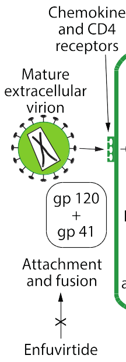

### Pharmacology 

## Anti-HIV & Antiviral Agents

Dr. Hao Chen 

hchen@uthsc.edu

---
### Agents for the treatment of virus infections 
* Retrovirus (HIV)
	* Fusion inhibitors Enfuvirtide, Maraviroc
	* Nucleoside reverse transcripase inhibitors Zidovudine, Didanosine, Lamivudine, Stavudine, Abacavir
	* Non-nucleoside reverse transcriptase inhibitors Nevirapine, Delavirdine, Efavirenz
	* Nucleotide inhibitors Tenofovir
	* Integrase inhibitior Raltegravir 
	* Protease inhibitors  Atazanavir, Saquinavir, Ritonavir, Lopinavir, Indinavir, Nelfinavir  

---
### Agents for the treatment of virus infections 
* Herpes Simplex Virus and Varicella Zoster Virus
	* Acyclovir, Valacyclovir, Famciclovir, Penciclovir
* Cytomegalovirus
	* Ganciclovir, Valganciclovir, Cidofovir, Foscarnet
* Hepatitis Virus B and C
	*  Lamivudine, Adefovir, Interferon alpha, Ribavirin
* Influenza Virus
	* Uncoating inhibitors  Amantadine, Rimantadine
	* Viral release inhibitors  Zanamivir, Oseltamivir

---
### Objectives

#### At the completion of this unit, the student should be able to:
1. Recognize the clinical characteristics and goals of therapy for HIV/AIDS
2. Identify the steps in the viral replication process that provide targets for antiviral therapy
3. Recall which drugs act at each of the target steps in the replication process for both RNA and DNA viruses
4. Recall the primary drugs that are effective for each major class of viral infection
5. Describe the mechanism of action and significant pharmacological properties of the five major classes of antiretroviral (anti-HIV) agents

---
### Objectives (Cont.)

6. Understand the drug interactions involved in multidrug antiretroviral combination therapy and the effect of these antiviral agents on other concurrent drug therapies
7. Understand the basis for the viral selectivity of the antiviral agents
8. Describe the common and unique adverse effects of the distinct classes of antiviral agents
9. Describe the mechanisms of action for HSV, CMV, and HBV antiviral agents and mechanisms of viral resistance to these agents 
10. Identify the significant characteristics of the anti-influenza drugs acting at viral uncoating and release

---
### AIDS background

1. **Primary infection.** About 90% of patients develop a flu-like illness, which coincides with seroconversion, between 2 and 4 weeks post exposure. Symptoms include, fever, night sweats, sore throat, lymphadenopathy, diarrhea. The illness is self-limiting.
2. **Asymptomatic phase.** Of variable duration, from 2 to 10 years. Patients are clinically well, but infectious.
3. **Acquired Immunodeficiency Syndrome (AIDS).** Syndrome with the following features:
	* Constitutional disease: fever, diarrhea, weight loss, skin rashes.
	* Neurological disease: dementia, myelopathy, peripheral neuropathy.
	* Immunodeficiency: increased susceptibility to opportunistic infections.
	* Rare malignancies: Kaposi sarcoma, oral hairy leukoplakia, lymphomas.

---
### Typical course of an untreated HIV patient

[life cycle of HIV](https://en.wikipedia.org/wiki/Discovery_and_development_of_HIV-protease_inhibitors#Life_cycle_of_HIV)

---

### HIV Life Cycle 

<iframe width="600" height="400" src="https://www.youtube.com/embed/eS1GODinO8w" frameborder="0" allowfullscreen></iframe>

---
### Current treatment guideline 

#### Initiation of Antiretroviral Therapy 
[Last updated January 28, 2016](https://aidsinfo.nih.gov/guidelines/html/1/adult-and-adolescent-treatment-guidelines/0/)

* Antiretroviral therapy (ART) is recommended for all HIV-infected individuals, regardless of CD4 T lymphocyte cell count, to reduce the morbidity and mortality associated with HIV infection (AI) and to
 prevent HIV transmission (AI).
* On a case-by-case basis, ART may be deferred because of clinical and/or psychosocial factors, but therapy should be initiated as soon as possible.

<small>Rating of Recommendations: A = Strong; B = Moderate; C = Optional </small>
<small>Rating of Evidence: I = Data from randomized controlled trials;</small>

---
### HIV Replication

<small>
1) *Initiation*  
- attachment 
- penetration 
-Uncoating 
2) *replication* 
- genome synthesis 
- RNA production  
- protein synthesis 
3) *release*  
- assembly 
- maturation 
- exit from cell 
</small>

---
### Fusion inhibitors
[Enfuvirtide (Fuzeon, T20)](https://www.ncbi.nlm.nih.gov/pubmedhealth/PMHT0010106/?report=details)

 
**Overview**
 
	36 amino acid synthetic peptide | increases the effectiveness of combination ART.

**Mechanism of action**  

	Binds to gp41 of the viral envelope | prevents conformational change and impedes the fusion of the viral and host cell membranes

**Resistance** 
	gp41 mutations may develop when drug is given at suboptimal doses as monotherapy | No cross-resistance with other HIV Agents

	

	

---
### Enfuvirtide 
* **ADME**
	* Administered subcutaneously
	* High protein binding
	* Metabolized by proteolytic hydrolysis
		* No involvement of cytochrome P450 system
* **Adverse effect**
	* Injection-site reactions 
		* Large % of patients
	* Hypersensitivity reaction
		* Occurs rarely <1%
	* Increased risk of bacterial pneumonia
		* Bacterial pneumonia occurred 8 times more frequently than placebo.
	* Use in combo with other ARV agents for persistent HIV-1 replication despite ongoing therapy
		* Secondary treatment – not part of 1st line cART

---
### Fusion inhibitors

[Maraviroc (Selzentry) ](https://www.ncbi.nlm.nih.gov/pubmedhealth/PMHT0011038/?report=details)

* **MoA**
	* Chemokine receptor 5 antagonist
	* Binds to CCR5 co-receptor
	* Prevents virus from entering the host cell
 
* **ADME**
	* Oral
	* Substrate for both CYP3A4 and P-glycoprotein
	* T 1/2: 14~18 h
	* Both feces and urine

---
### Maraviroc (Selzentry)
 
* **Indication**
	* Treatment of CCR5-tropic HIV-1 (not CXCR4)
	* In combination for patients failing other antiretroviral drugs
	* Only about 50% of treatment experienced patients will be eligible to take
* Coreceptor tropism assay
* Should be performed when a CCR5 antagonist
	* is being considered 
	* Requires plasma HIV RNA ≥1,000 copies/mL
	* Consider in patients with virologic failure on a
	* CCR5 antagonist

---
### Maraviroc (Selzentry)
 
* **Adverse effects**
	* Cough, pyrexia, rash, musculoskeletal symptoms, abdominal pain and postural dizziness, bladder irritation
	* Phase II studies reported possible liver and cardiac problems (1.3% of patients)
* **Drug interactions**
	* CYP3A inducers or inhibitors
	* Dosage adjustment needed with efavirenz and lopinavir/ritonavir

---
### Nucleoside Reverse Transcriptase Inhibitors (NRTIs)

* **NRTIs**
	* Didanosine (Videx, dideoxyinosine, ddI)
	* Lamivudine (Epivir, 3TC)
	* Emtricitabine (Emtriva, FTC)
	* Stavudine (Zerit, D4T)
	* Zidovudine (Retrovir, azidothymidine [ZVD], Apo-Zidovudine, Novo-AZT)
	* Abacavir (Ziagen, ABC)
* **Combinations**
	* Combivir (AZT+3TC)
	* Trizivir (AZT+3TC+ABC)

---
### NRTIs' mechanisms of action

 
* Analogs of naturally occurring nucleosides
* 3' hydroxyl replaced by an azido, hydrogen or other
* Competitive inhibitor of viral reverse transcriptase
* DNA chain terminator

---
### NRTIs' mechanisms of action

<iframe width="560" height="315" src="https://www.youtube.com/embed/cC9kyoAo1ac?list=PLMO1589WRspykVPiy6SgKi3OPKbe9b0El" frameborder="0" allowfullscreen></iframe>

---
### Nucleoside Reverse Transcriptase Inhibitors (NRTIs)

* Zidovudine, Stavudine
	* analogs of pyrimidine nucleoside (T) 
	* phosphorylated to active triphosphate forms
	* competes with deoxythymidine triphosphate for incorporation into DNA
* Lamivudine, Emtricitabine
	* analogs of pyrimidine nucleoside (C)
	* compete with deoxycytidine triphosphate for incorporation into viral DNA 
* Didanosine
	* analog of purine nucleosides (A, G)
	* Active 2',3'-dideoxyadenosine 5'-triphosphate (ddATP) competes with cellular deoxyadenosine triphosphate for incorporation into viral DNA
* Abacavir
	* analog of purine nucleosides (G) 

---
### Nucleoside Reverse Transcriptase Inhibitors (NRTIs)
* Indications
	* management of HIV infection as components of combination HAART 
	* prevent acute infection of susceptible cells
	* little effect on cells already infected by HIV
	* Zidovudine
	* Only NRTI shown to reduce perinatal HIV transmission
* Resistance
	* drugs select for different mutations of the reverse transcriptase gene at the level of specific codons 

---
### Pharmacological Properties of NRTIs
* Good oral absorption
* Poor binding to plasma proteins
* Metabolism does not rely on cytochrome P-450 system
* Excreted unchanged in urine, except:
	* Zidovudine is metabolized to glucoronide
	* Abacavir metabolized by alcohol dehydrogenase
* Didanosine is acid labile
	* Take 1/2 h before or 2 h after meals
		* Others taken without regard to meals
	

---

### Adverse Effects of NRTIs
* Common toxicities
	* Gastrointestinal distress
	* Lactic acidosis with hepatic steatosis due to mitochondrial toxicity
	* higher incidence with stavudine; stavudine > didanosine = zidovudine > tenofovir = abacavir = lamivudine = emtricitabine)
	* Lipodystrophy
	* Most common with stavudine and zidovudine

---
### Adverse Effects of NRTIs
 
* Unique toxicities
	* Zidovudine : bone marrow suppression
	* Didanosine : diarrhea, peripheral neuropathy, pancreatitis
	* Stavudine : peripheral neuropathy, pancreatitis
	* Abacavir : hypersensitivity reaction due to genetic predisposition
		* HLA-B\*5701 screening before starting therapy

---
### Drug-Drug Interactions NRTIs
 
* Zidovudine
	* Avoid concurrent administration with drugs that are bone marrow suppressive
		* Ganciclovir, interferon alpha, dapsone, flucytosine, vincristine, vinblastine
	* Avoid use with  Stavudine as antagonism results
* Didanosine
	* Early virologic failure results in combination with Lamivudine (or emtricitabine) + tenofovir 
	* some drugs can augment the neuropathy and pancreatitis 
		* Ethambutol, isoniazid, vincristine, cis-platin 
		* Stavudine 
	* Ganciclovir increases plasma conc 2X
	* Methadone  decreases plasma levels 
		* dosage adjustment needed

---
### Drug-Drug Interactions NRTIs

* Stavudine
	* same as  didanosine  
		* augment the neuropathy and pancreatitis with  didanosine, ethambutol, isoniazid, vincristine, cis-platin  
	* competition with  zidovudine  for activation enzymes
		* Thymidine kinase>thymidylate kinase>nucleoside diphosphate kinase
* Lamivudine
	*  trimethoprim-sulfamethoxazole  increases plasma concentration
* Abacavir
	* Ethanol significantly increases plasma levels

---
### NRTIs in brief

* Indications 
	* treatment of HIV as part of combination therapy
* MoA 
	* inhibit viral reverse transcriptase
* Resistance 
	* mutations in reverse transcriptase gene
* ADME 
	* well absorbed by the GI tract; good oral bioavailability
	* Excreted unchanged by the kidney; except
		*  AZT  (metabolized into glucoronide)
		*  Abacavir  (metabolized by alcohol dehydrogenase)

---
### NRTIs in brief

* Adverse effects
	* all cause GI distress
	* lactic acidosis with hepatic steatosis due to mitochondrial toxicity 
* Drug-Drug interactions
	* can be severe due to synergistic effects on myelosuppression and peripheral neuropathy

---
### Nucleotide Reverse Transcriptase Inhibitor

[Tenofovir disoproxil (Viread)] (https://www.ncbi.nlm.nih.gov/pubmedhealth/PMHT0012333/)

* Properties
	* First nucleotide reverse transcriptase inhibitor
	* Approved for use in combination with other anti-HIV agents
	* Requires only two intracellular phosphorylation steps for activation
	* More rapid and complete conversion to active triphosphate
* Mechanism of action
	* Inhibits viral reverse transcriptase
* Resistance
	* Thymidine analogue mutations
	* Cross resistance with preexisting  zidovudine  associated mutations
	* Not effected by  lamivudine-abacavir  associated mutations

---
### Tenofovir

* Administration
	* Once daily dosing
	* Increased bioavailability taken with a meal
	* Separate dosing from didanosine by 1-2 hours
* Metabolism
	* Not substrate for P450
	* No adverse drug-drug interactions with other p450 substrate drugs
* Adverse effect 
	* Most commonly (>3%) in clinical trials: nausea, diarrhea, asthenia, headache, vomiting, flatulence, abdominal pain, and anorexia. 
	* Increase in liver enzymes

---
### Non Nucleoside Reverse Transcriptase Inhibitors (NNRTIs)

[Delavirdine (Rescriptor),](https://www.ncbi.nlm.nih.gov/pubmedhealth/PMHT0009844/?report=details)
[Nevirapine (Viramune),](https://www.ncbi.nlm.nih.gov/pubmedhealth/PMHT0011391/?report=details)
[Efavirenz (Sustiva)](https://www.ncbi.nlm.nih.gov/pubmedhealth/PMHT0010077/?report=details)

* Indications
	* HIV-1 infections
		* do not have significant activity against HIV-2
* Mechanism of action
	* bind directly to a hydrophobic pocket of the RT protein 
	* induce conformational change in active site and block enzyme activity
	* do not require intracellular phosphorylation for activity
* Resistance
	* Each drug selects for different mutations of the RT gene at the level of specific codons. 

---
### Non Nucleoside Reverse Transcriptase Inhibitors (NNRTIs)

<iframe width="560" height="315" src="https://www.youtube.com/embed/RUUyd5bE9vQ?start=93" frameborder="0" allowfullscreen></iframe>

---
### Non Nucleoside Reverse Transcriptase Inhibitors (NNRTIs)

* Excellent oral absorption.
* Highly bound to plasma proteins.
* Metabolized by the cytochrome P-450 system
	* drug interactions are significant
* Excreted through the urines as glucuronide conjugates. 
*  Delavirdine : CYP3A4 inhibitor
	* Increases PIs, rifabutin, clarithromycin, methadone and ethinyl estradiol plasma levels
*  Efavirenz  and  Nevirapine 
	* CYP3A4 inducer
	* Reduces PIs, rifabutin, clarithromycin, methadone and ethinyl estradiol plasma levels

---

### NNRTIs Pharmacokinetics

---
### Adverse effects of NNRTIs

* Common toxicities
	* maculopapular rashes in the trunk and extremities
* Unique toxicities 
*  Nevirapine  
	* fever, fatigue, headache, somnolence, nausea
	* hepatotoxicity (elevated liver enzymes); may be severe and life-threatening
*  Efavirenz  
	* neuropsychiatric (headache, dizziness, abnormal dreams, psychosis, suicidal ideation)
	* teratogenic in nonhuman primates (FDA Pregnancy Category D)
 
---
### NNRTIs in brief

* Indications
	* treatment of HIV infection as part of  mono or combination therapy
	* not effective against HIV-2
*  MoA
	*  inhibit viral reverse transcriptase
*  Resistance
	*  Mutations in viral reverse transcriptase
*  ADME
	*  well absorbed by the GI tract
	*  Good oral bioavailability
	*  metabolized in the liver
	*  Excreted in the urine as glucoronidated metabolites
*  Adverse effects
	*  All NNRTIs cause rash

---
### Integrase Inhibitor

[Raltegravir (Isentress, MK-0518)](https://www.ncbi.nlm.nih.gov/pubmedhealth/PMHT0011938/?report=details)

* MoA
	* Inhibits HIV-1 integrase enzyme
	* Needed for insertion of viral DNA into host genome
* ADME
	* Oral
		* Separate from antacids
	* Glucuronidation in liver
	* T1/2 - 9 h
	* Feces and urine

---
### Raltegravir

* Indication
	* Use in combination therapy for treatment-experienced adults with HIV-1 strains resistant to multiple antiretroviral agents
* Adverse effects
	* Diarrhea, nausea, headache, and fever
* Drug interactions
	* Not inducer, inhibitor or substrate of CYP3A4
	* Metabolized by UDP glucuronosyltransferase (UGT)
	* Rifampin induces UGT
	* PI  atazanavir   inhibits UGT
 

---
### Protease Inhibitors, PIs

[Indinavir (Crixivan)](https://www.ncbi.nlm.nih.gov/pubmedhealth/PMHT0010696/?report=details)
 
[Nelfinavir (Viracept)](https://www.ncbi.nlm.nih.gov/pubmedhealth/PMHT0011368/?report=details)
 
[Ritonavir (Norvir)](https://www.ncbi.nlm.nih.gov/pubmedhealth/PMHT0012017/?report=details)
 
[Saquinavir](https://www.ncbi.nlm.nih.gov/pubmedhealth/PMHT0012080/?report=details)
 
[Fosamprenavir (Lexiva)](https://www.ncbi.nlm.nih.gov/pubmedhealth/PMHT0010390/?report=details)
 
[Lopinavir/Ritonavir (Kaletra)]( https://www.ncbi.nlm.nih.gov/pubmedhealth/PMHT0010983/)
 
PIs can be peptidomimetic (structural similarities to the cleavage site of HIV polyproteins) or not (nelfinavir).

<iframe width="560" height="315" src="https://www.youtube.com/embed/MK2r8J7SCSg?start=20&amp;stop=60" frameborder="0" allowfullscreen></iframe>

---
### Protease Inhibitors
* Indications
	* Treatment of HIV as part of combination therapy
	* Most effective ART available
	* Effective in both acutely and chronic HIV-1 infected cells
	* Effective in monocytes and macrophages 
		* Not affected by RT inhibitors
	* Early stages of HIV-1 replication cycle not affected
* Mechanism of Action
	* Selective, competitive inhibitors of HIV proteases
	* Bind reversibly to protease active site
	* Prevent cleavage of polyprotein and block viral maturation
* Resistance
	* Each drug selects for different mutations in protease gene at level of specific codons
 
---
### Protease Inhibitors

* Oral absorption varies
* Bind extensively to plasma proteins
* Metabolized by cytochrome P-450 system
	* Concurrent use of potent P-450 inducer (rifampin) leads to decreased PI concentration
* Renal excretion is minimal
	* No adjustments needed for renal dysfunctions
* Potent inhibitors of CYP3A4
	* Ritonavir used to increase plasma conc of other PIs
	* Toxic adverse effects related to drug accumulation due to PI-mediated inhibition of hepatic P450 system
	 
---
PIs Pharmacokinetics

---

### Drug interactions with PIs

* Carbamazepines lower indinavir AUC and potentially other PIs
	* Adjust dose
* Ketoconazole upregulates PIs AUC
	* Adjust dose
* Sildenafil AUC augmented by PIs
* Methadone AUC reduced by ritonavir and lopinavir
* Oral contraceptive AUC reduced by PIs
	* Indinavir is exception

---
### Common Adverse Effects of PIs

* Hyperlipidemia 
	* may be more dramatic with ritonavir due to interference in lipid metabolism. 
* Insulin resistance and diabetes
* Lipodystrophy
	* fat wasting, reaccumulation and redistribution: dorsocervical fat accumulation, “buffalo hump”; abdominal cavity accumulation, “protease paunch” or “Crix-belly”
	*  extremity wasting with venous prominence
	*  facial thinning
	*  breast enlargement - gynecomastia
*  Elevated liver function tests
*  Possible increased bleeding risk in hemophiliacs
*  Drug-drug interactions

---
### Specific Adverse Effects of PIs
* Ritonavir 
	* hepatotoxicity at high doses
* Indinavir
	* Alopecia, kidney stones, and renal insufficiency 
	* Patients should drink 2 liters/day
* Atazanavir
	* hyperbilirubinemia due to inhibition of UDP glucoronosyl transferase 
		* an enzyme that catalyzes bilirubin conjugation 
		* jaundice developed in 11% patients during clinical trials
		* first degree heart block in 9% patients

---

### PIs in brief

* Indications
	* Treatment of HIV infection as part of combination therapy
* MoA
	* Inhibition of HIV protease
* Resistance
	* mutations of the protease gene 
	* Indinavir, ritonavir and lopinavir require more mutations than other PIs
* ADME
	* Poor systemic bioavailability
	* All PIs metabolized in liver by P450 enzymes
* Adverse effects
	* GI distress, diarrhea and vomiting
	* Increase bleeding hemophilia A or B
	* Hyperglycemia, insulin resistance and hyperlipidemia
	* Fat wasting, reaccumulation, and redistribution -- lipodystropy
* Drug interactions
	* Can be severe due to effects on P450 enzymes

---

### Antiretroviral Drug Selectivity

* NRTIs
	* once phosphorylated by cellular kinases have greater affinity for viral reverse transcriptase than for cellular DNA polymerases.
* NNRTIs
	* do not undergo phosphorylation
	* have greater affinity for viral reverse transcriptase than for cellular DNA polymerases
* PIs
	* greater affinity for HIV aspartyl protease than for human protease.

---
### Agents to treat
#### Herpes Simplex Virus (HSV)
####  Varicella Zoster Virus (VZV)
#### Cytomegalovirus (CMV)
