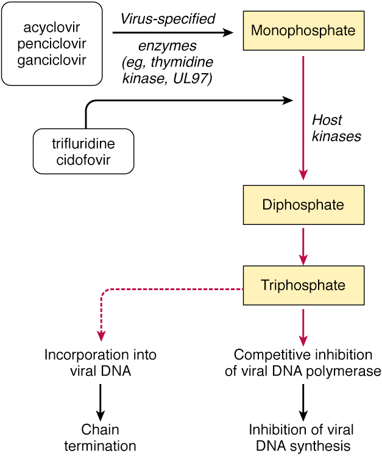

## Pharmacology 
----
# Anti-HIV & Antiviral Agents
----

Dr. Hao Chen 

Dept. Pharmacology, UTHSC

hchen@uthsc.edu

short URL: https://goo.gl/VXnkZL

full URL: http://chen42.github.io/presentations/antiviral.html

January 25, 2017

---

### Conventions 
#### used in this document 


* Drug name: 
	* <span id="drug">Enfuvirtide</span>
* Link to internet resources: 
	* [Clinicalkey](https://www-clinicalkey-com.ezproxy.uthsc.edu/#!/). You need to login via your UTHSC netid when off campus. 
* Open link in a new browser tab:
```
CTRL click
```
* Navigate the slides:
```
<- or -> 
Space_bar 
Page_down or Page_up 
Home or End
```
* To zoom in or out:
``` 
CTRL + or CTRL -
CTRL mouse_wheel_up or CTRL mouse_wheel_down 
```

<small>
Written using [Reveal.js](https://github.com/hakimel/reveal.js) and [markdown](https://help.github.com/categories/writing-on-github/)
</small>


---
### Agents for the treatment of virus infections 
#### Hour 1 
* <a href="#/hiv">Retrovirus (HIV)</a>
	* Fusion inhibitors <span id="drug">[Enfuvirtide](#/Enfuvirtide), [Maraviroc](#/Maraviroc)</span>
	* Nucleoside reverse transcriptase inhibitors <span id="drug">[Zidovudine, Didanosine, Stavudine, Lamivudine, Abacavir, Emtricitabine](#/nrti)</span>
	* Nucleotide inhibitors <span id="drug">[Tenofovir](#/Tenofovir)</span>
	* Non-nucleoside reverse transcriptase inhibitors <span id="drug">[Nevirapine, Delavirdine, Efavirenz](#/nnrti)</span>
	* Integrase inhibitor <span id="drug">[Raltegravir, Dolutegravir, Elvitegravir](#/Integrase) </span>
	* Protease inhibitors <span id="drug">[Atazanavir, Saquinavir, Ritonavir, Lopinavir, Indinavir, Nelfinavir, Darunavir](#/pi) </span> 


---
### Agents for the treatment of virus infections 
#### Hour 2 
* <a href="#/hsv">Herpes Simplex Virus</a> and Varicella Zoster Virus
	* <span id="drug">[Acyclovir, Valacyclovir](#/Acyclovir), [Famciclovir, Penciclovir](#/Penciclovir)</span>
* <a href="#/cmv">Cytomegalovirus</a>
	* <span id="drug">[Ganciclovir, Valganciclovir](#/Ganciclovir), [Cidofovir](#/Cidofovir), [Foscarnet](#/Foscarnet)</span>
* <a href="#/hbv">Hepatitis Virus B </a>and C
	* <span id="drug"> [Entecavir](#/Entecavir), [Adefovir](#/Adefovir), [Interferon alpha](#/Interferon), [Ribavirin](#/Ribavirin)</span>
* <a href="#/flu">Influenza Virus </a>
	* Uncoating inhibitors <span id="drug"> [Amantadine, Rimantadine](#/fluuncoating)</span>
	* Viral release inhibitors <span id="drug"> [Zanamivir, Oseltamivir](#/flurelease)</span>


---
### Objectives

#### At the completion of this unit, the student should be able to:
1. Recognize the clinical characteristics and goals of therapy for HIV/AIDS
2. Identify the steps in the viral replication process that provide targets for antiviral therapy
3. Recall which drugs act at each of the target steps in the replication process for both RNA and DNA viruses
4. Recall the primary drugs that are effective for each major class of viral infection
5. Describe the mechanism of action and significant pharmacological properties of the five major classes of antiretroviral (anti-HIV) agents


---
### Objectives (Cont.)

6. Understand the drug interactions involved in multidrug antiretroviral therapy and the effect of these antiviral agents on other concurrent drug therapies
7. Understand the basis for the viral selectivity of the antiviral agents
8. Describe the common and unique adverse effects of the distinct classes of antiviral agents
9. Describe the mechanisms of action for HSV, CMV, and HBV antiviral agents and mechanisms of viral resistance to these agents 
10. Identify the significant characteristics of the anti-influenza drugs acting at viral uncoating and release


---
<section id="hiv">
### [Human Immunodeficiency Viruses](https://www-clinicalkey-com.ezproxy.uthsc.edu/#!/content/book/3-s2.0-B9780323401616001716)


<div id="greyText">
single, positive strand RNA 
<br>
HIV-1 widely distributed, more pathogenic | HIV-2 restricted to Central and West africa
</div>
---

### [AIDS background](https://www-clinicalkey-com.ezproxy.uthsc.edu/#!/content/book/3-s2.0-B978044306752550003X)
<div id="left50">
1. **Primary infection.** About 90% of patients develop a flu-like illness, which coincides with [seroconversion](https://aidsinfo.nih.gov/education-materials/glossary/648/seroconversion), between 2 and 4 weeks post exposure. Symptoms include, fever, night sweats, sore throat, [lymphadenopathy](https://www-clinicalkey-com.ezproxy.uthsc.edu/#!/content/book/3-s2.0-B978070205035000014X?scrollTo=%23hl0001730), diarrhea. The illness is self-limiting.
<br>
2. **Asymptomatic phase.** Of variable duration, from 2 to 10 years. Patients are clinically well, but infectious.
<br>
3. **Acquired Immunodeficiency Syndrome (AIDS).** Features:
<ul><li>
	* Constitutional disease: 
	<ul><li>
	
		* fever, diarrhea, weight loss, skin rashes.
		</ul><li>
	* Immunodeficiency: 
	<ul><li>
		* increased susceptibility to [opportunistic infections](https://www-clinicalkey-com.ezproxy.uthsc.edu/#!/content/book/3-s2.0-B978141603618010044X?scrollTo=%23hl0002499)	
		</ul><li>
	* Neurological disease:
	<ul><li>
		* [dementia](https://www.ncbi.nlm.nih.gov/pubmed/24938216), [myelopathy](https://www-clinicalkey-com.ezproxy.uthsc.edu/#!/content/book/3-s2.0-B9780323287821004329?scrollTo=%23hl0000547), [peripheral neuropathy](https://www-clinicalkey-com.ezproxy.uthsc.edu/#!/content/book/3-s2.0-B9780323032759100121?scrollTo=%23hl0000789)	
		</ul><li>
	* Rare malignancies:
	<ul><li>
		* [Kaposi sarcoma](https://www.clinicalkey.com/#!/content/book/3-s2.0-B9780323401616001431?scrollTo=%23hl0000286), 
		[oral hairy leukoplakia](https://www.clinicalkey.com/#!/content/book/3-s2.0-B9781455750177003779?scrollTo=%23hl0000151), 
		or [lymphoma](https://www.clinicalkey.com/#!/content/book/3-s2.0-B9781455746965000117?scrollTo=%23hl0001298)	
		</ul></ul>
</div>

<div id="right50">

</div>

---
### Current [guideline](https://aidsinfo.nih.gov/guidelines/html/1/adult-and-adolescent-treatment-guidelines/0/)

for

#### The Initiation of Antiretroviral Therapy 

Last updated January 28, 2016

* Antiretroviral therapy (ART) is recommended for all HIV-infected individuals, regardless of CD4 T lymphocyte cell count, to reduce the morbidity and mortality associated with HIV infection (AI) and to
 prevent HIV transmission (AI).
* On a case-by-case basis, ART may be deferred because of clinical and/or psychosocial factors, but therapy should be initiated as soon as possible.

<small>Rating of Recommendations: A = Strong; B = Moderate; C = Optional </small>
<small>Rating of Evidence: I = Data from randomized controlled trials;</small>


[HAART - cART - ART](https://www.verywell.com/cart-hiv-combination-antiretroviral-therapy-48921)

---
### HIV Life Cycle 

<iframe width="600" height="400" src="https://www.youtube.com/embed/eS1GODinO8w" frameborder="0" allowfullscreen></iframe>


---
### [HIV Lifecycle](https://en.wikipedia.org/wiki/Discovery_and_development_of_HIV-protease_inhibitors#Life_cycle_of_HIV)

1. *Initiation*: attachment, penetration, uncoating
2. *Replication*: genome synthesis, RNA production, protein synthesis
3. *Release*: assembly, maturation, exit from cell
---

<section id="Enfuvirtide">
### Fusion inhibitors
[Enfuvirtide (Fuzeon, T20)](https://www-clinicalkey-com.ezproxy.uthsc.edu/#!/content/drug_monograph/6-s2.0-2752)

<div id="left50"> 
**[Structure](https://www.drugbank.ca/drugs/DB00109)**
<Br>
	Enfuvir<font color="darkred">tide</font> is a 36 amino acid synthetic pep<font color="darkred">tide</font>. 
<p>

**Mechanism of action** <br>
	Binds to [gp41](https://en.wikipedia.org/wiki/Gp41#Function) of the viral envelope; prevents conformational change and impedes the fusion of the viral and host cell membranes. 
</div>

<div id="right50">


</div>	

<div id="full"> 

** Recommendations for use** <br>

Not part of 1st line ART (due to the self-injection method, injection site reaction, and high cost). Reserved as salvage therapy for treatment resistant patients. Prophylasis after occupational HIV exposure. 

</div>

---
### Enfuvirtide 
* [ADME](https://en.wikipedia.org/wiki/ADME)
	* Administered subcutaneously (synthetic peptide)
	* Bound to plasma protein
	* Metabolized by proteolytic hydrolysis
	* T&frac12; = 4 h 
* <a href="#/adverse">Adverse effect</a>
	* Injection-site pain or infection 
	* Pancreatitis
	* Hypersensitivity reaction (rash, fever, peripheral edema, acute respiratory distress, etc.) 
	* Initial report of increased bacterial pneumonia (but no longer significant after adjusting for monitoring duration)
* Resistance 
	* gp41 mutations may develop when drug is given at suboptimal doses as monotherapy; No cross-resistance with other HIV Agents
	* Ineffective for HIV-2


---

<section id="Maraviroc">
### Fusion inhibitors

[Maraviroc (<font color="orange">Sel</font>z<font color="darkred">entry</font>) ](https://www-clinicalkey-com.ezproxy.uthsc.edu/#!/content/drug_monograph/6-s2.0-3567)


<div id="right50">


</div>	

<div id="left50">
**Mechanism of action** <br>

[Chemokine](https://www.ncbi.nlm.nih.gov/pubmed/7548618) receptor 5 antagonist<br>
Binds to CCR5 co-receptor<br>
Prevents virus from entering the host cell <br>
<p> 
**ADME** <br>
	Oral<br>
	Substrate for both [CYP3A4](https://en.wikipedia.org/wiki/CYP3A4#Function) and [P-glycoprotein](https://en.wikipedia.org/wiki/P-glycoprotein) <br>
	T&frac12;=14~18 h<br>
	Both urine and feces
</div>

---

### Maraviroc (Selzentry)
 
* Indication
	* Treatment of CCR5-tropic HIV-1 (not CXCR4)
	* Coreceptor (i.e. CCR5 vs CXCR4) tropism assay must be performed 
	* In combination for patients failing other antiretroviral drugs
* Adverse effects
	* Rash
	* Elevated hepatic enzyme, hepatitis 
	* Systemic allergic reaction, cough, fever 
	* Myocardial infarction or ischemia (1.3%) 
* Drug interactions
	* CYP3A inhibitors or inducers
		* Reduce dosage when <span id="drug"> ritonavir </span> or <span id="drug"> cobicistat </span> is coadministered 
		* Increase dosage with <span id="drug"> efavirenz </span> 

---
<section id="nrti">
### [Nucleoside Reverse Transcriptase Inhibitors (NRTIs)](https://www-clinicalkey-com.ezproxy.uthsc.edu/#!/content/book/3-s2.0-B9781455702824000435?scrollTo=%23hl0000874)

* NRTIs
	* <span id="drug">Zidovudine</span> (Retrovir, azidothymidine [ZVD], Apo-Zidovudine, Novo-AZT)
	* <span id="drug">Stavudine</span> (Zerit, D4T)
	* <span id="drug">Didanosine</span> (Videx, dideoxyinosine, ddI)
	* <span id="drug">Abacavir</span> (Ziagen, ABC)
	* <span id="drug">Lamivudine</span> (Epivir, 3TC)
	* <span id="drug">Emtricitabine</span> (Emtriva, FTC)

---
### mechanism of action - NRTIs 
<iframe width="560" height="315" src="https://www.youtube.com/embed/cC9kyoAo1ac?start=30&list=PLMO1589WRspykVPiy6SgKi3OPKbe9b0El" frameborder="0" allowfullscreen></iframe>

---
### Mechanisms of Action - NRTIs 
* Analogs of naturally occurring nucleosides
* Converted to their active triphosphate metabolites (i.e. a nucleotide) by host cell kinases
* Competitive inhibitor of viral reverse transcriptase
* Cause DNA chain termination 
* Also inhibit host cell DNA polymerase


---
### NRTIs

* [Zidovudine](https://www-clinicalkey-com.ezproxy.uthsc.edu/#!/content/drug_monograph/6-s2.0-653) (ZDV, AZT), [Stavudine](https://www-clinicalkey-com.ezproxy.uthsc.edu/#!/content/drug_monograph/6-s2.0-573) (d4t) 
	* Analogs of pyrimidine nucleoside (T) 
	* Phosphorylated to active triphosphate forms
	* Competes with deoxythymidine triphosphate for incorporation into DNA
* [Didanosine](https://www-clinicalkey-com.ezproxy.uthsc.edu/#!/content/drug_monograph/6-s2.0-186) (ddI)
	* Analog of purine nucleosides (A, G)
	* Active 2',3'-dideoxyadenosine 5'-triphosphate (ddATP) competes with cellular deoxyadenosine triphosphate for incorporation into viral DNA
* [Lamivudine ](https://www-clinicalkey-com.ezproxy.uthsc.edu/#!/content/drug_monograph/6-s2.0-339) (3TC), [Emtricitabine](https://www-clinicalkey-com.ezproxy.uthsc.edu/#!/content/drug_monograph/6-s2.0-2465)  (FTC)
	* Analogs of pyrimidine nucleoside (C)
* [Abacavir](https://www-clinicalkey-com.ezproxy.uthsc.edu/#!/content/drug_monograph/6-s2.0-2332) (ABC)
	* Analog of purine nucleosides (G) 


---
### Nucleoside Reverse Transcriptase Inhibitors (NRTIs)
* Indications
	* First line treatment of HIV infection as components of ART 
	* Prevent acute infection of susceptible cells
	* Little effect on cells already infected by HIV
	* <span id="drug"> Zidovudine </span> 
		* Only NRTI shown to reduce perinatal HIV transmission
* Resistance
	* Drugs select for different mutations of the reverse transcriptase gene at the level of specific codons 


---
### Pharmacological Properties of NRTIs
* Good oral absorption
* Crosses blood-brain barrier
* Metabolism plays limited role in clearance 
* Excreted unchanged in urine, except:
	* <span id="drug"> Zidovudine </span> is metabolized to glucoronide
	* <span id="drug"> Abacavir </span> metabolized by alcohol dehydrogenase
* <span id="drug"> Didanosine </span> is acid labile
	* Take 1/2 h before or 2 h after meals
	* Choose extended release formulation 
	* Others taken without regard to meals
	

---
<section id="nrtipk">
### Pharmacokinetics of NRTIs

| Parameter | Zidovudine | Lamivudine | Stavudine | Didanosine | Abacavir | Emtricitabine|
|---|---|---|---|---|---|---|
|Oral bioavailability, %| 60 | 80 | 80-90| 40 | > 70 | 75-93 | 
|Effect of meals on AUC| &darr; 24 (high fat) | &mdash; | &mdash; | &darr; 50% (acidity) | &mdash; | &mdash; | 
|Plasma t&frac12; emlim, h| 0.8-1.9 | 5-7 | 1.4 | 1.0 | 0.8-1.5| 10 | 
|Intracellular T&frac12;elim, triphosphate, h| 3-4 | 12 | 3.5 | 8-24 | 3 | 39| 
|Plasma protein binding, %| 20-38 | < 35 | < 5 | < 5 | 50 |  < 4|
|Metabolism, %| 60-80 <br> glucuronidation | 20-30 | 80 | 50 <br>(purine metabolism) | > 80 |  9  oxidation <br> 4 glucuronidation|
|Renal excretion, %, parent drug| 15 | 70 | 40 | 20-50 | < 5 |  86|
||

AUC, area under plasma conc.-time curve; T&frac12;elim, half-life of elimination; &darr;, decrease; &mdash;, no effect 

---

### <a href="#/adverse">Adverse Effects</a> of NRTIs
* Common toxicities
	* Rash; Gastrointestinal distress
	* [Lactic acidosis](https://aidsinfo.nih.gov/education-materials/fact-sheets/22/68/hiv-and-lactic-acidosis), [hepatic steatosis](https://www.ncbi.nlm.nih.gov/pubmed/22760655) 
		* higher incidence with <span id="drug"> [stavudine or didanosine](https://www.ncbi.nlm.nih.gov/pubmed/17896969)
	* [Lipodystrophy](https://www.ncbi.nlm.nih.gov/PubMed/10509567): fat loss and/or buildup or both. 
		* Including central obesity, dorsocervical fat enlargement [(buffalo hump)](https://www.clinicalkey.com/#!/content/medline/2-s2.0-9525364), peripheral wasting, accumulation of facial fat, [lipomas](http://www.mayoclinic.org/diseases-conditions/lipoma/basics/definition/con-20024646), breast enlargement, [gynecomastia](http://www.mayoclinic.org/diseases-conditions/gynecomastia/home/ovc-20257576)
		* Most common with <span id="drug"> stavudine </span> and <span id="drug"> zidovudine </span> 

---

### <a href="#/adverse/">Adverse Effects </a>of NRTIs
 
* Unique toxicities
	* <span id="drug">Zidovudine</span>: bone marrow suppression; anemia, neutropenia; myopathy (mt DNA); 
	* <span id="drug">Didanosine</span>: pancreatitis, exacerbates peripheral neuropathy 
	* <span id="drug">Stavudine </span>: pancreatitis, exacerbates peripheral neuropathy
		* avoid co-administration with didanosine or zidovudine 
	* <span id="drug">Abacavir</span>: hypersensitivity reaction due to genetic predisposition (multi-organ autoimmune response, potentially life threatening) 
		* HLA-B\*5701	screening before starting therapy [NEJM](http://www.nejm.org/doi/full/10.1056/NEJMoa0706135#t=article)
	* <span id="drug"> Emtricitabine </span>: psychiatric reactions, depression, dizziness, insomnia


---

### Drug Interactions of NRTIs
 
* <span id="drug"> Zidovudine </span> 
	* Avoid co-administration bone marrow suppressive drugs
		* <span id="drug">Ganciclovir, interferon alpha, dapsone, flucytosine, vincristine, vinblastine</span>
	* Antagonism with <span id="drug">Stavudine</span> [PubMed](https://www.ncbi.nlm.nih.gov/pubmed/10882616)
* <span id="drug"> Didanosine </span>
	* Some drugs can augment the neuropathy and pancreatitis 
		* <span id="drug">Ethambutol, isoniazid, vincristine, cis-platin </span>
		* <span id="drug">Stavudine </span>
	* Avoid use of <span id="drug"> didanosine </span> with <span id="drug"> stavudine / tenofovir </span> due to an increased toxicity risk and higher rates of early [virologic failure](https://aidsinfo.nih.gov/education-materials/glossary/879/virologic-failure) | [details](https://aidsinfo.nih.gov/guidelines/html/1/adult-and-adolescent-arv-guidelines/15/virologic-failure)
	* <span id="drug">Ganciclovir </span> increases plasma concentration; monitor for toxicity 
	* <span id="drug">Methadone </span> decreases plasma levels by ~60%; dosage adjustment needed


---

### Drug Interactions of NRTIs

* <span id="drug"> Stavudine </span> 
	* Augment the neuropathy and pancreatitis with <span id="drug"> didanosine, Bortezomib </span>(myeloma), <span id="drug"> Zalcitabine </span> 
	* <span id="drug"> Zidovudine </span> inhibits the phosphorylation of <span id="drug"> stavudine </span> . For women receiving a stavudine-containing regimen, discontinue stavudine during labor while intravenous zidovudine is being administered.
* <span id="drug"> Abacavir </span> 
	* Ethanol significantly increases plasma levels (alcohol dehydrogenase)

---

### NRTIs in brief

* Indications 
	* First line treatment of HIV as part of ART
* Mechanism of action 
	* Inhibit viral reverse transcriptase
* Resistance 
	* Mutations in reverse transcriptase gene
* ADME 
	* Well absorbed by the GI tract; good oral bioavailability
	* Excreted unchanged by the kidney; except
		* <span id="drug"> zidovudine </span> (metabolized into glucoronide)
		* <span id="drug"> Abacavir </span> (metabolized by alcohol dehydrogenase)

---

### NRTIs in brief
* Adverse effects
	* All cause GI distress
	* Lactic acidosis with hepatic steatosis due to mitochondrial toxicity 
* Drug-Drug interactions
	* Can be severe due to synergistic effects on myelosuppression and peripheral neuropathy

---
<section id="Tenofovir">
### Nucleo<font color="darkorange">t</font>ide Reverse Transcriptase Inhibitor

[Teno<font color="darkorange">fovir</font> disoproxil (Viread)](https://www-clinicalkey-com.ezproxy.uthsc.edu/#!/content/drug_monograph/6-s2.0-2477)


* Properties
	* <span id="drug"> Tenofovir disoproxil </span> is a prodrug. It is hydrolyzed to release tenofovir
	* Tenofovir is an analogue of adenosine- <font color="darkorange">5'-monophosphate </font>
	* Requires two intracellular phosphorylation steps for activation
	* Weak inhibitor of mammalian DNA and mt polymerase
	* Included in many first-line ART regimens
	* Also indicated for hepatitis B 
* Mechanism of action
	* Inhibits viral reverse transcriptase by chain termination
* Resistance
	* Does not tend to select new mutations [PubMed](https://www.ncbi.nlm.nih.gov/pubmed/23027713)
	* Cross resistance with preexisting <span id="drug"> zidovudine </span> associated mutations
	* Not effected by <span id="drug"> lamivudine-abacavir </span> associated mutations

---
### Tenofovir

* Administration
	* Once daily dosing
	* Increased bioavailability taken with a high fat meal
* Metabolism
	* Substrate of P-glycoprotein 
	* Not substrate for P450
	* T&frac12; = 17 h 
* <a href="#/adverse">Adverse effect </a>
	* Most commonly in clinical trials: nausea, vomiting, diarrhea, [flatulence](https://www-clinicalkey-com.ezproxy.uthsc.edu/#!/content/book/3-s2.0-B9781455770052000676?scrollTo=%23hl0000349), abdominal pain, dyspepsia, and anorexia with weight loss
	* Increases <span id="drug"> didanosine </span> concentration: pancreatitis and neuropathy
	* CNS: depression, anxiety, headache
	* Hepatotoxicity: elevated hepatic enzymes 
	* Exacerbates renal impairment 


---
### tenofovir disoproxil and emtricitabine
#### (Truvada)

* Better than Abacavir-Lamivudine for initial therapy 
	* Extending time to virologic failure and first adverse event 
	* [NEJM Dec 3 2009](https://www.ncbi.nlm.nih.gov/pubmed/?term=19952143)
* Effective as antiretroviral chemoprophylaxis before exposure
	* [NEJM Dec 30 2010](https://www.ncbi.nlm.nih.gov/pubmed/21091279)
* <a href="#/recommend">Recommended for treatment naive patients</a>
---
<section id="nnrti">
### Non Nucleoside Reverse Transcriptase Inhibitors (NNRTIs)

[Delavirdine (Rescriptor)](https://www.clinicalkey.com/#!/content/drug_monograph/6-s2.0-700)
 || [Nevirapine (Viramune)](https://www.clinicalkey.com/#!/content/drug_monograph/6-s2.0-432)
|| [Efavirenz (Sustiva)](https://www.clinicalkey.com/#!/content/drug_monograph/6-s2.0-2244)

* Indications
	* HIV-1 infections
		* Do not have significant activity against HIV-2
* Mechanism of action
	* Bind directly to a hydrophobic pocket of the reverse transcriptase 
	* Induce conformational change in active site and block enzyme activity
	* Do not require intracellular phosphorylation for activity
* Resistance
	* Resistant HIV emerges rapidly when used as monotherapy.
	* Each drug selects for different mutations of the RT gene at the level of specific codons. 

---

### NNRTIs

<iframe width="560" height="315" src="https://www.youtube.com/embed/RUUyd5bE9vQ?start=93&stop=150" frameborder="0" allowfullscreen></iframe>

---

### NNRTIs

* ADME
	* Excellent oral absorption.
	* Highly bound to plasma proteins.
	* Metabolized by the cytochrome P-450 system
		* Drug interactions are significant
	* Excreted through the urines as glucuronide conjugates. 
	* <span id="drug"> Delavirdine </span>: CYP3A4 inhibitor
		* Increases PIs, rifabutin, clarithromycin, methadone and ethinyl estradiol plasma levels
	* <span id="drug"> Efavirenz </span> and <span id="drug"> Nevirapine </span>: CYP3A4 inducer
		* Reduces PIs, rifabutin, clarithromycin, methadone and ethinyl estradiol plasma levels

---

### NNRTIs Pharmacokinetics

|Parameter| DELAVIRDINE | NEVIRAPINE\* | EFAVIRENZ\*| 
|---|---|---|---|
|Oral bioavailability, % | 85 | 90 | 50 | 
|Plasma T&frac12; elim h | 2-11 | 25-30 | 40-50|
|Plasma protein binding, % | 98 | 60 | 99| 
|Metabolism | Hepatic | Hepatic | Hepatic | 
|Renal excretion, parent drug, % | < 3 | < 3 | < 3|
|Autoinduction of metabolism | No | Yes | Yes |
|CYP3A modulation | Inhibitor | Inducer | Inducer 
||
\* values after multible doses. T&frac12; elim, half-life of elimination 


---
### <a href="#/adverse">Adverse effects</a> of NNRTIs

* Common toxicities
	* Maculopapular rashes in the trunk and extremities
* Unique toxicities 
	* <span id="drug"> Nevirapine </span> 
		* Fever, fatigue, headache, drowsiness, nausea
		* Hepatotoxicity 	
			* elevated liver enzymes 
			* fulminant cholestatic hepatitis, hepatic necrosis, and hepatic failure
	* <span id="drug"> Efavirenz </span> 
		* Penetrate the blood brain barrier 
		* Neuropsychiatric (headache, dizziness, abnormal dreams, psychosis, suicidal ideation)
		* Teratogenic in nonhuman primates ([Pregnancy Category D](https://en.wikipedia.org/wiki/Pregnancy_category))
		* Hepatotoxicity 
 
---
### NNRTIs in brief

* Indications
	* Treatment of HIV infection as part of combination therapy
	* Not effective against HIV-2
* Mechanism of action 
	* Inhibit viral reverse transcriptase
* Resistance
	* Mutations in viral reverse transcriptase
* ADME
	* Well absorbed by the GI tract
	* Good oral bioavailability
	* Metabolized in the liver 	
	* Excreted in the urine as glucoronidated metabolites
* Adverse effects
	* All NNRTIs cause rash

---
<section id="Integrase">
### Integrase Inhibitor

[Raltegravir (Isentress)](https://www-clinicalkey-com.ezproxy.uthsc.edu/#!/content/drug_monograph/6-s2.0-3572)  || [Dolutegravir (Tivicay)](https://www-clinicalkey-com.ezproxy.uthsc.edu/#!/content/drug_monograph/6-s2.0-3823) || [Elvitegravir (Vitekta)](https://www-clinicalkey-com.ezproxy.uthsc.edu/#!/content/drug_monograph/6-s2.0-3928)

<div id="right20">

</div>
<div id="left80">
**Mechanism of action**<br>
	Inhibits HIV-1 integrase enzyme <br>
	Prevents insertion of viral DNA into host genome <p>
**ADME**<br>
	Oral <br>
	Glucuronidation and by CYP3A<br>
	<span id="drug"> Elvitegravir </span>  is mainly metabolized by CYP3A4 <br>
	Eliminated in both feces and urine <p>
**Resistance**<br>
	<span id="drug"> Dolutegravir </span> has less resistance overlap with <span id="drug"> Raltegravir </span> than does <span id="drug"> elvitegravir </span> . 
</div>
---
### Integrase Inhibitor 

* Indication
	* <a href="#/recommend">Recommended</a> for naive patients as part of combination ART 
* Adverse effects
	* Diarrhea, nausea, headache, and fever
	* Hypersensitivity to <span id="drug"> Dolutegravir </span> include serious rash, blisters/peeling of skin, hepatitis, facial edema, angioedema, difficulty breathing, or eosinophilia.
* Drug interactions
	* Not inducer, inhibitor or substrate of CYP3A4
	* Metabolized by UDP glucuronosyltransferase (UGT)
	* <span id="drug"> Rifampin </span> (antibiotic) induces UGT, thus requires higher <span id="drug"> Raltegravir / Dolutegravir </span> dose

---

### Pharmacokinetics of Integrase Inhibitors

|Parameter| Raltegravir | Dolutegravir | Elvitegravir | 
|---|---|---|---|
|Oral bioavailability, % | unknown | unknown | unknown  | 
|Effect of food on AUC, % | &uarr; 46-200 | &uarr; 33-66| &uarr; 34-87  |   
|Plasma T&frac12; elim h | 9   | 14  | 8.7  |
|Plasma protein binding, % | 83  | 98.9 | 98-99 | 
|Metabolism | Glucuron| Glucoron, CYP3A4 | **CYP3A**, Glururon | 
|Renal excretion, parent drug, % | 32 | 31  | 6.7 |
||

 T&frac12; elim, half-life of elimination 


---

<section id="pi">
### Protease Inhibitors, PIs
<div id="left50">
[Ataza<u>navir</u> (Reyataz)](https://www.clinicalkey.com/#!/content/drug_monograph/6-s2.0-2795)
<br>
[Indi<u>navir</u> (Crixivan)](https://www-clinicalkey-com.ezproxy.uthsc.edu/#!/content/book/3-s2.0-B9780323401616001303?scrollTo=%23hl0001350)
<br>
[Nelfi<u>navir</u> (Viracept)](https://www.clinicalkey.com/#!/content/drug_monograph/6-s2.0-764)
<br>
[Saqui<u>navir</u> (Fortovase)](https://www.clinicalkey.com/#!/content/drug_monograph/6-s2.0-556)
<br>
[Fosampre<u>navir</u> (Lexiva)](https://www-clinicalkey-com.ezproxy.uthsc.edu/#!/content/book/3-s2.0-B9780323401616001303?scrollTo=%23hl0001368)
<br>
[Rito<u>navir</u> (Norvir)](https://www.clinicalkey.com/#!/content/drug_monograph/6-s2.0-551)
<br>
[Daru<u>navir</u> (Prezista)](https://www-clinicalkey-com.ezproxy.uthsc.edu/#!/content/drug_monograph/6-s2.0-3515)

<br>
PIs can be peptidomimetic (structural similarities to the cleavage site of HIV polyproteins) or not (<span id="drug"> nelfinavir </span> ).
</div>

<div id="right50">
<iframe width="560" height="315" src="https://www.youtube.com/embed/MK2r8J7SCSg?start=20&amp;stop=60" frameborder="0" allowfullscreen></iframe>
</div>


---
### Protease Inhibitors
* Indications
	* Treatment of HIV as part of combination therapy
	* Most effective ART available
	* Effective in both acutely and chronic HIV-1 infected cells
	* Effective in monocytes and macrophages 
		* Not affected by RT inhibitors
	* Early stages of HIV-1 replication cycle not affected
* Mechanism of Action
	* Selective, competitive inhibitors of HIV proteases
	* Bind reversibly to protease active site
	* Prevent cleavage of polyprotein and block viral maturation
* Resistance
	* Each drug selects for different mutations in protease gene at level of specific codons
 
---
### Protease inhibitors

* ADME
	* Oral absorption varies
	* Bind extensively to plasma proteins
	* Metabolized by cytochrome P-450 system
		* Concurrent use of potent P-450 inducer (e.g. <span id="drug"> rifampin </span> ) leads to decreased PI concentration
	* Renal excretion is minimal
		* No adjustments needed for renal dysfunctions
	* Potent inhibitors of CYP3A4
		* <span id="drug"> Ritonavir </span> used to increase (i.e. "boost") plasma concentration of other PIs except <span id="drug"> nelfinavir </span> (CYP2C19) 
		* Toxic adverse effects related to drug accumulation due to PI-mediated inhibition of hepatic P450 system
		 

---
### protease inhibitors 
#### Pharmacokinetics
|Parameter| Amprenavir | Indinavir | Nelfinavir | Ritonavir | Saquinavir | Lopinavir| Darunavir| 
|---|---|---|---|---|---|---|
|Oral bioavailability, % | 35-90 | 60-65 | 20-80|65-70|12|?| 80&dagger;| 
|Effect of meal on AUC|&darr; 21%<br> high fat | &darr; 77% <br>high fat| &uarr; 200-300% | &uarr; 15% <br>capsule | &uarr; 600% | &uarr; 130% high fat| &uarr; 40%|
|Plasma T&frac12;elim, h| 7-11 |1.5-2| 3.5-5|3-5|7-12|6-8| 7-15| 
|Plasma protein binding, %| 90|60|98|98-99| 98|98-99| 95|
|Metabolism|CYP3A4|CYP3A4| CYP3A4 <br> CYP2C19| CYP3A4| CYP3A4| CYP3A4| CYP3A4|
|Autoinduction of metabolism|No |No|Yes|Yes|No|Yes| No| 
|Renal Excreted, % parent drug| < 3 | 11 | 1-2|3.5 |< 3|< 3| 14 |
|Inhibition of CYP3A4|++|++|++|++++|+|+++| ++ |
||

Abbreviation: AUC, area under plasma concentration-time curve; T&frac12;elim, half-life of elimination; &uarr;, increase; &darr; decrease;
<span id="drug"> Saquinavir </span> data refer to soft-gel capsule formulation. 
<span id="drug"> Lopinavir</span> refers to coformulation with <span id="drug"> ritonavir </span> 
<br> &dagger; Coadministered with <span id="drug"> ritonavir </span> 

---

### Protease inhibitors
#### Drug interactions 

* <span id="drug"> Carbamazepine</span> 
	* (treat epilepsy) lower <span id="drug"> indinavir </span> AUC and potentially other PIs
* <span id="drug"> Ketoconazole </span> 
	* (antifugal) upregulates PIs AUC
* <span id="drug"> Sildenafil </span> 
	* (vasodilator) AUC augmented by PIs
* <span id="drug"> Methadone </span>
	* (addiction treatment) AUC reduced by <span id="drug"> ritonavir / lopinavir </span> 
* Oral contraceptive AUC reduced by PIs
	* <span id="drug"> Indinavir </span> is exception


---

### Protease inhibitors
#### Common <a href="#/adverse">Adverse Effects</a>
* Hyperlipidemia 
	* May be more dramatic with <span id="drug"> ritonavir </span> due to interference in lipid metabolism. 
* Insulin resistance and diabetes
* [Lipodystrophy](https://www.ncbi.nlm.nih.gov/PubMed/9652687)
	* Including central obesity, dorsocervical fat enlargement [(buffalo hump)](https://www.clinicalkey.com/#!/content/medline/2-s2.0-9525364), peripheral wasting, accumulation of facial fat, [lipomas](http://www.mayoclinic.org/diseases-conditions/lipoma/basics/definition/con-20024646), breast enlargement, [gynecomastia](http://www.mayoclinic.org/diseases-conditions/gynecomastia/home/ovc-20257576)
* Elevated liver function
* Possible increased bleeding risk in [hemophilics](https://www-clinicalkey-com.ezproxy.uthsc.edu/#!/content/medical_topic/21-s2.0-1014697)

---

### Protease inhibitors
#### Specific Adverse Effects 
* Ritonavir 
	* Hepatotoxicity at high doses
* Indinavir
	* [Nephrolithiasis/urolithiasis](https://www-clinicalkey-com.ezproxy.uthsc.edu/#!/content/book/3-s2.0-B9780323280488008241): patients should drink 2 liters/day
	* [Alopecia](https://www-clinicalkey-com.ezproxy.uthsc.edu/#!/content/medical_topic/21-s2.0-1014848) 
* Atazanavir
	* Hyperbilirubinemia due to inhibition of UDP glucoronosyl transferase 
		* An enzyme that catalyzes bilirubin conjugation 
		* Jaundice developed in 11% patients during clinical trials

---
<section id="Darunavir">
### Darunavir

* Achieves faster virologic response than control PIs. [PubMed](https://www.ncbi.nlm.nih.gov/pubmed/21692667) 
* <a href="#/recommend">Recommended</a> for treatment-naive patients
* Can be used to treat patients resist to other PIs. 
	* <span id="drug"> darunavir </span> displays a < 10-fold decreased susceptibility against 90% of HIV-1 isolates resistant to <span id="drug"> amprenavir, atazanavir, indinavir, lopinavir, nelfinavir, ritonavir, saquinavir, </span> and/or <span id="drug"> tipranavir </span> . 	
* Must be used in combination in an antiviral regimen.
	* Requires an enhancer (i.e. low does <span id="drug"> ritonavir </span> or [cobicistat](https://www.ncbi.nlm.nih.gov/pubmed/26566368)  )

---

### Protease Inhibitors 
#### in brief

* Indications
	* Treatment of HIV infection as part of combination therapy
* Mechanism of action 
	* Inhibition of HIV protease
* Resistance
	* Mutations of the protease gene 
		*	<span id="drug"> Indinavir, ritonavir </span> and <span id="drug"> lopinavir </span> acquire more mutations than other PIs
* ADME
	* Poor systemic bioavailability (need 'boost')
	* All PIs metabolized in liver by P450 enzymes
* Adverse effects
	* GI distress, diarrhea and vomiting
	* Increase bleeding hemophilia A or B
	* Hyperglycemia, insulin resistance and hyperlipidemia
	* Fat wasting, reaccumulation, and redistribution -- lipodystropy
* Drug interactions
	* Can be severe due to effects on P450 enzymes

---

### Antiretroviral Drug Selectivity

* NRTIs
	* Once phosphorylated by cellular kinases have greater affinity for viral reverse transcriptase than for cellular DNA polymerases.
* NNRTIs
	* Do not undergo phosphorylation
	* Have greater affinity for viral reverse transcriptase than for cellular DNA polymerases
* PIs
	* Greater affinity for HIV aspartyl protease than for human protease.

---
<section id="recommend">
### [Current Recommendations](https://aidsinfo.nih.gov/guidelines)
#### treatment-naive patients

* Integrase inhibitor-based regimens 	
	* <span id="drug"> Dolutegravir / abacavir / lamivudine </span> only for HLA-B\*5701 negative patients 
	* <span id="drug"> Dolutegravir </span> and 
		* <span id="drug"> tenofovir disoproxil fumarate /emtricitabine </span> 
		* <span id="drug"> tenofovir alafenamide / emtricitabine </span> 
	* <span id="drug"> Elvitegravir / [cobicistat](https://www-clinicalkey-com.ezproxy.uthsc.edu/#!/content/drug_monograph/6-s2.0-3929) / tenofovir alafenamide / emtricitabine </span> 
	* <span id="drug"> Elvitegravir / cobicistat / tenofovir disoproxil fumarate / emtricitabine </span> 
	* <span id="drug"> Raltegravir </span> and 
		* <span id="drug"> tenofovir disoproxil fumarate / emtricitabine </span> 
		* <span id="drug"> tenofovir alafenamide / emtricitabine </span> 
* Protease Inhibitor-Based Regimens
	* <span id="drug"> Darunavir / ritonavir </span> and
		* <span id="drug"> tenofovir disoproxil fumarate / emtricitabine </span> 
		* <span id="drug"> tenofovir alafenamide / emtricitabine </span> 

---

#### Agents to treat HSV, VZV and CMV

|Virus| Disease| 
|---|---|
|[Herpes simplex virus](https://www-clinicalkey-com.ezproxy.uthsc.edu/#!/content/book/3-s2.0-B9780323401616001388) | herpes genitalis | 
|| herpes labialis | 
|| herpetic keratoconjunctivitis |
|| herpetic encephalitis|
|[Varicella-zoster virus](https://www-clinicalkey-com.ezproxy.uthsc.edu/#!/content/book/3-s2.0-B9781455775668002532) | chickenpox (varicella)|
|| shingles (herpes zostr)|
|[Cytomegalovirus](https://www-clinicalkey-com.ezproxy.uthsc.edu/#!/content/book/3-s2.0-B9780323401616001406) | retinitis &dagger;| 
|| esophagitis &dagger;| 
||
&dagger; most often in immunocompromised (e.g. AIDS) patients.

---

<section id="hsv">

### Herpes Simplex virus


<div id="greyText">
Double stranded DNA virus
</div>

---

[Life cycle](https://www-clinicalkey-com.ezproxy.uthsc.edu/#!/content/book/3-s2.0-B9780323401616001388?scrollTo=%23s0010) of HSV


---
### Nucleoside Analogs

<div id="left50">

<ul>
<li><span id="drug">Acyclovir</span> (Zovirax)
<li><span id="drug">Valcyclovir</span> (Valtrex)
<li><span id="drug">Penciclovir</span> (Denavir)
<li><span id="drug">Famciclovir</span> (Famvir)
<li><span id="drug">Ganciclovir</span> (Cytovene)
<li><span id="drug">Valganciclovir</span> (Valcyte)
<li><span id="drug">Cidofovir</span> (Vistide)
<li><span id="drug">Foscarnet</span> (Foscavir)
</ul>
</div>

<div id="right50">
<ul>
<li> Mechanism of action 
<ul><li> Inactivation of viral DNA polymerase through direct binding and competition for dNTPs.
<li> Inducing viral DNA chain termination 
</ul>
</div>


---


#### Mechanisms of Acitvation of Nucleoside Analogs



---

### Nucleoside analogues

* Resistance: 
	* Mutated viral DNA polymerase 
	* Absence of viral thymidine kinase (TK) 
	* Altered viral TK substrate specificity
* Drug selectivity:
	* The virus in infected cells activates the drug to an active form
		* Uninfected cell does not activate drug.
	* Preferential affinity of acyclovir triphosphate for viral DNA polymerase rather than cellular enzyme. 
	

---
<section id="Acyclovir">
### Acyclovir 
#### [Valacyclovir](https://www-clinicalkey-com.ezproxy.uthsc.edu/#!/content/drug_monograph/6-s2.0-636) (L-valyl ester prodrug of acyclovir)
	

* Mechanism of action 
	* <span id="drug"> acyclovir </span> is phosphorylated intracellularly by viral thymidine kinases (TK), then by cellular kinases to the triphosphate state, which terminates DNA replication when incorported into the viral DNA. 
	* Only effective against actively replicating virus. Does not eliminate the viral genome. 
* ADME
	* <span id="drug"> acyclovir </span> has low <a href="#/hsvpk">oral bioavailability</a> (10-20%). 
	* <span id="drug"> Valacyclovir </span> is hydrolyzed to acyclovir in intestine or liver. Increase bioavailability (3.3 - 5 X) 
	* T&frac12;= 2.5-3.3 h 
* Indication
	* HSV keratitis, herpes labialis, genital herpes, HSV encephalitis
	* VZV 
	* CMV-positive bone marrow transplant recipients
	* 'off-label' use for HIV [PubMed](https://www.ncbi.nlm.nih.gov/pubmed/23542637) 
* Adverse effects
	* Headache, nausea, diarrhea
	* Following high IV dose
		* Reversible renal dysfunction (crystalline nephropathy)
		* Neurologic toxicity (tremors, delirium, seizures)
---
<section id="Penciclovir">

### Penciclovir
#### [Famciclovir](https://www-clinicalkey-com.ezproxy.uthsc.edu/#!/content/drug_monograph/6-s2.0-240) (diacetyl ester prodrug)


* ADME
	* <span id="drug"> Penciclovir </span> is for topical application only.
	* <span id="drug"> Famciclovir </span> is oral, has longer intracellular <a href="#/hsvpk">half-life</a> than <span id="drug"> Acyclovir </span>, but with lower affinity for the viral enzyme 
* Mechanism of action 
	* Competitive inhibition of viral DNA polymerase
* Indications
	* Oral alternative to Acyclovir
	* Effective against HBV following liver transplant
* Adverse effects
	* Well tolerated
	* Headaches, nausea, diarrhea

---
<section id="cmv">
### Cytomegalovirus


<div id="greyText">
Double stranded DNA virus
</div>

---
<section id="Ganciclovir">
### Ganciclovir
#### [Valganciclovir](https://www-clinicalkey-com.ezproxy.uthsc.edu/#!/content/drug_monograph/6-s2.0-2584) (L-valyl ester prodrug)


* ADME
	* <span id="drug"> Valganciclovir </span> is hydrolyzed by esterases following oral administration to <span id="drug"> ganciclovir </span> 
* Indications
	* CMV retinitis in AIDS patients
		* Activity 100 x greater than <span id="drug"> Acyclovir </span> 
	* CMV prophylaxis - oral
* <a href="#/adverse">Adverse effects</a>
	* Bone marrow suppression, neutropenia, anemia, 
* Drug Interactions
	* Increase the concentration of <span id="drug"> didanosine </span> 

---

<section id="Cidofovir">
### [Cido<font color="darkorange">fovir</font>](https://www-clinicalkey-com.ezproxy.uthsc.edu/#!/content/drug_monograph/6-s2.0-125)

* Mechanism of action 
	* Cytidine nucleo<font color="darkorange">t</font>ide analog
	* Not phosphorylated by viral TK
	* Inhibits herpervirus DNA polymerase >> human DNA polymerase
* ADME	
	* <a href="#/hsvpk">Once weekly </a> dosing
* Indications
	* <span id="drug"> Ganciclovir, foscarnet, </span> and <span id="drug"> acyclovir </span> -resistant CMV strains	
	* <span id="drug"> cidofovir </span> i.v. delays progression of CMV retinitis in HIV+ patients
* <a href="#/adverse"> Adverse effects</a>
	* Nephrotoxicity, neutropeina, ocular hypotony, alopecia
	* Potential human carcinogen
	

---
<section id="Foscarnet">
### [Foscarnet (Foscavir)](https://www-clinicalkey-com.ezproxy.uthsc.edu/#!/content/drug_monograph/6-s2.0-267)
#### Non-nucleoside Anti-HSV Agent

* Mechanism of Action
	* Inorganic pyro<font color="darkorange">phos</font>phate analog
	* Inhibits HSV DNA polymerase and HIV-1 RT
	* Binds to pyrophosphate binding site of polymerase
	* Inhibits cleavage of pyrophosphate from deoxyribonucleotide triphosphate (dNTP)
	* Blocks viral DNA synthesis
* Indications
	* Nucleoside-resistant HSV, VZV, and CMV infections
	* Effective in CMV retinitis, and acyclovir and ganciclovir-resistant strains of HSV and VZV
	* Has been used as [salvage therapy](https://www.ncbi.nlm.nih.gov/PubMed/16964823) for multi-drug resistant HIV
* <a href="#/adverse">Adverse effects</a>
	* Renal failure or dysfunction 
	* Bone marrow suppression
	* Nausea, vomiting, and fatigue

---

<section id="hsvpk">
### Phamacokinetics of antiherpesvirus Agents

|Parameter|Acyclovir |Famciclovir| Ganciclovir| Cidofovir | Foscarnet|
|---|---|---|---|---|---|
|Oral bioavailability| 10-20% | 65-77% | < 10% | 2-22% | 9-17%| 
|Effect of meal on AUC| &mdash; | &mdash; | &uarr; 22% High fat | &mdash; | Uncertain |
|Plasam T&frac12;elim h| 2.5-3 | 2 | 2-4 | 2-3 | 4-8 (initial)|
|Intracellular T&frac12; of triphosphate h| 1 | 7-20 | > 24 | 17-56 | Not applicable | 
|CSF/plasma ratio| 0.5 | Uncertain | 0.2-0.7 | Uncertain | 0.7| 
|Protein binding| 9-34% | < 20% | 1-2%| < 6%| 15%|
|Metabolism | 15% | 5% | Negligible | Negligible |Negligible|
|Renal excretion (parent drug) | 60-90% | 70% | > 90% | > 90% | > 80%| 
|Dose adjustment | CrCl < 50 (IV) <br> CrCl < 25 (PO)| CrCl < 60| CrCl < 80| Scr > 1.5mg/dl <br> CrCl < 55| CrCl < 58-67|
||
AUC, area under curve; T&frac12;, half-life of elimination: CrCL, creatinine clearance (ml/min), Scr, serum creatinine; CSF, cerebrospinal fluid

---

### Inhibitors of Viral DNA Replication 
#### in Brief
* Indications
	* HSV, CMV, and VZV infections 
* Mechanism of action
	* Inhibit viral DNA polymerases
* Resistance
	* Mutations of the viral polymerase gene
	* Deficiency of viral tyrosine kinase 
* ADME
	* Bioavailability varies. 
	* Renal excretion of unmetabolized parent drug through glomerular filtration -- Adjust dose
* Adverse effects
	* Generally well tolerated
	* Ganciclovir -- myelosuppressant and has teratogenic potential
	* Cidofovir and Foscarnet -- nephrotoxic

---
<section id="hbv">
### Hepatitis B Virus


<div id="greyText">
Partially double-stranded DNA virus
</div>

---

[HBV life cycle](https://www-clinicalkey-com.ezproxy.uthsc.edu/#!/content/book/3-s2.0-B9780323401616001480?scrollTo=%23hl0000906)

<iframe width="560" height="315" src="https://www.youtube.com/embed/sVpiXaEMs7I?start=178" frameborder="0" allowfullscreen></iframe>

---

### Anti-Hepatitis Agents

* <span id="drug">Entecavir</span> (Baraclude)
* <span id="drug">Adefovir</span> (Hepsera)
* <span id="drug">Tenofovir</span> (Viread)
* <span id="drug">Ribavirin</span> (Virazole)
* <span id="drug">Interferon alfa-2a</span> (Roferon) and -2b (Intron A)
* <span id="drug">Peginterferon alfa-2a</span> (Pegasys) and alfa-2b (PegIntron)

---
<section id="Entecavir">
### [Entecavir](https://www-clinicalkey-com.ezproxy.uthsc.edu/#!/content/drug_monograph/6-s2.0-3427) (Baraclude)

* Mechanism of action 
	* Nucleoside analog of guanosine
	* Inhibits all 3 activities of HBV polymerase
		* Base priming ([GAA](https://youtu.be/sVpiXaEMs7I?t=6m12s)) [PubMed](https://www.ncbi.nlm.nih.gov/pmc/articles/PMC4399241/) 
		* Reverse transcription
		* DNA synthesis of positive strand
* Indication 
	* Effective in treatment naive HBV patients
	* Equally active against <span id="drug"> lamivudine</span>-resistant HBV
	* Weak activity against HIV but not clinically relevant

---

### Entecavir

* ADME
	* Oral bioavailability is 100%
		* Tablets and liquid form are interchangeable
		* Absorption is affected by food (decreased <40%)
			* Take on empty stomach (2 hrs before or 2 hrs after meal)
	* Not metabolized - not substrate for CYP450
		* No dosage alteration for hepatic impairment
	* Excreted by kidneys (both glomerular filtration and tubular secretion)
		* With CrCl < 50 ml/min, dose should be modified
		* Co-administration with other drugs that reduce renal function, may increase conc of <span id="drug"> entecavir </span> or other drug

---
### Entecavir

* Adverse effects
	* Generally well tolerated
	* HBV exacerbation upon discontinuation of treatment
	* Elevation of hepatic enzymes may occur, lactic acidosis 
		* Monitor hepatic function for several months and re-initiate therapy if warranted
	* Most commonly reported: headache, fatigue, dizziness
---
<section id="Adefovir">
### [Ade<font color="darkorange">fovir</font>](https://www-clinicalkey-com.ezproxy.uthsc.edu/#!/content/drug_monograph/6-s2.0-2233)(Hepsera)

* Mechanism of action 
	* Nucleo<font color="darkorange">t</font>ide analog of deoxy<font color="darkorange">ade</font>nosine monophosphate
	* Following formation of the diphosphate by cellular kinases, it inhibits HBV DNA polymerase
	* ~10-fold more active for viral DNA polymerase than for the human DNA polymerase
	* No cross resistance of <span id="drug"> lamivudine</span>-resistant HBV strains
* ADME
	* Oral bioavailability (60%), unaffected by meals
	* Very low protein binding, <4%
	* Renal excretion -- adjust dose with renal function impairment

---

### Adefovir 

* Adverse Effects
	* Exacerbations of hepatitis after discontinuation of treatment 
	* Nephrotoxicity 
	* Lactic acidosis/severe hepatomegaly with steatosis
* Drug Interactions
	* The combination of adefovir with <span id="drug">  lamivudine </span>  showed additive anti-HBV activity
	* Increased AUC when co-administered with <span id="drug"> ibuprofen </span> 
		* Increase in bioavailability

---
<section id="Ribavirin">

### [Ribavirin](https://www-clinicalkey-com.ezproxy.uthsc.edu/#!/content/drug_monograph/6-s2.0-542)
(Copegus | Moderiba | Rebetol | RibaPak | RibaTab | Ribasphere | Virazole)

* Mechanism of action 
	* Nucleoside analog of guanosine
	* May related to increased mutation of viral DNA and leads to "error catastrophe"
	* Interference with synthesis of GTP
	* Increase production of cytokine
* ADME
	* Oral bioavailability increased with fatty meals, decreased with antacids
	* <span id="drug"> Ribavirin </span>  triphosphate concentrates in RBC
	* Renal clearance decreased with CrCl <30

---

### Ribavirin
* Indication 
	* Treat <u>Hepatitis C</u> in combination with <span id="drug"> peginterferon alpha </span>  
		* Weight based doesing results in a higher sustained virologic response 
	* <u>Respiratory syncytial virus</u>: aerosolized form 
	* <u>Hantaan virus</u>: intravenous 
* Adverse effects
	* Dose dependent hemolytic anemia (10-20% of patients) with systemic use
		* Extravascular hemolysis
	* Bone morrow suppression
	* Psychiatric effects: depression, insomnia, anxiety.
	* Pyrexia (fever)
	* Aerosolized form well tolerated
		* Possible mild conjunctival irritation
		* Reversible deterioration in pulmonary function
	* Teratogenic in animals

---
### Tenofovir disoproxil fumarate

* Mechanism of action
	* A nucleotide analog of adenosine monophosphate
	* First nucleotide reverse transcriptase inhibitor
	* Approved for use in combination with other anti-HIV agents
	* Inhibits viral reverse transcriptase
* Resistance
	* Thymidine analogue mutations
		* Cross resistance with preexisting <span id="drug"> zidovudine</span>-associated mutations
	* Not effected by <span id="drug">  lamivudine-abacavir </span>  associated mutationse
---
### Tenofovir
* Administration
	* Once daily dosing
	* Increased bioavailability taken with a meal
* Metabolism
	* Not substrate for P450
	* No adverse drug interactions with other p450 substrate drugs
* Adverse effect: 
	* Most commonly (>3%) in clinical trials: nausea, diarrhea, asthenia, headache, vomiting, flatulence, abdominal pain, and anorexia. 
	* Increase in liver enzymes
	* watch for hepatitis flare if discontinued in patients with chronic HBV infection.
---
### Common to all the nucleoside analogs

<span id="drug">Entecavir </span> <span id="drug">Adefovir </span> <span id="drug">Tenofovir </span> <span id="drug">Telbivudine </span>

* Lactic acidosis and severe hepatomegaly with steatosis is a more common adverse effect of the nucleoside analogs in the treatment of HIV, where they are always used in combination therapy, but these effects are much <u>less</u> likely to occur with monotherapy for treatment of hepatitis B. 

* Severe acute exacerbations of hepatitis B have been reported in patients who have stopped taking the drug.

---
### Immunoregulators

* [Interferons](https://www.clinicalkey.com/#!/content/book/3-s2.0-B9780323080583000137?scrollTo=%23hl0000129) (IFNs)
	* Potent cytokines that posses antiviral, antiproliferation (antineoplastic) and  immunomodulating  actions
		* Activates ribonucleases to degrade viral RNA
		* Inhibition of viral replication
		* Blocks protein synthesis &mdash; inhibits translation initiation complex
	* Three major classes of human IFNs

|Interferon|Type| Receptor|
|---|---|---|--|
|&alpha;|Type I | IFNAR &dagger;|
|&beta;| Type I | IFNAR|
|&gamma;|Type II| IFNGR &Dagger;|
||
<small>
 &dagger; composed of  two subunits IFNAR1 and IFNAR2. &Dagger; composed of  two subunits IFNAR1 and IFNAR2
 </small>
---


### Interferons 
#### Antiviral effect 

* Type I has more potent antiviral effect. It can be produced in almost any cell type when it is infected with a virus.  It is triggered by molecular patterns of characteristic of viral but not host components (e.g. viral 5'-triphosphorylated ssRNA and dsRNA).  
	* dsRNA is produced by positive-strand RNA viruses and DNA viruses,  but not detectable by negative-strand RNA Viruses [PubMed](https://www.ncbi.nlm.nih.gov/pmc/articles/PMC1472073/)

* Interferon alpha is generally active against the following viruses <i> in vitro</i>: 
	* <span style="font-weight:normal; font-size: 0.8em"> adenovirus; coronavirus; encephalomyocarditis virus; hepatitis B virus; hepatitis C virus (HCV); hepatitis D virus; herpes simplex virus type 1; herpes simplex virus type 2; human immunodeficiency virus (HIV); papillomavirus; poliovirus; rhinovirus; vaccinia virus; varicella-zoster virus; vesicular stomatitis virus; human T-lymphotropic virus type I (HTLV-I).
</span>


---

<section id="Interferon">
### [Interferon alpha-2a](https://www.clinicalkey.com/#!/content/drug_monograph/6-s2.0-2508) 
### [peginterferon alpha-2a](https://www.clinicalkey.com/#!/content/drug_monograph/6-s2.0-2634)

* Indications
	* Chronic HBV, HPV and HH-V8 (Kaposi sarcoma)
	* HCV 
		* <span id="drug"> peginterferon </span>  in combination with <span id="drug"> Ribavirin </span>
	* Hairy cell leukemia 
* ADME
	* Administered i.m. or s.c.
	* High bioavailability
	* Proteolytic degradation in the Kidney is the main site of metabolism
	* Eliminated in the urine ( IFN-&alpha;2 T&frac12; = 5.1 h)
	* Peginterferon has much longer T&frac12; ( 80 h)  
		* IFN-&alpha;2a is no longer produced in the USA

<small>
 \* PEG = bis-monomethoxy polyethylene glycol 
 </small>
---

### Interferon alpha-2
* <a href="#/adverse">Adverse effects</a>
	* Flu-like syndrome: nausea, vomiting, anorexia
	* Bone marrow suppression (95% patients)
	* Psychiatric effects: depression,  homicidal and suicidal ideation
	* Injection site reaction
	* Should not be administered during pregnancy
* Drug interactions
	* Increases in the level of many drugs:
		* <span id="drug"> theophylline </span> (for asthema)  by 100%  
		* <span id="drug"> zidovudine </span> by 93%. 
	* Co-administration with <span id="drug"> didanosine </span> increases risk of hepatic failure
	* Co-administration with <span id="drug">  zidovudine </span>  can increase severity of myelosuppression.
	* Additive myelosuppressive effects when combined with some anticancer agents or immunosuppressives.

---
<section id="flu">

### [Influenza virus](https://www.clinicalkey.com/#!/content/book/3-s2.0-B9781455775668002581)


<div id="greyText"> Single negative strand, segmented (8) RNA virus || Type A H18N10, Type B or C  </div>

---


[Life cycle review](https://www.ncbi.nlm.nih.gov/pmc/articles/PMC2794490/)

[Youtube video](https://www.youtube.com/watch?v=7Omi0IPkNpY&t=34s)

---
### Mechanism of Action of Antiinfluenza Agents


---

## Antiinfluenza Agents

* Uncoating inhibitors
	* <span id="drug"> Amantadine</span> (Symadine, Symmetrel)
	* <span id="drug"> Rimantadine</span> (Flumadine)
 
* Virus release inhibitors
	* <span id="drug"> Zanamivir</span> (Relenza)
	* <span id="drug"> Oseltamivir</span> (Tamiflu)

---


## Antiinfluenza Agents

* <span id="drug"> [Amantadine](https://www.clinicalkey.com/#!/content/drug_monograph/6-s2.0-20), [rimantadine](https://www.clinicalkey.com/#!/content/drug_monograph/6-s2.0-547)
</span> 
	* Inhibitors of uncoating of the virus
	* Binding to the ion channel formed by the M2 transmembrane protein in the envelope of the virus 
	* Inhibiting H+ ion transport that acidifies the interior of the virion
* <span id="drug"> [Zanamivir](https://www.clinicalkey.com/#!/content/drug_monograph/6-s2.0-2259), [oseltamivir](https://www.clinicalkey.com/#!/content/drug_monograph/6-s2.0-2450)
</span> 
	* Inhibitors of influenza neuraminidase. 
	* The influenza neuraminidase cleaves terminal sialic acid residues 
	* Destroying the receptors recognized by viral hemaglutinin which are present on the cell surface 
	* Reaction essential for release of virus from infected cells. 
	* Inhibits neuraminidase activity promoting viral aggregation and reducing viral spread

---

<section id="fluuncoating">

### <span id="drug"> [Amantadine](https://www.clinicalkey.com/#!/content/drug_monograph/6-s2.0-20) and  [rimantadine](https://www.clinicalkey.com/#!/content/drug_monograph/6-s2.0-547)
#### Inhibitors of Uncoating

synthetic tricyclic amines

* Indications
	* Oral prophylaxis against influenza A (but not influenza B). 
	* Good alternative to vaccine in immunocompromised patients and the elderly. 
* Mechanism of action
	* Inhibit viral replication by inhibiting uncoating of the virus.
* Resistance
	* Single amino acid substitution at the level of the transmembrane region of M2.
* Adverse effects 
	* Amantadine can cause anorexia, nausea and in the elderly minor CNS effects such as nervousness, anxiety, insomnia and lightheadedness. 
	* Rimatandine has similar effects but a lower risk of CNS adverse effects.
		* it is the methy derivative of <span id="drug">  amantadine </span> .

---
<section id="flurelease">
### <span id="drug"> [Zanamivir](https://www.clinicalkey.com/#!/content/drug_monograph/6-s2.0-2259)  and [oseltamivir](https://www.clinicalkey.com/#!/content/drug_monograph/6-s2.0-2450)
#### Inhibitors of Virus Release

Sialic acid analog inhibitors of influenza A and B neuraminidase 

* Mechanism of action
	* Competitive inhibitors of influenza neuraminidase. 
* Indications
	* Effective against influenza A and B viruses that are	resistant to amantadine and rimantadine
* Resistance
	* HA or neuraminidase mutations
* Adverse effects: 
	* Zanamivir is orally inhaled and causes nasal and throat discomfort. 
	* Oseltamivir is taken orally and can cause nausea and vomiting.
---

### Characteristics of Antiinfluenza Agents

|Parameter|Amantadine|Rimantadine| Zanamivir|Oseltamivir|
|---|---|---|---|--|
|Spectrum| A|A|A,B|A,B|
|Route|Oral|Oral|Inhaled|Oral|
|Oral bioavailability|50-90%|>90%|<5%\*|~80%|
|Effect of meals on AUC|Negligible| Negligible|Not applicable| Negligible|
|Plasma T&frac12; h| 12-18|24-36|2.5-5|6-10|
|Protein binding, %| 67|40|<10|3|
|Metabolism|<10|~75|Negligible|Negligible|
|Renal excretion, %| 50-90| ~25|100|95|
|Does adjustment| CLcr <80%<br>Age>65years| CLcr <10<br>Age>65years|None|CLcr<30|
||
\* Systemic absorption 4% to 17% after inhalation


---
<section id="adverse">
### Antiviral Drugs with Overlapping toxicities
##### Not an exhaustive list

|Bone Marrow suppression|Peripheral neuropathy|Pancreatitis| Nephrotoxicity | Hepatoxicity| Lipodystrophy |Psychiatric |Fever|Alopecia|
|---|---|---|---|---|---|---|---|---|
| | | Enfuvirtide |  | Maraviroc|  | | Maraviroc| | 
|Zidovudine|Zidovudine Didanosine Stavudine|Didanosine  Stavudine Lamivudine (children) || Stavudine Didanosine Tenofovir|Stavudine Zidovudine Didanosine  Lamivudine Abacavir|Abacavir Emtricitabine Tenofovir|Zidovudine Emtricitabine|Lamivudine|
|||||Nevirapine Efavirenz ||Efavirenz|||
|||||Dolutegravir|||||
||||Indinavir |Ritonavir|Indinavir Nelfinavir Fosamprenavir Darunavir Ritonavir|||Indinavir|
|Ganciclovir Cidofovir Foscarnet|||Cidofovir Foscarnet |||||Cidofovir|
|Ribavirin Peginterferon alpha2a|||Adefovir|Entecavir Adefovir||Ribavirin Peginterferon alpha2a|Ribavirin|Peginterferon alpha2a|
||


[Abacavir](#/nrti)||
[Acyclovir](#/Acyclovir)||
[Adefovir](#/Adefovir)||
[Amantadine](#/fluuncoating)||
[Cidofovir](#/Cidofovir)||
[Darunavir](#/Darunavir)||
[Didanosine](#/nrti)||
[Dolutegravir](#/Integrase)||
[Efavirenz](#/nnrti)||
[Emtricitabine](#/nrti)||
[Enfuvirtide](#/Enfuvirtide)||
[Entecavir](#/Entecavir)||
[Fosamprenavir](#/pi)||
[Foscarnet](#/Foscarnet)||
[Ganciclovir](#/Ganciclovir)||
[Ganciclovir](#/Ganciclovir)||
[Indinavir](#/pi)||
[Lamivudine](#/nrti)||
[Maraviroc](#/Maraviroc)||
[Nelfinavir](#/pi)||
[Nevirapine](#/nnrti)||
[Oseltamivir](#/flurelease)||
[Peginterferon](#/Interferon)||
[Penciclovir](#/Penciclovir)||
[Ribavirin](#/Ribavirin)||
[Rimantadine](#/fluuncoating)||
[Ritonavir](#/pi)||
[Stavudine](#/nrti)||
[Tenofovir](#/Tenofovir)||
[Zanamivir](#/flurelease)||
[Zidovudine](#/nrti)||     

