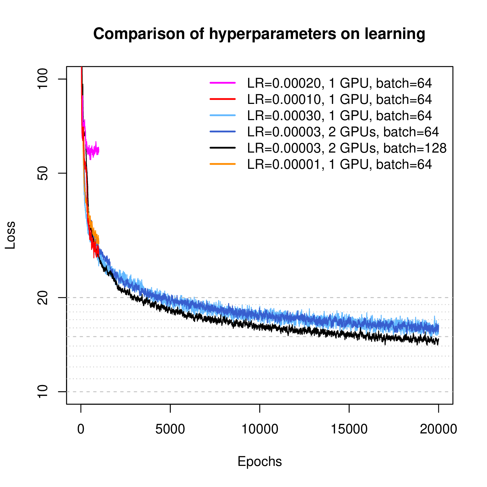
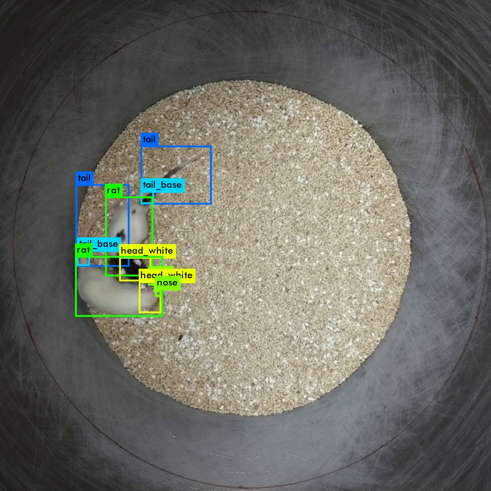
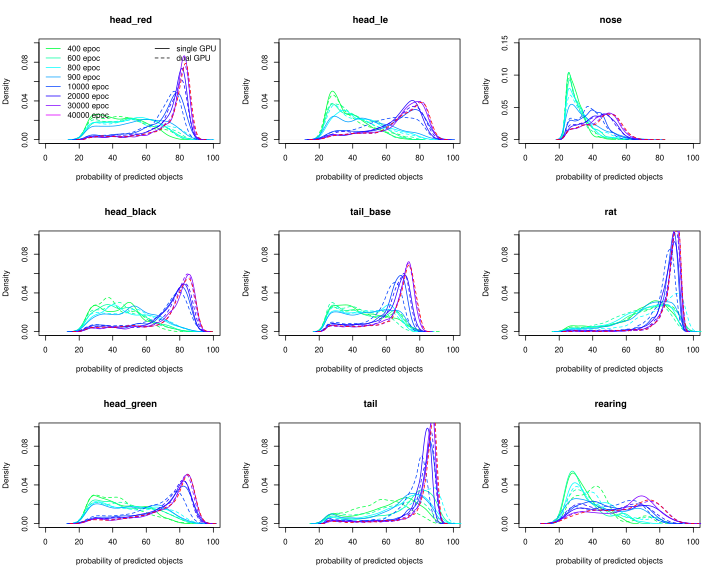

#### Anat 841 Behavior Neuroscience

# automating rodent behavior experiments 
## the DIY way  

<hr>


### **Hao Chen**, Department of Pharmacology, UTHSC

 December 11, 2018, 2:00-3:30p

https://chen42.github.io/talks/behaut.html

<small> Written using [Reveal.js](https://github.com/hakimel/reveal.js) and [markdown](https://help.github.com/categories/writing-on-github/) </small>

---

## outline

* Analysis of rodent behaviors and approaches for automation
* Know your tools  
* Example systems

---

## Typical rodent behavior experiments

* Only visual observation --> camera 
  * Open field, plus maze, object interaction, social interaction
  * Video analysis
* Measure a specific reaction --> sensor
  * Tail immersion
  * Tremor
* Operant conditioning  --> sensor + motor
  * Lever pressing
  * Nose poking
  * Licking
  * Touching

---

#### Single board computers

## Raspberry Pi Family

<a href="https://maker.pro/raspberry-pi/tutorial/how-to-get-started-with-your-first-raspberry-pi" ></a>

---

## Raspberry Pi 3B+


---

## GPIO (general purpose input-output)


* Ground (grey), 5V (pink), 3V(orange),
* GPIO (either input or output, green)
* Special I/O protocols
  *  I2C (magenta)
  *  serial (purple)
  *  SPI (blue)

---


## Operating system for the RPi

* Raspbian is the official OS 
  * graphical user interface (GUI) 
  * command line interface (CLI)
  * derived from Debian Linux
* Why you should learn some Linux commands 
  * Servers
  * Mac OS 
  * Supercomputer
  * Windows

---

## Sensors: Camera

 

---

## Sensors: Temperature 

<a href="https://pimylifeup.com/raspberry-pi-temperature-sensor/"></a>

---

## Sensors: Temperature

<a href="https://raspberrypi.stackexchange.com/questions/48357/connecting-ds18b20-temperature-sensor-with-rj45-connector">
</a>

---

## Sensors: Capacitive touch sensor

<iframe width="780" height="560" src="https://www.youtube.com/embed/Wk76UPRAVxI?start=15" frameborder="0" allow="accelerometer; autoplay; encrypted-media; gyroscope; picture-in-picture" allowfullscreen></iframe>

<a href="https://www.forbes.com/profile/limor-fried/?list=top-tech-women-america#2077af9a4ecc">America's top 50 women in tech, 2018</a>

---

## Output: Buzzer 

<a href="https://www.sunfounder.com/learn/sensor-kit-v2-0-for-raspberry-pi-b-plus/lesson-10-buzzer-module-sensor-kit-v2-0-for-b-plus.html">
 </a>

---

## Output: LED

<a href="https://thepihut.com/blogs/raspberry-pi-tutorials/27968772-turning-on-an-led-with-your-raspberry-pis-gpio-pins">

</a>

---

## Output: LCD 

<iframe width="780" height="560" src="https://www.youtube.com/embed/Fj3wq98pd20?start=30" frameborder="0" allow="accelerometer; autoplay; encrypted-media; gyroscope; picture-in-picture" allowfullscreen></iframe>

---

## Output: motor

<a href="https://projects.raspberrypi.org/en/projects/physical-computing/16">
</a>

---

## Microcontrollers

### Arduino


<a href="https://www.arduino.cc/en/Guide/Introduction"> Input-Output Coupling</a>

---

## Radio frequency ID


---

## RFID reader


---

## 3D printing

<iframe width="780" height="560" src="https://www.youtube.com/embed/ZcohRrFfmvc?start=404" frameborder="0" allow="accelerometer; autoplay; encrypted-media; gyroscope; picture-in-picture" allowfullscreen></iframe>

---

## Example 1: RFID reader
<a href="https://github.com/chen42/openbehavior/tree/master/RFID">
</a>


---

## Example 2: Environment sensor

<a href="https://github.com/chen42/openbehavior/tree/master/envSensors">


</a>


---

## Example 3: Operant Licking

<a href="https://github.com/chen42/openbehavior/blob/master/operantLicking/Assembly.md"> 
 
</a>

<a href="https://peerj.com/articles/2981/"> Peer J Article </a>

---


## Example 4. Tremor 

<a href="https://github.com/chen42/openbehavior/tree/master/ratremor">

</a>

---

## Example 6. Tail Immersion

<a href="https://github.com/chen42/openbehavior/tree/master/RFID">

</a>

---
## Example 6: Record video


---

## Example 7. Analyze social behavior

#### Use 3D printed ear tag with different colors to identify individual rats

 

---

## Social interaction between rats 

<iframe width="500" height="500" src="https://www.youtube.com/embed/mJglzLs3RNo" frameborder="0" allow="autoplay; encrypted-media" allowfullscreen></iframe>


---

## Three chamber social interaction test
<a href="https://med.stanford.edu/sbfnl/services/bm/si/three-chamber.html">

</a>

---

## Object recognition


---

## Neural Network
### Modeling one neuron 


---

## Deep Neural Network
### Fully connected


---

## Deep Neural network

### Training the network

<a href="https://theclevermachine.wordpress.com/tag/backpropagation/">


</a>


---
## Live demo of DNN

<a href="https://lecture-demo.ira.uka.de/neural-network-demo/?preset=Three%20classes%20test" target=_new ></a>

---


## Convolution


 


https://ujjwalkarn.me/2016/08/11/intuitive-explanation-convnets/

---

## Convolution as feature detector


https://ujjwalkarn.me/2016/08/11/intuitive-explanation-convnets/

---

## Deep Neural network

### ConvNet, CNN


---

## Visual example of a ConvNet

<a href="http://scs.ryerson.ca/~aharley/vis/conv/"></a>


Author: [Adam Harley](http://www.cs.cmu.edu/~aharley/)

---

## YOLO (2016)


S x S grid, each grid predict a few bounding boxes. Each bounding box has x, y, w, h, confidence, and class probability. 

---

## YOLO v3 (2018)


[towarddatascience.com](https://towardsdatascience.com/yolo-v3-object-detection-53fb7d3bfe6b)

---

## YoRodents: Labeling images


### 8093 images so far

---


## Training a custom YOLO network



```
darknet detector train rat12class.data yolo_12_class.cfg darknet19_448.conv.23 
```

---

## Detecting objects using the trained network



---

## Prediction probability of 9 classes



---

## Reconstructing behavior 

* Re-assemble bounding boxes into **individuals** based on ear tag color in python
* Slightly compress time course (30fps -> 10fps) by taking the median 
* Imput missing body parts using Amelie package in R
* Smooth the imputed data using Lowess in R 

---

## From bounding box to behavior 

* Distance and velocity 
	* Calculate distances between different objects (nose-nose, nose-anog, etc)
	* Calculate speed and direction of travel
* Social behavior
	* Nose-nose 
	* Nose-body
	* Nose-anogenital 
	* Follow 
	* Grouping (active join, passive joing, leaving) 
	* Huddle 
 
---

## Putting everything together 

<iframe width=80% height="450" src="https://www.youtube.com/embed/Lwfg2t9nXcI?start=45" frameborder="0" allow="autoplay; encrypted-media" allowfullscreen></iframe>

---

## Visualization is good for detecting errors


---

## Time course of behaviors 


---

## Mask R-CNN (2017)


---

## Summary

* Single board computers are useful for automating many rodent behavioral experiments
	* RFID chips are cheap ($1)  
	* Many types of sensors can be used. 
	* Motors or lights or tone generators can be used to provide stimulus.
* 3D printers can be used to make various parts 
* Computer programming skills are useful, for the rest of your life

---

## Hands on 

* Linux command line 
	* <a href="https://chen42.github.io/talks/linux.html"> Hao's tutorial </a> 
* Openscad
	* <a href="https://www.makeuseof.com/tag/beginners-guide-openscad-programming-3d-printed-models/">Makeuseof.com tutorial</a>
	* <a href="http://edutechwiki.unige.ch/en/OpenScad_beginners_tutorial#Primitive_Solids"> EduTech Wiki</a>
