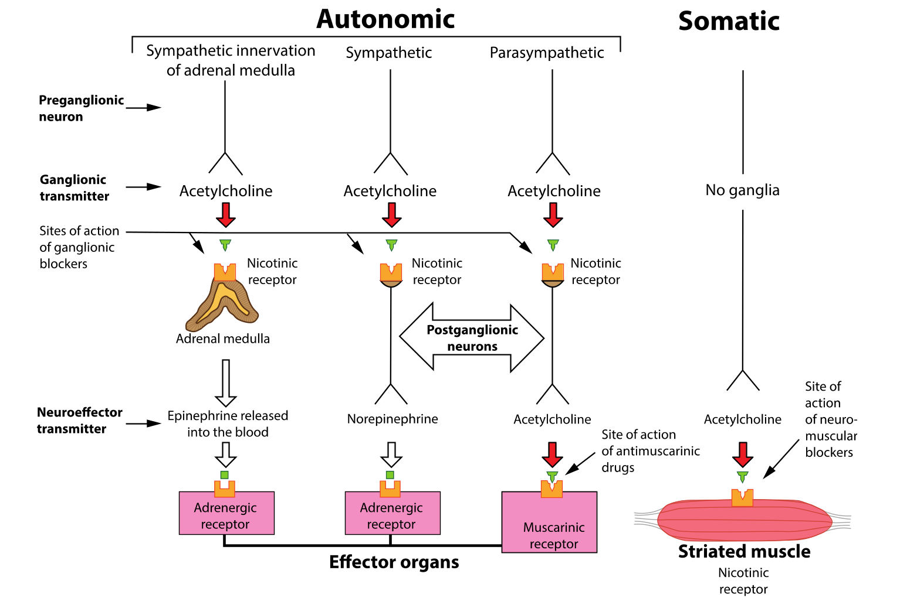

## Pharmacology 
----
# Cholinergic Agonists 
----

Dr. Hao Chen 

Dept. Pharmacology, UTHSC

hchen@uthsc.edu

URL: http://chen42.github.io/talks/cho_ag.html

Sept 1, 2017

---

## Conventions 
#### used in this document 

* Color and style theme: 
	* Drug name: <span id="drug"> Enfuvirtide</span>
	* Links: [Clinicalkey](https://www.clinicalkey.com/#!/). 
		* You need to login via your UTHSC netid when off campus to use e-textbooks. 
* Open link in a new browser tab:
```
CTRL click
```
* Navigate the slides:
```
<- or -> 
Space_bar 
Page_down or Page_up 
Home or End
```
* To zoom in or out:
``` 
CTRL + or CTRL -
CTRL mouse_wheel_up or CTRL mouse_wheel_down 
```

<small>
Written using [Reveal.js](https://github.com/hakimel/reveal.js) and [markdown](https://help.github.com/categories/writing-on-github/)
</small>


---
## Learning Objectives

* List the locations of and the differences between muscarinic and nicotinic receptors.
	* Describe the responses to activation of these receptors.
* Describe the different classes of cholinomimetic agents.
	* List and describe the rationale for contraindications of cholinergic drugs.	
* Describe the different classes of muscarinic agonists and anticholinesterases.
	* Describe the effects of accumulated acetylcholine at muscarinic and nicotinic receptors in the periphery and the central nervous system.
	* Explain the reason why anticholinesterases classified as reversible or irreversible.
---

## Learning Objectives 

* Discuss the therapeutic uses and side effects of muscarinic agonists and anticholinesterases. 
	* Explain the differences in onset and duration of action and route of administration for different groups of anticholinesterases
	* Explain why anticholinesterase agents can be used as insecticides (malathion, parathion) and chemical warfare agents (sarin, VX series).
* Describe treatment options of muscarinic or anticholinesterase poisoning.
	* Distinguish the mechanism by which pralidoxime reactivates phosphorylated AChE.
	* Explain why pralidoxime is not effective reactivating all phosphorylated AChE.  
	* Describe nicotine's agonist and antagonist properties.
	* Explain why nicotine is not used clinically (except as a smoking deterrent).

---

## Drug List (Direct agonists)

|Generic |Brand |
|---|---|
|Acetylcholine | | 
|Bethanechol |Urecholine |
|Carbachol | |
|Cevimeline |Evoxac |
|Methacholine |Provocholine |
|Nicotine | | 
|Pilocarpine |Isopto carpine |
|Varenicline |Chantix |
| | | 

---

## Drug List (Indirect agonists)

| Generic | Brand|
|---|---|
|Donepezil|Aricept|
|Echothiophate|Phospholine|
|Edrophonium|Tensilon|
|Galantamine|Reminyl|
|Neostigmine|Prostigmin|
|Physostigmine|Antilirium, Isopto Eserine|
|Pyridostigmine|Mestinon|
| | | 

---

## Drug List (Indirect agonists, other)

| Generic | Brand|
|---|---|
|Sildenafil|Viagra|
|Tadalafil| Cialis|
|Vardenafil|Levitra|
|Malathion | |
|Sarin | |
|Soman | |
|Pralidoxime | |
| | | 

---

## Outline

1. Brief review of the autonomic nervous system 
2. Direct-acting agonists
3. Indirect-acting agonists 
4. Type 5 phosphodiesterase inhibitors 

---

## Where is Acetylcholine?

 

---

## Acetylcholine

* Central nervous system 
	* Excitatory actions
	* Cortex, basal ganglia, spinal cord, many others (both nicotinic and muscarinic) 

* Peripheral nervous system 
	* Activates skeletal muscles (nicotinic) 
	* All *pregaglionic* autonomic (both parasympathetic and sypathetic) (nicotinic) 
	* All *postganglionic* <b>parasympathetic</b> and sympathetic to sweat gland and some blood vellels (muscarinic) 

---

## Major groups of cholinergic agonists 


---

## Direct-acting agonists

 Bind and activate acetylcholine receptors

* Choline esters
	* <span id="drug"> Acetylcholine Methacholine Bethanechol Carbachol </span> 
* Plant alkaloids
	* <span id="drug"> Muscarine Nicotine Pilocarpine </span> 	
* Synthetic 
	* <span id="drug"> Cevimeline Varenicline </span> 

---

## Choline esters: ADME 
<ul>
<li> poorly absorbed from the GI tract
<p>
<li> *not* distributed to the CNS 
<p>
<li> hydrolized in the GI tract, especially <span id="drug"> acetylcholine</span>. Others are more resistant.
	
<p>
<li><span id="drug"> Acetylcholine </span> and <span id="drug"> carbachol </span> activate both muscarinic and nicotinic receptors

<p>
<li><span id="drug"> Methacholine and Bethanechol </span> activates only muscarinic receptors (due to the CH3 group) but not subtype specific.
</ul>
 


---

## Plant alkaloids: ADME


---

## Choline esters: MoA 


---


## Choline esters: MoA

### Cholinergic receptors

<table><thead><tr><th> TYPE OF RECEPTOR </th><th>	PRINCIPAL LOCATIONS</th> <th>	MECHANISM OF SIGNAL TRANSDUCTION</th> <th>	EFFECTS</th></tr></thead>

<tr><td colspan=4><b>Muscarinic</b></td></tr> 			
<tr><td>M 1 (neural) </td><td>	Autonomic ganglia, presynaptic nerve terminals, and CNS 	</td><td>Increased IP 3 	</td><td>Modulation of neurotransmission</td></tr>
<tr><td>M 2 (cardiac) </td><td>	Cardiac tissue (sinoatrial and atrioventricular nodes) 	</td><td>Increased potassium efflux or decreased cAMP 	</td><td>Slowing of heart rate and conduction</td></tr>

<tr><td>M 3 (glandular) 	</td><td>Smooth muscle and glands 	</td><td>Increased IP 3 	Contraction of smooth muscles and stimulation of glandular secretions </td><td> Vascular smooth muscle 	Increased cGMP as a result of nitric oxide stimulation 	Vasodilation</td></tr>

<tr><td colspan=4><b>Nicotinic</b>	</td></tr>

<tr><td>Muscle type 	</td><td>Neuromuscular junctions </td><td>	Increased sodium influx 	</td><td>Muscle contraction </td></tr>

<tr><td>Ganglionic type </td><td>	Autonomic ganglia </td><td>	Increased sodium influx </td><td>	Neuronal excitation </td></tr>

<tr><td>CNS type 	</td><td>CNS 	</td><td>Increased sodium influx 	</td><td>Neuronal excitation
</td></tr>

</table>
<br> cAMP, cyclic adenosine monophosphate; cGMP, cyclic guanosine monophosphate; CNS, central nervous system; IP 3 , inositol triphosphate </br>

[Pharmacology 4e](https://www-clinicalkey-com.ezproxy.uthsc.edu/#!/content/book/3-s2.0-B978145570282400006X)

---


Choline esters: Organ system effects 

### Ocular effects 
<div id="left50">
<ul>
<li> Increase lacrimal glad secretions
<p>
<li> Stimulate the contraction of the iris sphincter muscle and the ciliary muscle (Miosis and accommondation) 
<p>
<li> Facilitate outflow of [aqueous humor](https://www.aao.org/eye-health/anatomy/aqueous-humor) (reduce [IOP](https://www.aao.org/bcscsnippetdetail.aspx?id=f010bbf6-3f3e-486b-b5cd-0ad86ddb9d74))
</ul>

</div>
<div id="right50">

</div>

---
Choline esters: Organ system effects 

### Cardiac effects 

* Muscarinic agonists 
	* reduces the rate of diastolic depolarization
		* reduce the heart rate
	* slow conduction of the cardiac action potential
		* increase PR interval 

---

Choline esters: Organ system effects 

### Vascular effects 

* <span id="drug"> Acetylcholine </span> typically causes vasodilation. 
	* mediated by activating muscarinic M3 receptors located in vascular endothelial cells 
		* activation of nitric oxide (NO) synthetase. 
		* NO diffuses into vascular smooth muscle cells
		* leading to vascular smooth muscle relaxation and vasodilation. 
	* endothelia cells are obligatory in the relaxation of vascular smooth muscle by ACh


[Pubmed](https://www.ncbi.nlm.nih.gov/PubMed/6253831)

---

Choline esters: Organ system effects 

### Respiratory Tract Effects 

* Muscarinic agonists
	* increases bronchial muscle contraction
	* causes an increase in the secretion of mucus throughout the respiratory tract. 
	* contra-indicated in patients with asthma and other forms of obstructive lung disease. 

---


Choline esters: Organ system effects 

### Gastrointestinal and Urinary Tract Effects 
* Muscarinic receptor agonists
	* stimulate salivary, gastric, and other secretions in the gastrointestinal tract.
	* 	increase contraction of GI smooth muscle (except sphincters)
		* 	by stimulating the enteric nervous system
	* increases gastrointestinal motility. 
	---
	* stimulate the [bladder detrusor muscle](http://img.medscapestatic.com/pi/meds/ckb/21/12721.jpg), they *relax* the internal sphincter of the bladder 
	* promote emptying of the bladder (micturition). 
	* higher doses produce excessive salivation and cause diarrhea, intestinal cramps, and urinary incontinence (the "all faucets turned on" syndrome). 

---

Cholinomimetics

### Acetylcholine

* Indications
	* Limited clinical appliation
		* limited absorption, short duration of action, and lack of receptor specificity
	* Cataract or other ophthalmic surgery (to produce complete miosis)		
	* diagnostic coronary angiography
		* Ach normally induces vasodilation but the opposite is seen in patients with vasospatic angina pectoris. 

---

Cholinomimetics

### Bethanechol and Carbachol 

* Indications 
	* <span id="drug"> Bethanechol </span> 
		* selective for muscarinic receptor. 
		* stimulate bladder or GI muscle
		* without significantly affect heart rate or blood pressure
	* <span id="drug"> Carbachol </span> 
		* intraocular application (similar to Ach)
---

Cholinomimetics

### Muscarine and nicotine

* Muscarine is found in mushrooms
	* No current medical use
* Nicotine is found in tabacco leaves
	* Availalbe as smoking cessation aid.

---


Cholinomimetics


### Pilocarpine
<div id="left50">
<ul>
<li> Alkaloid from a small shrub
<li> Indication 
	<ul>
		<li> 2nd line drug for chronic open angle glaucoma 
		<li> well absorbed after ocular application
	</ul>
	<ul> <li> acute angle-closure glaucoma, which is a medical emergency 
		</ul>
		</ul>
</div>	
<div id="right50">


</div>

---


Cholinomimetics

### Synthetic agonists

* <span id="drug"> Cevimeline </span> 
	* oral drug treat dry mouth
		* [Sjogren syndrome](https://www.clinicalkey.com/#!/content/medical_topic/21-s2.0-1014950), an autoimmune disease
		* radiation therapy for head and neck cancer
	* adverse effect 
		* increased sweating, nausea, visual disturbances (drug induced miosis) 

* <span id="drug"> Varenicline </span> 
	* partial agonist of on several CNS nicotinic receptor subtypes 
	* smoking cessation aid

---

## Indirect-acting agonists


---

## Indirect-acting agonists: ADME

* <span id="drug"> Neostigmine </span> 
	* poor absorption from conjunctiva, skin, gut, or lung.
	* negligible CNS effects
* <span id="drug"> Physostigmine </span> 
	* well sbsorbed
	* topical application in the eye
	* penetrates BBB
		* CNS side effects
* <span id="drug"> parathion, malathion</span> 
	* converted in the body to the oxygen analos. 
	* thiophosphate insecticides
	* well absorbed from skin, lung, gut
	* distributed to all parts of the body
* <span id="drug"> Echothiophate </span> 
	* long duration and stable in aqueous solution
* <span id="drug"> Sarin </span> 
	* "nerve gas"


---


## Indirect-acting agonists: MoA

* electrostatically bind to AchE 
	* Quaternary alcohols, e.g, <span id="drug"> Edrophonium </span> 
	* 2-10 min
* convalantly bind to AchE 
	* icaramate esters, e.g., <span id="drug"> Neostigmine Physostigmine </span> 
	* 30 min - 6 h 
* form covalant phosphorus-enzyme bond 
	* organophosphates, e.g., <span id="drug"> Echothiophate Malathion </span> 
	* hundreds of hours
	* <b>Aging</b> refers to the breaking of one oxygen-phosphorus bounds
		* further strengthens the phosphorus-enzyme bond
		* occurs within 10 min for <span id="drug"> [soman](https://en.wikipedia.org/wiki/Soman) </span> , but 48 h later for <span id="drug"> [VX](https://en.wikipedia.org/wiki/VX_%28nerve_agent%29) </span> ; 
		* cholinesterase regenerator (e.g., <span id="drug"> pralidoxime </span> ) is more effective before aging occurs

---

Indirect-acting agonists: Organ system effects

### CNS

* lipid-soluable AchE inhibitors 
	* low concentration: subjective alerting response
	* high concentration: generalized convulsions, coma, respiratory arrest


---

Indirect-acting agonists: Organ system effects

### Eye, respiratory, GI, uninary 

* Similar to the direct acting cholinomimetics


---

Indirect-acting agonists: Organ system effects

### Cadiovascular system 

* increase activity in both sympathetic and parasympathetic limbs, but net effect is modest bradycardia, a fall in cardiac output
* heart
	* parasympathetic effect predominate
	* mimic vagal activation 
* vascular smooth muscle
	* minimal effect (lack cholinergic innervation)

---

Indirect-acting agonists: Organ system effects

### Neuromuscular junction 

* low (therapeutic) concentration prolong and intensity the actions of physiologically released ACh
	* increase the strength of contraction
		* mulcles weakened by <span id="drug"> curare </span> 
		* [myasthenia gravis](https://www.clinicalkey.com/#!/content/medical_topic/21-s2.0-1014472)
			* autoimmune disease against nicotinic ACh recepotors (nAChR)
			* most offen affect face, throat and neck

* high concentration results in fibrillation of muscle fibers 

---

Reversible Cholinesterase Inhibitors

### Edrophonium
* ADME and MoA
	* rapidly increase ACh concentration at somatic neuromuscular junction
	* not a substrate of AChE 
	* it is a positively charged alcohol, reversibly binds to a negatively charged site on AChE 
	* rapid renal excretion, short duration of action (~ 10 min)
* Indications
	* initial diagnosis of [myasthenia gravis](https://www.clinicalkey.com/#!/content/medical_topic/21-s2.0-1014472)
	* distinguish undertreatment (*Myasthenia crisis*) vs over treatment (*cholinergic crisis*) 
		* over treatment causes muscle weakness due to depolarization blockade 
		* edrophonium improves *Myasthenia crisis* and exacerbates *cholinergic crisis* 

---

Reversible Cholinesterase Inhibitors

### Neostigmine, Physostigmine, Pyridostigmine

* ADME and MoA
	* substrate of AChE, compete with ACh 
	* <span id="drug"> Neostigmine</span>
		* plant alkaloid, well absorbed from the gut, penetrates the blood-brain barrier
	* <span id="drug"> Physostigmine, Pyridostigmine</span> 
		* synthetic, less well absorbed from the gut, do not penetrate the blood-brain barrier
* Indications
	* long-term treatment of myasthenia gravis
	* post-surgery recovery from muscle relaxation
	* <span id="drug"> atropine </span> overdoe


---


Quasi-reversible Cholinesterase Inhibitors

### Echothiophate Malathion 

* ADME and MoA
	* esters of phosphoric acid 
	* lipid soluable, well absorbed
	* tight convalant bond with the catalytic site of AChE
	* reproduce all the effects of muscarinic receptor activation
* Indications
	* <span id="drug"> Echothiophate </span> 
		* glaucoma not responding to other treatments, provide 24 h control of intraocular pressure 
		* strabismus ([Accommodative esotropia](https://en.wikipedia.org/wiki/Esotropia#Accommodative_esotropia) ) 
	* <span id="drug"> Malathion </span> 
		* pesticide
		* head lice (pediculosis capitis)
###  Organophosphate poisoning
* <span id="drug"> pralidoxime </span> regenerates AChE
* it binds to the AChE and displaces organophosphate
* administer as soon as possible, before *aging* occurs
* often used with <span id="drug"> atropine </span> 

---

Type 5 phosphodiesterase inhibitors

### <span id="drug"> Sildenafil Tadalafil Vardenafil </span> 

<div id="left50">
<b> MoA</b>
<ul>
	<li> potentiate the vasodilation effect of ACh
	<li> ACh -> M3 (Endothelia cell) -> NO -> cGMP (smooth muscle cell) -> cGMP breakdown by 5-PDE 
	<li> last step is inhibited by these drugs thus extend vasodilation 
</ul>
</div>
<div id="right50">
	
<a href="http://www.nature.com/nrd/journal/v5/n8/full/nrd2030.html"> Nature Reviews Drug Discovery 5, 689-702 2006</a>
</div>

---


Type 5 phosphodiesterase inhibitors

### <span id="drug"> Sildenafil Tadalafil Vardenafil </span> 
* ADME
	* rapidly absorbed after oral administration 
	* the absorbed of <span id="drug"> sildenafil </span> is reduced by high-fat meal. <span id="drug"> Tadalafil Vardenafil </span> are not.
	* onset of action is 30-60 min
	* metablized by cyotochrome P450 3A4, half-life 4-6 h 
		* should not take more than one dose
* Indications 
	* <span id="drug"> Sildenafil </span> and <span id="drug"> Vardenafil</span>: erectile dysfunction 
	* <span id="drug">  Tadalafil</span>:  benign prostatic hyperplasia,  pulmonary arterial hypertension
* adverse effects and interactions  
	* headache, nasal congestion, and visual disturbances
	* concurrent use with nitroglycerin cause profound hypotension. 
	* CYP3A4 inhibitors increase the level of the drug (reduce dose for patients taking these inhibitors)

---

## Properties and Clinical Uses of Cholinesterase Inhibitors and Phosphodiesterase Inhibitors 
<table><thead>
<tr><td>DRUG </td><td>ROUTE OF ADMINISTRATION </td><td>DURATION OF ACTION </td><td>CLINICAL USE</td></tr>
<tr><td colspan=4><b>Cholinesterase Inhibitors</b></td></tr></td></tr>
<tr><td>Donepezil </td><td>Oral </td><td>24 hr </td><td>Alzheimer disease</td></tr>
<tr><td>Edrophonium </td><td>Intravenous </td><td>10 min </td><td>Myasthenia gravis (diagnosis)</td></tr>
<tr><td>Neostigmine </td><td>Oral, subcutaneous, or intramuscular </td><td>2-4 hr </td><td>Myasthenia gravis; postoperative urinary retention</td></tr>
<tr><td></td><td>Intravenous </td><td>2-5 min </td><td>Reversal of curariform drug effects</td></tr>
<tr><td>Physostigmine </td><td>Intramuscular or intravenous </td><td>1-5 hr </td><td>Reversal of central nervous system effects of antimuscarinic drugs</td></tr>
<tr><td>Pyridostigmine </td><td>Oral </td><td>3-6 hr </td><td>Myasthenia gravis</td></tr>
<tr><td></td><td>Intramuscular or intravenous </td><td>2-5 min (IV); 15 min (IM) </td><td>Reversal of curariform drug effects</td></tr>
<tr><td>Echothiophate </td><td>Topical ocular </td><td>1 wk or more </td><td>Glaucoma and <a href="https://en.wikipedia.org/wiki/Esotropia#Accommodative_esotropia">accommodative esotropia</a></td></tr>
<tr><td>Malathion </td><td>Topical </td><td></td><td>Pediculosis (lice)</td></tr>
<tr><td colspan=4><b>Phosphodiesterase Inhibitors </b> </td></tr>
<tr><td>Sildenafil </td><td>Oral </td><td>4-6 hr </td><td>Erectile dysfunction, pulmonary arterial hypertension</td></tr>
<tr><td>Tadalafil </td><td>Oral </td><td>36 hr </td><td>Erectile dysfunction, benign prostatic hyperplasia, pulmonary arterial hypertension</td></tr>
<tr><td>Vardenafil </td><td>Oral </td><td>4-6 hr </td><td>Erectile dysfunction </td></tr>
</table>

[Pharmacology 4e](https://www-clinicalkey-com.ezproxy.uthsc.edu/#!/content/book/3-s2.0-B978145570282400006X)

---

## Summary 

* The direct-acting acetylcholine receptor agonists include choline esters (e.g., [bethanechol](#/22)) and plant alkaloids (e.g., [pilocarpine](#/24)). <span id="drug"> Pilocarpine </span>  is used to treat glaucoma and dry mouth.
* The cholinesterase inhibitors indirectly activate acetylcholine receptors by increasing the synaptic concentration of acetylcholine. These drugs have both parasympathomimetic and somatic nervous system effects.
* The reversible cholinesterase inhibitors include [edrophonium](#/33), which is used to diagnose myasthenia gravis, and [neostigmine and pyridostigmine](#/34) , which are used to treat myasthenia gravis.
* The quasi-reversible cholinesterase inhibitors are organophosphate compounds that are widely used as pesticides and less commonly used in medical therapy. [Echothiophate](#/35) can be used to treat ocular conditions, whereas [malathion](#/35) is used to treat pediculosis.
* Organophosphate toxicity is treated with atropine and a cholinesterase regenerator called [pralidoxime](#/35).
* [Sildenafil](#/36) and related drugs inhibit the degradation of cGMP by 5-PDE and thereby potentiate the vasodilative action of nitric oxide in the penis and other tissues. These drugs are used to treat male erectile dysfunction. 

[Pharmacology 4e](https://www-clinicalkey-com.ezproxy.uthsc.edu/#!/content/book/3-s2.0-B978145570282400006X)


