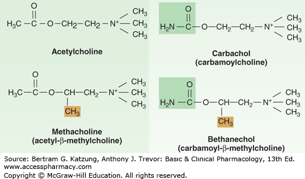
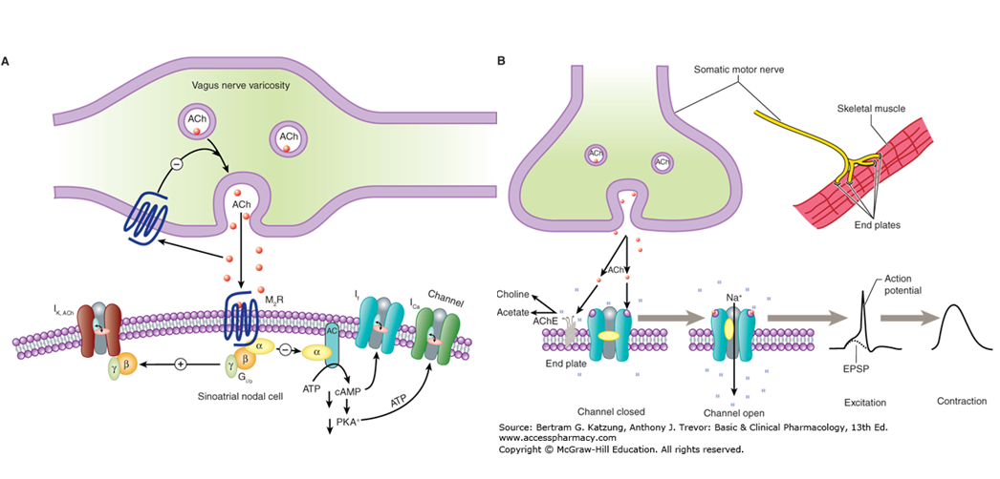
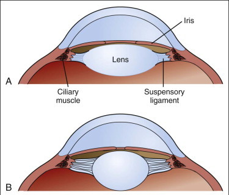
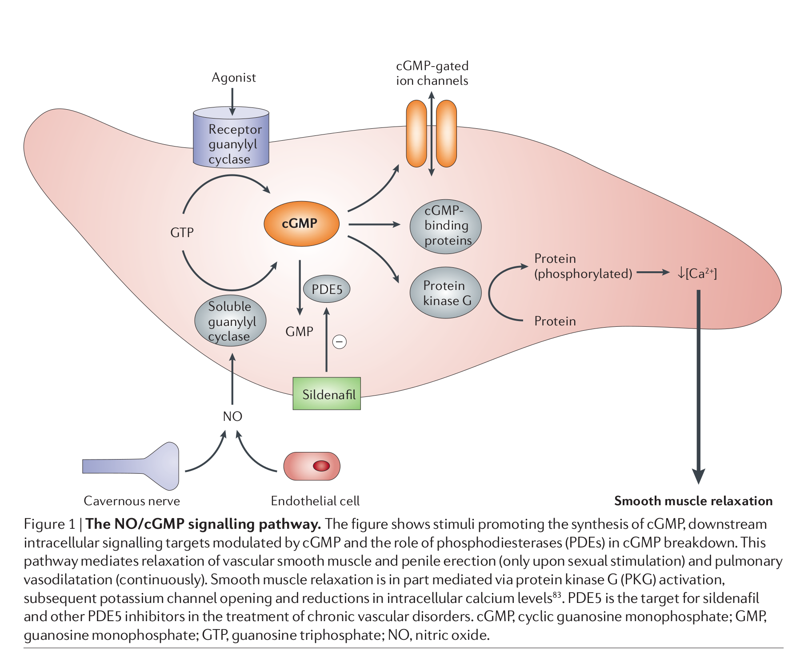

## Pharmacology 
----
# Cholinergic Agonists 
----

Dr. Hao Chen 

Dept. Pharmacology, UTHSC

hchen@uthsc.edu

URL: http://chen42.github.io/talks/cho_ag.html

Aug 17, 2018 1 - 2 PM

---

## Conventions 
#### used in this document 

* Color and style theme: 
	* Drug name: <span id="drug"> Enfuvirtide</span>
	* Links: [Clinicalkey](https://www.clinicalkey.com/#!/). 
		* You need to login via your UTHSC netid when off campus to use e-textbooks. 
		* [VPN](http://uthsc.edu/vpn/index.php) provides a better experience. 
	* [Printable](http://chen42.github.io/talks/cho_ag.html?print-pdf#/) version 
* Open link in a new browser tab:
```
CTRL click
```
* Navigate the slides:
```
<- or -> 
Space_bar 
Page_down or Page_up 
Home or End
```
* To zoom in or out:
``` 
CTRL + or CTRL -
CTRL mouse_wheel_up or CTRL mouse_wheel_down 
```

<small>
Written using [Reveal.js](https://github.com/hakimel/reveal.js) and [markdown](https://help.github.com/categories/writing-on-github/)
</small>


---

## Textbook chapters used 

#### [Cholinoceptor-Activating & Cholinesterase-Inhibiting Drugs](http://accessmedicine.mhmedical.com/content.aspx?bookid=1193&sectionid=69104334#1104841667) 

Katzung and Trevor, Basic & Clinical Pharmacology, 13e

#### [Peripheral Neuropharmacology and Acetylcholine Agonists](https://www.clinicalkey.com/#!/content/book/3-s2.0-B9780323391665000062)

Brenner and Stevens, Pharmacology, 5e. 

---
## Learning Objectives

* List the locations of and the differences between muscarinic and nicotinic receptors.
 * Describe the responses to activation of these receptors.
* Describe the different classes of cholinomimetic agents.
 * List and describe the rationale for contraindications of cholinergic drugs. 
* Describe the different classes of muscarinic agonists and anticholinesterases.
 * Describe the effects of accumulated acetylcholine at muscarinic and nicotinic receptors in the periphery and the central nervous system.
 * Explain the reason why anticholinesterases classified as reversible or irreversible.
---

## Learning Objectives 

* Discuss the therapeutic uses and side effects of muscarinic agonists and anticholinesterases. 
 * Explain the differences in onset and duration of action and route of administration for different groups of anticholinesterases
 * Explain why anticholinesterase agents can be used as insecticides (malathion, parathion) and chemical warfare agents (sarin, VX series).
* Describe treatment options of muscarinic or anticholinesterase poisoning.
 * Describe the mechanism by which pralidoxime reactivates phosphorylated AChE.
 * Explain why pralidoxime is not effective reactivating all phosphorylated AChE. 
* Describe nicotine's agonist and antagonist properties.
 * Explain why nicotine is not used clinically (except as a smoking cessation aid).

---

## Drug List (Direct agonists)

|Generic |Brand |
|---|---|
|Acetylcholine | | 
|Bethanechol |Urecholine |
|Carbachol | |
|Cevimeline |Evoxac |
|Methacholine |Provocholine |
|Nicotine | | 
|Pilocarpine |Isopto carpine |
|Varenicline |Chantix |

---

## Drug List (Indirect agonists)

| Generic | Brand|
|---|---|
|Donepezil|Aricept|
|Echothiophate|Phospholine|
|Edrophonium|Tensilon|
|Galantamine|Reminyl|
|Neostigmine|Prostigmin|
|Physostigmine|Antilirium, Isopto Eserine|
|Pyridostigmine|Mestinon|

---

## Drug List (Indirect agonists, other)

| Generic | Brand|
|---|---|
|Sildenafil|Viagra|
|Tadalafil| Cialis|
|Vardenafil|Levitra|
|Malathion | |
|Sarin | |
|Soman | |
|Pralidoxime | |

---

## Outline

1. Brief review of the autonomic nervous system 
2. Direct-acting agonists
3. Indirect-acting agonists 
4. Type 5 phosphodiesterase inhibitors 

---

## Site of action for cholinergic agonists


//  Function: Fight or Flight vs Rest and Digest 

---


## Autonomic system 


// sweat glands

---

## Acetylcholine

* Central nervous system 
 * Excitatory actions
 * Cortex, basal ganglia, spinal cord, many others (both nicotinic and muscarinic) 

* Peripheral nervous system 
 * Activates skeletal muscles (nicotinic) 
 * All *pregaglionic* autonomic (both parasympathetic and sympathetic) (nicotinic) 
 * All *postganglionic* **parasympathetic** and <u>sympathetic</u> to sweat gland and some blood vessels (muscarinic) 

---

## Major groups of cholinergic agonists 

<a href="http://accessmedicine.mhmedical.com/content.aspx?bookid=1193&sectionid=69104334#1104841667"></a>

* Direct vs Indirect 
* Cholinergic agonist --think-> Parasympathetic activation

// direct vs indirect uses the receptor as the reference point
Check the diagram for agonist = parasympathetic  (not sympathetic)

---

## Direct-acting agonists


<b>cholinomimetics</b> 

Bind and activate acetylcholine receptors (think muscarinic)

* Choline esters
 * <span id="drug"> Acetylcholine Methacholine Bethanechol Carbachol </span> 
* Plant alkaloids
 * <span id="drug"> Muscarine Nicotine Pilocarpine </span> 
* Synthetic 
 * <span id="drug"> Cevimeline Varenicline </span> 

---

## Cholinomimetics: ADME 
* they are hydrolized in the GI tract, especially <span id="drug"> acetylcholine</span>. Others are more resistant.
* poorly absorbed from the GI tract
* choline esters are *not* distributed to the CNS 
* <span id="drug"> Acetylcholine </span> and <span id="drug"> carbachol </span> activate both muscarinic and nicotinic receptors
* <span id="drug"> Methacholine </span> and <span id="drug"> Bethanechol </span> activates only muscarinic receptors (due to the CH3 group) but are not subtype-specific.
 




---

## Cholinomimetics: ADME


---

## Cholinomimetics: MoA 


<small>
<b>Muscarinic and nicotinic signaling. A:</b> Muscarinic transmission to the sinoatrial node in heart. Acetylcholine (ACh) released from a varicosity of a postganglionic cholinergic axon interacts with a sinoatrial node cell muscarinic receptor (M2R) linked via Gi/o to K+ channel opening, which causes hyperpolarization, and to inhibition of cAMP synthesis. Released ACh also acts on an axonal muscarinic receptor (autoreceptor) to cause inhibition of ACh release (autoinhibition). B: Nicotinic transmission at the skeletal neuromuscular junction. ACh released from the motor nerve terminal interacts with subunits of the pentameric nicotinic receptor to open it, allowing Na+ influx to produce an excitatory postsynaptic potential (EPSP). The EPSP depolarizes the muscle membrane, generating an action potential, and triggering contraction. Acetylcholinesterase (AChE) in the extracellular matrix hydrolyzes ACh. See [textbook](https://accessmedicine.mhmedical.com/content.aspx?bookid=1193&sectionid=69104334#kat13_ch7fg4) for more details.
</small>


---


## Cholinomimetics: MoA 

### Cholinergic receptors

<table><thead><tr><th> TYPE OF RECEPTOR </th><th> <font color="yellow">PRINCIPAL</font> LOCATIONS</th> <th> MECHANISM OF SIGNAL TRANSDUCTION</th> <th> EFFECTS</th></tr></thead>

<tr><td colspan=4><b>Muscarinic</b></td></tr> 
<tr><td>M 1 </td><td> Autonomic ganglia, presynaptic nerve terminals, and CNS </td><td>Increased IP 3 </td><td>Modulation of neurotransmission</td></tr>
<tr><td>M 2 </td><td> Cardiac tissue (sinoatrial and atrioventricular nodes) </td><td>Increased potassium efflux or decreased cAMP </td><td>Slowing of heart rate and conduction</td></tr>

<tr><td>M 3 </td><td>Smooth muscle and glands </td><td>Increased IP 3 Contraction of smooth muscles and stimulation of glandular secretions </td><td> Vascular smooth muscle Increased cGMP as a result of nitric oxide stimulation Vasodilation</td></tr>

<tr><td colspan=4><b>Nicotinic</b> </td></tr>

<tr><td>Muscle type </td><td>Neuromuscular junctions </td><td> Increased sodium influx </td><td>Muscle contraction </td></tr>

<tr><td>Ganglionic type </td><td> Autonomic ganglia </td><td> Increased sodium influx </td><td> Neuronal excitation </td></tr>

<tr><td>CNS type </td><td>CNS </td><td>Increased sodium influx </td><td>Neuronal excitation
</td></tr>

</table>
<br> cAMP, cyclic adenosine monophosphate; cGMP, cyclic guanosine monophosphate; CNS, central nervous system; IP 3 , inositol triphosphate </br>
</a>

[Pharmacology 5e](https://www.clinicalkey.com/#!/content/book/3-s2.0-B9780323391665000062?scrollTo=%23t0015) Table 6.2

// important to remember the location of the subtypes and their effects

---
<section id="eye">
Cholinomimetics: Organ system effects 

### Ocular effects 
<table><tr><td width=50%>
<ul>
<li> Increase lacrimal gland secretions
<li> Stimulate the contraction of the iris sphincter muscle and the ciliary muscle ([Miosis](http://www.e-safe-anaesthesia.org/sessions/15_05/gif/ana_1_011_autonomic_nervous_system_08_t1_01_med.gif) and [accommondation](https://www.clinicalkey.com/#!/content/book/3-s2.0-B9780702055546000046?scrollTo=%23hl0002638))
<li> Facilitate outflow of [aqueous humor](https://openclipart.org/image/2400px/svg_to_png/276637/aqueous-humor.png) ([more info](https://www.aao.org/bcscsnippetdetail.aspx?id=591e80ab-e372-4ad3-9c49-1aed4ba74f61)) and reduce [intraocular pressue, IOP](https://www.aao.org/bcscsnippetdetail.aspx?id=f010bbf6-3f3e-486b-b5cd-0ad86ddb9d74)
</ul>
</td><td width=50%>

<br>
suspensory ligment = zonule
</td></table>

// Miosis is excessive contraction of the pupil (to close the eye)

In humans, relaxation of the zonule is induced by contraction of the ciliary muscle, which moves forward, thereby allowing the lens to adopt a more spherical shape owing to the elasticity of the lens capsule

---
<section id='vascular'>
Cholinomimetics: Organ system effects 

### Vascular effects 

* <span id="drug"> Acetylcholine </span> *typically* causes vasodilation. 
	* mediated by activating muscarinic M3 receptors located in vascular [endothelial cells](http://www.lab.anhb.uwa.edu.au/mb140/corepages/vascular/Images/VesWall.jpg) 
		* activation of nitric oxide (NO) synthetase. 
		* NO diffuses into vascular smooth muscle cells
		* leading to vascular smooth muscle relaxation and vasodilation. 
	* endothelia cells are obligatory in the relaxation of vascular smooth muscle by ACh
	* coronary arteriolar response to ACh the same way. *If the endothelium is damaged by atherosclerosis, ACh causes vasoconstriction* by activating the smooth muscle cells directly. 


<br>
[Nature. 1980 Nov 27;288:373-6.](https://www.ncbi.nlm.nih.gov/PubMed/6253831)

// NA; noradrenaline, Ach, Wash, drug addiction and cummulative concentration with flow.
direct effect of Ach on vascular smoothe muscle is contraction

the endothelium contains the enzymes necessary to synthesize, store and breakdown ACh.  flow‐mediated endothelial calcium responses arise from the autocrine action of non‐neuronal ACh released by the endothelium. [link](https://www.ncbi.nlm.nih.gov/pmc/articles/PMC5157078/)  

---

<section id="cardiac">

Cholinomimetics: Organ system effects 

### Cardiac effects 


* Muscarinic agonists 
	* i.v. muscarinic agonist effect: 
		* low dose ACh cause vasodilation, reduces blood pressure, often accompanied by a reflex increasing in heart rate (<b>homeostatic reflex</b>)
		* high dose ACh cause bradycardia, decrease atrioventricular node conduction velocity, hypotension

//  parasympathetic, relaxation and digest

---

<section id='respiratory'>

Cholinomimetics: Organ system effects 

### Respiratory Tract Effects 

* Muscarinic agonists
 * increases bronchial muscle contraction
 * causes an increase in the secretion of mucus throughout the respiratory tract. 
 * contra-indicated in patients with asthma and other forms of obstructive lung disease. 

// M3 receptor 

---

<section id="urinary">

Cholinomimetics: Organ system effects 

### Gastrointestinal / Urinary Tract Effects 
* Muscarinic receptor agonists
	*	stimulate salivary, gastric, and other secretions in the gastrointestinal tract.
	*	 increase contraction of GI smooth muscle (except sphincters)
		* by stimulating the enteric nervous system
	*	increases gastrointestinal motility. 
	---
	*	*stimulate* the [bladder detrusor muscle](http://img.medscapestatic.com/pi/meds/ckb/21/12721.jpg), *relax* the internal sphincter of the bladder 
	*	promote emptying of the bladder (micturition). 
	---
	*	higher doses produce excessive salivation and cause diarrhea, intestinal cramps, and urinary incontinence (the "all faucets turned on" syndrome). 

---

Cholinomimetics: choline esters

### Acetylcholine

* Indications
	* Limited clinical applications
		* limited absorption, short duration of action, and lack of receptor specificity
	* Cataract or other ophthalmic surgery (to produce complete miosis) 
	* diagnostic coronary angiography, especially in patients with nearly normal coronary angiograms
		* Ach normally induces vasodilation, but the opposite is seen in patients with [vasospastic angina](https://www.clinicalkey.com/#!/content/book/3-s2.0-B9781455750177000714?scrollTo=%23hl0001437), also called variant angina or Prinzmetal's Angina. 

		---
		[about angina](https://www.mayoclinic.org/diseases-conditions/angina/symptoms-causes/syc-20369373) 

// short duration drugs are good for diagnosis
Vaospastic angina is defined as ≥90% narrowing of the epicardial coronary arteries on an angiography during the test

---


Cholinomimetics: choline esters

### Bethanechol and Carbachol 

* Indications 
	* <span id="drug"> Bethanechol </span> 
		* selective for muscarinic receptor. 
		* stimulate bladder or GI muscle
		* without significantly affect heart rate or blood pressure
	*	<span id="drug"> Carbachol </span> 
		* intraocular application (similar to Ach)
---

Cholinomimetics:	plant alkaloids


###	Muscarine and nicotine

*	Muscarine is found in mushrooms
	* No current medical use
*	Nicotine is found in tobacco leaves
	* Available as smoking cessation aid.

---

Cholinomimetics: plant alkaloids

### Pilocarpine <font color="blue">Salagen</font>
<table><tr>

<td valign="middle">
<ul>
 <li> Alkaloid from a small shrub, first isolated in 1874
 <li> Indications 
 <ul> <li> 2nd line drug for chronic open-angle [glaucoma](http://www.ilovegrowingmarijuana.com/wp-content/upload_folders/ilovegrowingmarijuana.com/2017/02/What-is-Glaucoma.jpg) ([WHO Essential Medicines](http://www.who.int/medicines/publications/essentialmedicines/en/)) 
 <ul><li> contract iris and ciliary muscle, open the angle </ul>
 <li> well absorbed after ocular application
 <li> Dry mouth	
 	<ul><li>[Sjogren's syndrome](https://www.clinicalkey.com/#!/content/medical_topic/21-s2.0-1014950), an autoimmune disease 
	<li>Xerostomia after radiotherapy.
	</ul>
 </ul>
 
 <li> Salagen was sometimes confused with <font color="grey"> Selegiline </font>, a drug for Parkinson's disease
 </ul>
</td>
<td> 
<br>
open vs close angle glaucoma
</td>

</tr>
</table>

// pronounced as showgrins

zerostoma (stoma: openning, mouth)

first line glaucoma treatment: beta-blocker or prostaglandin analog 

---


Cholinomimetics: synthetic agonists

### Cevimeline, Varenicline 

* <span id="drug"> Cevimeline </span> 
	* oral drug treat dry mouth
		* [Sjogren syndrome](https://www.clinicalkey.com/#!/content/medical_topic/21-s2.0-1014950), an autoimmune disease against glands that make tears and saliva
		* Xerostomia following radiation therapy for head and neck cancer
	*	adverse effect 
		* increased sweating, nausea, visual disturbances (drug induced miosis) 

*	<span	id="drug"> Varenicline </span> 
	*	partial agonist of on several CNS nicotinic receptor subtypes 
	*	blocks nAChR from nicotine
	* smoking cessation aid

---

### Properties and Clinical Uses of Direct-Acting Acetylcholine Receptor Agonists

<table>
<thead><tr><th>DRUG </th><th>RECEPTOR SPECIFICITY </th><th>HYDROLYZED BY CHOLINESTERASE </th><th>ROUTE OF ADMINISTRATION </th><th>CLINICAL USE</th></tr>
<tr><td colspan=5><b>Choline Esters</b> </td></tr>
<tr><td>Acetylcholine </td><td>Muscarinic and nicotinic </td><td>Yes </td><td>Intraocular </td><td>Miosis during ophthalmic surgery</td></tr>
<tr><td></td><td></td><td></td><td>Intracoronary </td><td>Coronary angiography</td></tr>
<tr><td>Bethanechol </td><td>Muscarinic </td><td>No </td><td>Oral or subcutaneous </td><td>Gastrointestinal and urinary stimulation</td></tr>
<tr><td>Carbachol </td><td>Muscarinic and nicotinic </td><td>No </td><td>Intraocular </td><td>Miosis during ophthalmic surgery</td></tr>
<tr><td colspan=5><b> Plant Alkaloids</b> </td></tr>
<tr><td>Muscarine </td><td>Muscarinic </td><td>No </td><td>None </td><td>None</td></tr>
<tr><td>Nicotine </td><td>Nicotinic </td><td>No </td><td>Oral or transdermal </td><td>Smoking cessation programs</td></tr>
<tr><td>Pilocarpine </td><td>Muscarinic </td><td>No </td><td>Topical ocular </td><td>Glaucoma</td></tr>
<tr><td></td><td></td><td></td><td>Oral </td><td>Xerostomia</td></tr>
<tr><td colspan=5><b>Other Drugs</b> </td></tr>
<tr><td>Cevimeline </td><td>Muscarinic </td><td>No </td><td>Oral </td><td>Xerostomia</td></tr>
<tr><td>Varenicline </td><td>Nicotinic </td><td>No </td><td>Oral </td><td>Smoking cessation </td></tr>
</table>
---


## Indirect-acting agonists


<small>Cholinesterase inhibitors. Neostigmine exemplifies the typical ester composed of carbamic acid ([1]) and a phenol bearing a quaternary ammonium group ([2]). Physostigmine, a naturally occurring carbamate, is a tertiary amine. Edrophonium is not an ester but binds to the active site of the enzyme. Carbaryl is used as an insecticide. See [textbook](https://accessmedicine.mhmedical.com/content.aspx?bookid=1193&sectionid=69104334#1104841671) Figure 7-6 for details </small>

---


## Indirect-acting agonists: MoA

*	electrostatically bind to AchE 
	* <span id="drug"> Edrophonium </span> 
	* rapid onset (1-2 min), short duration (2-10 min)
*	convalantly bind to AchE 
	* <span id="drug"> Neostigmine Physostigmine </span> 
	* duration: 30 min - 6 h 
*	form covalant phosphorus-enzyme bond 
	* <span id="drug"> Echothiophate Malathion </span> 
	* duration: hundreds of hours
	* <b>Aging</b> refers to the breaking of one oxygen-phosphorus bonds
		* further strengthens the phosphorus-AChE bond
		* occurs within 10 min for <span id="drug"> [soman](https://en.wikipedia.org/wiki/Soman) </span>, but 48 h later for <span id="drug"> [VX](https://en.wikipedia.org/wiki/VX_%28nerve_agent%29) </span> ; 
		* cholinesterase regenerator (e.g., <span id="drug"> pralidoxime </span> ) is more effective before aging occurs

// chocolate, refregirator, praline, aging

---

<section id="cns">

Indirect-acting	agonists: Organ system effects

###	CNS

*	lipid-soluable AchE inhibitors 
	* low concentration: subjective alerting response
	* high concentration: generalized convulsions, coma, respiratory arrest

---

Indirect-acting agonists: Organ system effects

### Eye, respiratory, GI, urinary 

* Similar to the direct acting cholinomimetics

---

<section id='vaspara'>

Indirect-acting agonists: Organ system effects

### Cadiovascular system 

* increase activity in both sympathetic and parasympathetic limbs, but net effect is modest bradycardia, a fall in cardiac output
* heart
	* parasympathetic effect predominate
	* mimic vagal activation 
*	vascular smooth muscle
	* minimal effect 
	* most blood vessels in the body do not have parasympathetic innervation
		* there are [exceptions]
		* what is the direct effect of [ACh](#/vascular) on vasculature?

// this is different between direct and indirect acting agonists, while the direct agonist ACh dilates vasculature via NO and constricts the vasculature if act on the smooth muscle directly, the indirect agonist has minimal effect because there is no endogenous ACh in most vessels. The PDE 5 inhibitors prolong the effect of NO.  

---

Indirect-acting agonists: Organ system effects

### Neuromuscular junction 

* low (therapeutic) concentration prolong and intensity the actions of physiologically released ACh
	* increase the strength of contraction
		* muscles weakened by <span id="drug"> curare </span> 
		* [myasthenia gravis](https://www.clinicalkey.com/#!/content/medical_topic/21-s2.0-1014472)
			* autoimmune disease against nicotinic ACh recepotors (nAChR)
			* most offen affect face, throat and neck
			* ptosis, diplopia, and blurred vision are the most common initial manifestations; weakness of facial and bulbar muscles are the second most common manifestations of the disease [image](https://www.chop.edu/sites/default/files/styles/3_4_portrait/public/ocular-myasthenia-gravis-illustration-3x4.jpg?itok=XoVrkDYA)
* high concentration results in fibrillation of muscle fibers 


//  Bulbar muscles : of the mouth and throat responsible for speech and swallowing.

---

Reversible Cholinesterase Inhibitors

###	Edrophonium
*	ADM	and MoA
	*	rapidly increase ACh concentration at somatic neuromuscular junction
	*	it is a positively charged alcohol, reversibly binds to a negatively charged site on AChE 
	*	not a substrate of AChE 
	*	rapid renal excretion, short duration of action (~ 10 min)
*	Indications
	*	initial diagnosis of [myasthenia gravis](https://www.clinicalkey.com/#!/content/medical_topic/21-s2.0-1014472)
	*	distinguish under treatment (*Myasthenia crisis*) vs. over treatment (*cholinergic crisis*) 
		* patients are unable to breathe adequately and may develop respiratory failure
		* over treatment causes muscle weakness due to depolarization blockade (similar to <span id="drug"> succinylcholine</span>) 
		* <span id="drug">edrophonium</span> improves *Myasthenia crisis* and exacerbates *cholinergic crisis* 

---

<section id="stigmine">

Reversible	Cholinesterase	Inhibitors

###	Neostigmine, Pyridostigmine, Physostigmine

*	substrate of AChE, compete with ACh 
*	[Neostigmine](https://www.clinicalkey.com/#!/content/drug_monograph/6-s2.0-431)	
	*	plant alkaloid, quaternary amine, poorly absorbed from the gut
	*	indications 
		* myasthenia gravis 
		* [post-surgical](http://chen42/github.io/talks/cho_at.html#/postsurgical) distention and urinary retention
*	[Pyridostigmine](https://www.clinicalkey.com/#!/content/drug_monograph/6-s2.0-530)	
	*	longer-acting, but slower onset than <span id="drug"> neostigmine </span> 
	*	indications 
		* myasthenia gravis
		* post-surgical distention and urinary retention
		* pretreatment for Soman, a nerve gas [FDA approval](https://www.fda.gov/Drugs/EmergencyPreparedness/BioterrorismandDrugPreparedness/ucm130342.htm) 
			* start several hours before exposure 
			* switch to <span id="drug"> atropine </span> and <span id="drug"> pralidoxime </span> once exposed to Soman
*	[Physostigmine](https://www.clinicalkey.com/#!/content/drug_monograph/6-s2.0-486)
	*	tertiary amine 
	*	primarily CNS effects, weak neuromuscular effect
	*	indications
		* open angle glaucoma
		* overdose of anticholinergic (atropine) drugs

---
<section id="galantamine">

Reversible	Cholinesterase Inhibitors
	 
###	Galantamine

*	ADME and MoA
	* Daffodil blub extract 
	* tertiary alkaloid 
	* in addition to inhibit AChE, it also binds to nAChR
*	indication
	*	first-line treatment option for Alzheimer's disease [ref](https://www.clinicalkey.com/#!/content/drug_monograph/6-s2.0-725)
		* improves cognitive performance
		* does not alter the progress of the disease
	*	beneficial for vascular dementia 
	* original use was for its anti-<span id="drug">curare</span> effect
	 
---


Quasi-reversible	Cholinesterase Inhibitors

###	Echothiophate, Malathion 

*	ADME and MoA
	*	esters of phosphoric acid 
	*	lipid soluable, well absorbed
	*	tight convalant bond with the catalytic site of AChE
	*	reproduce all the effects of muscarinic receptor activation
*	Indications
	*	<span id="drug"> Echothiophate </span> 
	 		* glaucoma not responding to other treatments, provide 24 h control of intraocular pressure 
	 		* strabismus ([Accommodative esotropia](https://en.wikipedia.org/wiki/Esotropia#Accommodative_esotropia) ), i.e., crossed eye
	*	<span id="drug"> Malathion </span> 
		*	pesticide
		*	head lice (pediculosis capitis)
---

###	Organophosphate poisoning
*	organophosphates inhibits AChE, leading to build up of ACh.
*	<span id="drug"> pralidoxime </span> regenerates AChE
*	it binds to the AChE and displaces organophosphate
*	administer as soon as possible, before *aging* occurs
*	often used with <span id="drug"> atropine </span> 

---

Type 5 phosphodiesterase inhibitors

###	<span id="drug"> Sildenafil Tadalafil Vardenafil </span> 
<table><tr><td width=50%>
<b>	MoA</b>
<ul>
	<li> potentiate the vasodilation effect of ACh
	<li> ACh -> M3 (Endothelia cell) -> NO -> cGMP (smooth muscle cell) -> cGMP breakdown by 5-PDE <small> [Sounds familiar](#/19) </small> 
	<li> cGMP promotes vasodilation
	<li> PDE5 is inhibited by these drugs thus extend vasodilation 
</ul>
</td><td>
	</tr></table>
<a	href="http://www.nature.com/nrd/journal/v5/n8/full/nrd2030.html"> Nature Reviews Drug Discovery 5, 689-702 2006</a>


// One can argue if these are cholinergic drugs, but...

---


Type	5 phosphodiesterase inhibitors

###	<span id="drug"> Sildenafil Tadalafil Vardenafil </span> 
*	ADME
	* rapidly absorbed after oral administration 
	* the absorbed of <span id="drug"> sildenafil </span> is reduced by high-fat meal. <span id="drug"> Tadalafil Vardenafil </span> are not.
	* onset of action is 30-60 min
	* metablized by cyotochrome P450 3A4, half-life 4-6 h 
		* should not take more than one dose
*	Indications 
	* <span id="drug"> Sildenafil </span> and <span id="drug"> Vardenafil</span>: erectile dysfunction 
	* <span id="drug"> Tadalafil</span>: benign prostatic hyperplasia, pulmonary arterial hypertension
*	adverse effects and interactions 
	* headache, nasal congestion, and visual disturbances
	* concurrent use with nitroglycerin cause profound hypotension. 
	* CYP3A4 inhibitors increase the level of the drug (reduce dose for patients taking these inhibitors)

// HIV protease inhibitors inhibits CYP3A4

---

###	Properties and Clinical Uses of Cholinesterase Inhibitors and Phosphodiesterase Inhibitors 
<table><thead>
<tr><th>DRUG	</th><th>ROUTE OF ADMINISTRATION </th><th>DURATION OF ACTION </th><th>CLINICAL USE</th></tr>
<tr><td	colspan=4><b>Cholinesterase Inhibitors</b></td></tr></td></tr>
<tr><td>Donepezil	</td><td>Oral </td><td>24 hr </td><td>Alzheimer disease</td></tr>
<tr><td>Edrophonium	</td><td>Intravenous </td><td>10 min </td><td>Myasthenia gravis (diagnosis)</td></tr>
<tr><td>Neostigmine	</td><td>Oral, subcutaneous, or intramuscular </td><td>2-4 hr </td><td>Myasthenia gravis; postoperative urinary retention</td></tr>
<tr><td></td><td>Intravenous	</td><td>2-5 min </td><td>Reversal of curariform drug effects</td></tr>
<tr><td>Physostigmine	</td><td>Intramuscular or intravenous </td><td>1-5 hr </td><td>Reversal of central nervous system effects of antimuscarinic drugs</td></tr>
<tr><td>Pyridostigmine	</td><td>Oral </td><td>3-6 hr </td><td>Myasthenia gravis</td></tr>
<tr><td></td><td>Intramuscular	or intravenous </td><td>2-5 min (IV); 15 min (IM) </td><td>Reversal of curariform drug effects</td></tr>
<tr><td>Echothiophate	</td><td>Topical ocular </td><td>1 wk or more </td><td>Glaucoma and <a href="https://en.wikipedia.org/wiki/Esotropia#Accommodative_esotropia">accommodative esotropia</a></td></tr>
<tr><td>Malathion	</td><td>Topical </td><td></td><td>Pediculosis (lice)</td></tr>
<tr><td	colspan=4><b>Phosphodiesterase Inhibitors </b> </td></tr>
<tr><td>Sildenafil	</td><td>Oral </td><td>4-6 hr </td><td>Erectile dysfunction, pulmonary arterial hypertension</td></tr>
<tr><td>Tadalafil	</td><td>Oral </td><td>36 hr </td><td>Erectile dysfunction, benign prostatic hyperplasia, pulmonary arterial hypertension</td></tr>
<tr><td>Vardenafil	</td><td>Oral </td><td>4-6 hr </td><td>Erectile dysfunction </td></tr>
</table>

[Pharmacology	4e](https://www.clinicalkey.com/#!/content/book/3-s2.0-B978145570282400006X)

---

##	Summary 

*	The direct-acting acetylcholine receptor agonists include choline esters (e.g., [bethanechol](#/24)) and plant alkaloids (e.g., [pilocarpine](#/26)). <span id="drug"> Pilocarpine </span> is used to treat glaucoma and dry mouth.
*	The cholinesterase inhibitors indirectly activate acetylcholine receptors by increasing the synaptic concentration of acetylcholine. These drugs have both parasympathomimetic and somatic nervous system effects.
*	The reversible cholinesterase inhibitors include [edrophonium](#/35), which is used to diagnose myasthenia gravis, and [neostigmine and pyridostigmine](#/36), which are used to treat myasthenia gravis.
*	The quasi-reversible cholinesterase inhibitors are organophosphate compounds that are widely used as pesticides and less commonly used in medical therapy. [Echothiophate](#/38) can be used to treat ocular conditions, whereas [malathion](#/38) is used to treat pediculosis.
*	Organophosphate toxicity is treated with atropine and a cholinesterase regenerator called [pralidoxime](#/39).
*	[Sildenafil](#/41) and related drugs inhibit the degradation of cGMP by 5-PDE and thereby potentiate the vasodilative action of nitric oxide in the penis and other tissues. These drugs are used to treat male erectile dysfunction. 


---
https://www.pharmacologyeducation.org/pharmacology/autonomic-pharmacology

