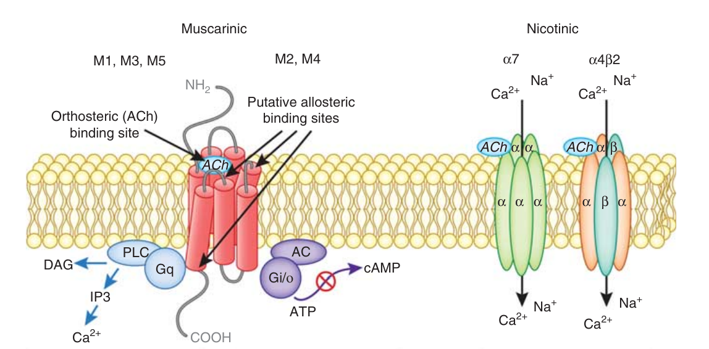

## Pharmacology 
----
# Cholinergic Antagonists 
----

Dr. Hao Chen 

Dept. Pharmacology, UTHSC

hchen@uthsc.edu

URL: http://chen42.github.io/talks/cho_at.html

Sept 5, 2017 (10 AM -- 12 PM)

---

## Conventions 
#### used in this document 

* Color and style theme: 
	* Drug name: <span id="drug"> Enfuvirtide</span>
	* Links: [Clinicalkey](https://www.clinicalkey.com/#!/). 
		* You need to login via your UTHSC netid when off campus to use e-textbooks. 
		* [VPN](http://uthsc.edu/vpn/index.php) provides a better experience. 
	* [Printable](http://chen42.github.io/talks/cho_ag.html?print-pdf#/) version 
* Open link in a new browser tab:
```
CTRL click
```
* Navigate the slides:
```
<- or -> 
Space_bar 
Page_down or Page_up 
Home or End
```
* To zoom in or out:
``` 
CTRL + or CTRL -
CTRL mouse_wheel_up or CTRL mouse_wheel_down 
```

<small>
Written using [Reveal.js](https://github.com/hakimel/reveal.js) and [markdown](https://help.github.com/categories/writing-on-github/)
</small>


---


## Textbook chapters used

[Cholinoceptor-Blocking Drugs](http://accessmedicine.mhmedical.com/content.aspx?bookid=1193&sectionid=69104442)

Katzung and Trevor, Basic & Clinical Pharmacology, 13e

[Acetylcholine Receptor Agonists](https://www.clinicalkey.com/#!/content/book/3-s2.0-B9781455702824000071)

Brenner and Stevens, Pharmacology, 4e. 

---

## Learning Objectives

* Describe classes of anticholinergics.
* Describe effects of anticholinergics on organ systems.
* Describe therapeutic uses of anticholinergics.
	* Explain the rationale for the therapeutic use of muscarinic antagonists in diseases such as bronchoconstriction, excessive salivation, and motion sickness. 
	* Explain the rationale for the therapeutic use to produce mydriasis and cycloplegia.
	* Explain the rationale for historical uses in treatment of hypertension and autonomic hyperreflexia.

---

## Learning Objectives
* Describe side effects and drug interactions of anticholinergics.
	* Explain why muscarinic antagonists cause xerostomia, blurred vision, photophobia, tachycardia, anhidrosis, difficulty in micturition, hyperthermia, glaucoma and mental confusion in the elderly.
	* Explain why muscarinic antagonists are contraindicated in glaucoma, obstructive disease of the gastrointestinal tract or urinary tract, intestinal atony.
	* List the adverse side effects of drug acting at autonomic ganglia.

---

## Drug List 

<table><tr><td>

<b> Muscarinic Antagonists</b> <br>
Atropine<br>
Belladonna<br>
Benztrpoine (Cogentin)<br>
Biperiden (Akineton)<br>
Clidinium (Quarzan)<br>
Cyclopentolate (Cyclogyl)<br>
Darifenacin (Enablex)<br>
Dicyclomine (Bentyl)<br>
Fesoterodine (Toviaz)<br>
Flavoxate (Urispas)<br>
Glycopyrrolate (Robinul)<br>
Homatropine<br>
Hyoscyamine (Anaspaz)<br>
Ipratropium (Atrovent)<br>
Mepenzolate (Cantil)<br>
Methantheline (Banthine)<br>


</td><td>
Methscopolamine (Pamine)<br>
Oxybutynin (Ditropan)<br>
Propantheline (Pro-Banthine)<br>
Scopolamine<br>
Solifenacin (Vesicare)<br>
Tiotropium (Spiriva)<br>
Tolterodine (Detrol)<br>
Tridihexethyl (Pathilon)<br>
Trihexyphenidyl (Artane)<br>
Tropicamide (Mydriacyl Ophthalmic)<br>
Trospium (Spasmex)<br>
<br>
<b>Ganglionic Blockers</b><br>
<br>
Hexamethonium<br>
Mecamylamine (Inversine)<br>
Trimethaphan (Arfonad)<br>

<b>Neuromuscular Blockers</b><br>

</td></tr></table>

---

## outline

1. Cholinoreceptor Blockers
2. Muscarinic Receptors
3. Drug Effects
4. Antimuscarinics
5. Atropine
6. Scopolamine
7. Synthetic Antimuscarinics
8. Side Effects
9. Drug Interactions
10. Ganglionic Blockers

---

## Sites of drug actions


---

## Cholinergic receptors

<a href="https://www.ncbi.nlm.nih.gov/pmc/articles/PMC3238081/figure/fig2/"></a>

The structure and signaling pathways of mAChRs and nAChRs. Each mAChR subtype is a seven-transmembrane protein, which belongs to two major functional classes based on G-protein coupling. The M1, M3, and M5 mAChRs selectively couple to the Gq/G11-type G-proteins resulting in the generation of inositol-1,4,5-trisphosphate (IP3) and 1,2-diacylglycerol (DAG) through activation of the phosphoinositide-specific phospholipase-C&beta; leading to increased intracellular calcium levels. The M2 and M4 mAChRs preferentially activate Gi/Go-type G-proteins, thereby inhibiting adenylate cyclase, reducing intracellular concentration of cAMP, and prolonging potassium channel opening. Neuronal nAChRs are pentameric ligand-gated ion channels. The most abundant neuronal subunits are &alpha;4, &beta;2, and &alpha;7, with the heteromeric &alpha;4&beta;2 receptor subtype in highest abundance.

[Neuropsychopharmacology. 2012 Jan;37(1):16-42.](https://www.ncbi.nlm.nih.gov/pubmed/21956443 )
---

## mAChR subtypes

<a href="https://www.ncbi.nlm.nih.gov/pmc/articles/PMC3238081/figure/fig1/"></a>

The M2 and M4 mAChRs serve as autoreceptors on cholinergic terminals to suppress ACh release and inhibit cholinergic neurotransmission at select synapses in the central nervous system (left neuron). <font color="blue">The mAChRs located on non-cholinergic neurons act as heteroceptors controlling the release of other neurotransmitters, such as Dopamine. (not draw) </font> M1, M3, M5, but also M4 mAChRs that are located postsynaptically facilitate slow cholinergic synaptic neurotransmission relative to nAChR subtypes. The alpha7 and alpha4beta2 nAChR subtypes mediate fast synaptic transmission and also use-dependent changes required for neuronal plasticity. These nAChR subtypes can have both pre- and postsynaptic localization. 

Note: The endogenous ligand of these cholinergic receptors, ACh, is synthesized in cholinergic neurons (left neuron) by the enzyme ChAT through the transfer of acetyl-CoA onto choline. Choline uptake is mediated by presynaptic high-affinity choline transporters (ChT). After synthesis, ACh is packaged into synaptic vesicles by the vesicular ACh transporter (vAChT). After neuronal activation-mediated release into the synaptic cleft, ACh can bind to pre- and postsynaptic receptors, or it can be inactivated through hydrolysis by the AChE enzymes, a process that can be inhibited by different substances (eg, organophosphates, AChE inhibitors) to increase synaptic ACh levels. Once ACh is hydrolyzed, choline is transported through the ChTs into the presynaptic terminal, where it is again synthesized into ACh.

---

### cholinergic receptor subtypes 

<table><thead><tr><th> TYPE OF RECEPTOR </th><th> <font color="yellow">PRINCIPAL</font> LOCATIONS</th> <th> MECHANISM OF SIGNAL TRANSDUCTION</th> <th> EFFECTS</th></tr></thead>

<tr><td colspan=4><b>Muscarinic</b></td></tr> 
<tr><td>M 1 </td><td> Autonomic ganglia, presynaptic nerve terminals, and CNS </td><td>Increased IP 3 </td><td>Modulation of neurotransmission</td></tr>
<tr><td>M 2 </td><td> Cardiac tissue (sinoatrial and atrioventricular nodes) </td><td>Increased potassium efflux or decreased cAMP </td><td>Slowing of heart rate and conduction</td></tr>

<tr><td>M 3 </td><td>Smooth muscle and glands </td><td>Increased IP 3 Contraction of smooth muscles and stimulation of glandular secretions </td><td> Vascular smooth muscle Increased cGMP as a result of nitric oxide stimulation Vasodilation</td></tr>

<tr><td colspan=4><b>Nicotinic</b> </td></tr>

<tr><td>Muscle type </td><td>Neuromuscular junctions </td><td> Increased sodium influx </td><td>Muscle contraction </td></tr>

<tr><td>Ganglionic type </td><td> Autonomic ganglia </td><td> Increased sodium influx </td><td> Neuronal excitation </td></tr>

<tr><td>CNS type </td><td>CNS </td><td>Increased sodium influx </td><td>Neuronal excitation
</td></tr>

</table>
<br> cAMP, cyclic adenosine monophosphate; cGMP, cyclic guanosine monophosphate; CNS, central nervous system; IP 3 , inositol triphosphate </br>
</a>
[Pharmacology 4e](https://www.clinicalkey.com/#!/content/book/3-s2.0-B978145570282400006X?scrollTo=%23hl0000469)

---

## Major Groups of cholinergic blockers

antimuscarinic = <font color="gray">parasympatholytic </font>

* Muscarinic Receptor Antagonists
	* Belladonna Alkaloids
		* <span id="drug"> Atropine, scopolamine, Hyoscyamine</span> 
	* Semisynthetic and Synthetic Muscarinic Receptor Antagonists
		* hundreds available
		* <span id="drug"> Dicyclomine, Glycopyrrolate, Ipratropium, Oxybutynin, Tropicamide</span> 
* Nicotinic Receptor Antagonists
	* Neuromuscular Blocking Agents
		* Nondepolarizing Neuromuscular Blocking Agents
			* <span id="drug"> Rocuronium, Cisatracurium, Pancuronium</span>
		* Depolarizing Neuromuscular Blocking Agents 
			* <span id="drug"> Succinylcholine </span> 
---

## Antimuscarinics: ADME
<table><tr><td width=60%>
<a href="http://accessmedicine.mhmedical.com/content.aspx?bookid=1193&sectionid=69104442#1104841776">

</a>
</td><td>
The structure of atropine (oxygen [red] at [1] is missing) or scopolamine (oxygen present). In homatropine, the hydroxymethyl at [2] is replaced by a hydroxyl group, and the oxygen at [1] is absent.
</td><tr></table>

* Absorption 
	* tertiary antimuscarinic drugs are well absorbed
	* quaternary antimuscarinic drugs are not well absorbed [organic chemistry](http://11452-presscdn-0-51.pagely.netdna-cdn.com/wp-content/uploads/2010/06/4-1234.png)
* Distribution 
	* tertiary antimuscarinics are widely distributed in the body.
		* Significant levels are achieved in the CNS within 30 minutes to 1 hour.
	* quaternary derivatives are poorly taken up by the brain and therefore are relatively free of CNS effects.
* Metabolism 
	* the elimination of <span id="drug"> atropine </span> from the blood occurs in two phases: the t1/2 of the rapid phase is 2 hours and that of the slow phase is approximately 13 hours. 
* Excretion 
	* About 50% of the dose is excreted unchanged in the urine. The rest appears in the urine as hydrolysis and conjugation products. 
	* Effect on parasympathetic function declines rapidly in all organs except the eye, where it can persist for &gt; 72 hours.

---

## antimuscarinics: MoA
<table><tr><td>
<ul>
<li> reversible blockade of muscarinic receptor 
	<ul>
	<li> representative drugs: <span id="drug"> atropine, pirenzepine</span>
	<li> can be overcome by ACh or cholinomimetics 
	<li> binds to the aspartate in the third transmembrane segment of the heptahelical receptor 
	<li> prevents the release of IPs and inhibits adenylyl cyclase (<a href="http://accessmedicine.mhmedical.com/data/books/1193/m_kat_ch1_f003.png">inverse agonists</a>)
	<li> sensitivity: salivary, bronchial, sweat glands >> gastric parietal cells 
	<li> sensitivity: exogenously administered >> ACh
	<li> receptor subtype selectivity
		<ul> <li> <span id="drug"> Atropine </span> non-selelctive
		<li> other: moderately selective on mAChRs 
		<li> synetic antimuscarinics may interact with nAChR or histamine receptors
		</ul>
		</ul>
</td><td>
<a href="http://www.nature.com/nrd/journal/v13/n7/full/nrd4295.html">
</a>
<br>
Nature Reviews Drug Discovery 13, 549-560 (2014) 
</td></tr></table>

---

Antimuscarinics: Organ System Effects

### Central nervous system

Compare with [indirect cholinergic angonists](http://chen42.github.io/talks/cho_ag.html#/30)

* sedative effects, drowsiness, amnesia: <span id="drug"> Atropine, scopolamine </span>
	* initial effect is mild stimulation
* reduce Parkinsons tremor: <span id="drug"> atropine</span> 
* motion sickness (vestibular disturbance): <span id="drug"> Scopolamine </span> 
* highe dose cause an acute confusional state known as delirium, 

---

Antimuscarinics: Organ System Effects

### Eye 

Compare with [cholinomimetics ](http://chen42.github.io/talks/cho_ag.html#/17)

<table><tr><td>
<ul>
<li> reduce lacrimal secretion ("sandy" eyes)
<li> Belladonna (Italian, "beautiful lady")
	<ul> <li><a href="http://www.e-safe-anaesthesia.org/sessions/15_05/gif/ana_1_011_autonomic_nervous_system_08_t1_01_med.gif"> mydriasis </a>
	<li> remove parasympathetic opposition to the sympathetic system in the iris
	</ul>
<li> cycloplegia 
<ul>
	<li> ciliary muscle fail to contract 
	<li> inability to accomondate (i.e. focus on near objects)
		<ul><li> cause acute close angle glaucoma
		</ul>
</ul></ul></td><td>


</td></tr></table>

---

Antimuscarinics: Organ System Effects

### Cardiac system 


Compare with [cholinomimetics ](http://chen42.github.io/talks/cho_ag.html#/19)

* sinoatril and atrioventricular node
	* blocking the effects of the vagus nerve 
		* tachycardia, increase conduction velocity 
		* low dose i.v. administration results in initial bradycardia 
			* ? due to block of prejunctiona [M1]() [auto-receptors](#/9)
			* ? stimulation of the vagal motor nucleus in the brain stem. 
	* reduce [PR interval](https://lifeinthefastlane.com/wp-content/uploads/2011/01/waves-of-the-ecg.gif) of the ECG 

---

Antimuscarinics: Organ System Effects

### Vascular system 

Compare with [cholinomimetics ](http://chen42.github.io/talks/cho_ag.html#/18)

* most blood vessels receive no direct innervation from the parasympatholytic system
	* except those in the toracic and abdominal viscera
	* sympathetic cholinergic nerve cause Vasodilation. 
	* almost all vessles contain endothelia muscarinic receptors &rarr; vasodilation
		* blocked by antimuscarinic drugs

### net cardiovascular effect of atropine
	* in patients with normal hemodynamics
		* no dramatic effect, tachycardia may occur, but little effect on blood pressure
		* prevent the cardiovascular effect of direct-activing muscarinic agonits


---

Antimuscarinics: Organ System Effects

### Respiratory system

Compare with [cholinomimetics ](http://chen42.github.io/talks/cho_ag.html#/20)

* potent inhibitors of secretions in the upper and lower respiratory tract.
* bronchial smooth muscle relaxation and bronchodilation
	* used before inhalant anesthetics to reduce trachea secretion 	 
* limited use for [COPD](https://s3-ap-southeast-2.amazonaws.com/assets.asthmafoundation.org.nz/images/_fit640/COPD-diagram_160331_100539.jpg)
	* effect [opposed](http://cursoenarm.net/UPTODATE/contents/images/f2/12/2250.myextj?title=Muscarinic+receptors+in+asthma) by the blockade of autoinhibitory M2 receptors on postganglionic parasympathetic nerves
	* can oppose the bronchodilation caused by block of M3 receptors on airway smooth muscle. 
	* https://www.researchgate.net/publication/285656805/figure/fig11/AS:303163300171776@1449291171111/Figure-11-Effects-of-bronchodilators-in-COPD-Postganglionic-cholinergic-nerves.png

---

Antimuscarinics: Organ System Effects

### Gastrointestinal tract 

Compare with [cholinomimetics](http://chen42.github.io/talks/cho_ag.html#/21)


* The removal of autoinhibition, a negative feedback mechanism by which neural acetylcholine suppresses its own release, might explain the lower efficacy of antimuscarinic drugs against the effects of endogenous acetylcholine.
* Dry mouth is a common side effect
* gastric secretion is not as effectively blocked because [other neurotransmitters](http://accessmedicine.mhmedical.com/data/books/1193/m_kat_ch6_f002.png) are involved. 
* gastrointestinal Smooth muscle mobility is affected
	* from stomach to colon
	* diminish the tone and propulsive movement
	* relax viscera wall, prolong gastric emptying time.
	* stop diarrhea caused by cholinomimetics. 


---

Antimuscarinics: Organ System Effects

### Genitourinary tract 

Compare with [cholinomimetics](http://chen42.github.io/talks/cho_ag.html#/21)

* relaxes smooth muscle of the ureters and bladder ball. 
* treating spasm induced by mild inflammation or surgery. 
* can precipitate urinary retention 

---


Antimuscarinics: Organ System Effects

### Sweat glands

* suppresses thermoregulatory sweating.
* body temperature increase when large dose of Antimuscarinics is given
	* "Atropine" fever in infants and children

---
<section id="scopolamine">

## <span id="drug"> Atropine, Scopolamine, glycopyrrolate, hyoscyamine </span> 

### ADME
* <span id="drug"> atropine </span> and <span id="drug"> scopolamine</span> are nonionized tertiary amines. 
	* well absorbed from the gut and are readily distributed to the CNS.

* <span id="drug"> scopolamine </span>  has longer duration of action and stronger CNS effect than <span id="drug">  atropine  </span> 

* <span id="drug"> glycopyrrolate </span> and <span id="drug"> hyoscyamine </span> are  quaternary amines 
	*  less CNS effects

* excreted in the urine with a half-life of about 2 hours. 


---

## <span id="drug"> Atropine, Scopolamine, glycopyrrolate, hyoscyamine </span> 
### Ocular Indications
* localized application to produce mydriasis 
	* facilitate ophthalmoscopic examination of the peripheral retina
	* effect of <span id="drug">  atropine, scopolamine, glycopyrrolate  </span>   can last for days 
		* they bind to pigments in the iris that slowly release the drugs. 
		* people with darker irises bind more atropine and experience a more prolonged effect than do people with lighter irises. 
* to produce cycloplegia and permit the accurate determination of refractive errors, 
* [cyclopentolate](https://www.clinicalkey.com/#!/content/drug_monograph/6-s2.0-1277) are preferred for inducing cycloplegia and mydriasis (rapid onset of action, lasting a day) 
* should be only used when both mydriasis and cycloplegia or prolonged action is required 
	* short-lasting mydriasis can be induced by <span id="drug">  phenylephrine </span> or [tropicamide](#/tropicamide)
* reduce muscle spasm and pain caused by inflammation
	* treat iritis and cyclitis (inflammation of the iris and ciliary muscles) associated with infection, trauma, or surgery.
	* long-lasting effects are valuable


---

## <span id="drug"> Atropine, Scopolamine, glycopyrrolate, hyoscyamine </span> 
###  Cardiac Indications
* sinus bradycardia with reduced cardiac output and hypotension or ischemia. 
	* sometimes occurs after a myocardial infarction. 
	* i.v. <span id="drug"> Atropine </span> 
* symptomatic atrioventricular blocking
	* <span id="drug"> atropine </span> or <span id="drug"> glycopyrrolate </span> 
---

## <span id="drug"> Atropine, Scopolamine, glycopyrrolate, hyoscyamine </span> 

### Respiratory Tract Indications

* no longer used for bronchodilation  because of its many adverse effects.
	* e.g., impairs ciliary activity, reducing the clearance of mucus from the lungs and causing accumulation of viscid material in the airways. 
	* [ipratropium](#/ipratropium) is preferred 
* to reduce salivary and respiratory secretions, prevent airway obstruction in patients who are receiving general anesthetics. 
	* <span id="drug"> Glycopyrrolate </span> is mostly used for this purpose 
	* <span id="drug"> scopolamine </span> may cause amnesia associated with surgery  
	 
---

## <span id="drug"> Atropine, Scopolamine, glycopyrrolate, hyoscyamine </span> 

###  Gastrointestinal and urinary tract Indications

* relieve intestinal or uninary bladder spasms and pain 

* not used to treat peptic ulcer due to large adverse effects. 
	*	a selective muscarinic M1 receptor blocker, <span id="drug"> pirenzepine</span> can be used.

* formulations of <span id="drug"> hyoscyamine </span> for oral or sublingual administration are used to treat intestinal spasms and other gastrointestinal symptoms. 

---

## <span id="drug"> Atropine, Scopolamine, glycopyrrolate, hyoscyamine </span> 

### central nervous system indications

* motion sickness 
	* A transdermal formulation of <span id="drug"> scopolamine</span>  can be used to prevent motion sickness. 
	* blocking acetylcholine neurotransmission from the vestibular apparatus to the vomiting center in the brain stem. 
* used in the treatment of Parkinson disease.
	* adjunctive therapy with adverse  effects 
	* better drugs available

---
<section id="toxicity">
## <span id="drug"> Atropine, Scopolamine, glycopyrrolate </span> 
### Toxicity

<table><tr><td width=65%>


</td><td width=35%>

</td><tr></table>


Atrophin toxicity: "dry as a bone, blind as a bat, red as a beet, and mad as a hatter." 

---

## <span id="drug"> Hyoscyamine </span> 

* ADME and MoA
	* the [levorotatory isomer](https://en.wikipedia.org/wiki/Dextrorotation_and_levorotation) of racemic atropine
	* the natural form of the alkaloid that occurs in plants.
	* tertiary amine 
	* competitive antagonist of the mascarinic receptors
		* no effect on the nicotinic recepotors at low does
* indication
	* has similar effect as <span id="drug"> atropine</span>
	* formulations of <span id="drug"> hyoscyamine </span> for oral or sublingual administration are used to treat intestinal spasms and other gastrointestinal symptoms. 
	* no CNS depression (better than <span id="drug"> scopolamine</span> ) 

---

## Semisynthetic and Synthetic Muscarinic Receptor Antagonists

the pharmacologic effects of these agents are similar to those of atropine, their unique pharmacokinetic properties are advantageous in specific situations. 


---
<section id="ipratropium">
## <span id="drug"> Ipratropium, Tiotropium </span> 

quaternary amine derivatives of atropine, are administered by inhalation to patients with obstructive lung diseases. Because these drugs are not well absorbed from the lungs into the systemic circulation, they produce few adverse effects. For example, unlike atropine, they do not impair the ciliary clearance of secretions from the airways. This makes them particularly useful in treating patients with asthma, emphysema, and chronic bronchitis. The respiratory effects and uses of these compounds are discussed more thoroughly in Chapter 27 . 

* main difference  is duration of action. 
	* Tiotropium once daily dosing
	* ipratropium requires four times daily dosing
---

## <span id="drug"> Dicyclomine, Oxybutynin, Solifenacin, </span> and Related Drugs

Dicyclomine is a synthetic amine used to relax intestinal smooth muscle and thereby relieve irritable bowel symptoms, such as intestinal cramping. Oxybutynin, tolterodine, darifenacin, solifenacin, and trospium are used to reduce the four major symptoms of overactive bladder: daytime urinary frequency, nocturia (frequent urination at night), urgency, and incontinence. Oxybutynin is now available in both oral and topical (gel) formulations. Compared with other muscarinic receptor antagonists, darifenacin, solifenacin, tolterodine, and trospium appear to have a more selective action on the urinary bladder and may cause fewer adverse effects such as dry mouth and blurred vision. These uroselective blockers are administered once or twice daily.

M3 receptor 


---

## <span id="drug"> Glycopyrrolate </span> 
* blocks muscarinic receptors throughout the body.
* low doses preferentially inhibit secretions, and the drug is administered preoperatively to inhibit excessive salivary and respiratory tract secretions.
* used during anesthesia to inhibit the secretory and vagal effects of cholinesterase inhibitors (e.g., neostigmine ) that are used to reverse nondepolarizing neuromuscular blockade induced by curariform drugs (e.g., vecuronium ). 
* reduce chronic severe drooling in patients aged 3 to 16 years with neurologic conditions such as cerebral palsy.


---
<section id="tropicamide">
## <span id="drug"> Tropicamide </span> 

* synthetic drug
* topical ocular administration as a mydriatic. 
* given before ophthalmoscopy to facilitate examination of the peripheral retina. 
* It has a short duration of action (about 1 hour) and is often preferable to atropine and scopolamine for short-term mydriasis. 

---

## <span id="drug"> Pirenzepine </span> 

* selective for M 1 receptors
* reduce vagally stimulated gastric acid secretion in patients with peptic ulcers. 
* it blocks M 1 receptors on paracrine cells and inhibits the release of histamine, a potent gastric acid stimulant. 
* Pirenzepine is available in Canada and Europe but not in the United States. 


---

## Nicotinic Receptor Antagonists 

* Ganglionic Blocking Agents
	* reduce excessive activity of the sympathetic or parasympathetic nervous system, 
	* lack of selectivity for sympathetic or parasympathetic ganglia 
	* their numerous adverse effects
	* now obsolescence 


---
## Nicotinic Receptor Antagonists 

* Neuromuscular Blocking Agents
	* neuromuscular blocking agents == paralytics == muscle relaxants
	* bind to the muscle type of nicotinic acetylcholine Receptor
	* inhibit neurotransmission at skeletal neuromuscular junctions
	* causing muscle weakness and paralysis.
	
* Two classes
	* nondepolarizing blockers
		* competitive antagonists at the neuromuscular junction
	* the depolarizing blocker 
		* <span id="drug"> succinylcholine </span> 
	* can produce complete respiratory failure

---
<section id="nondepol">
Nicotinic Receptor Antagonists 
## Nondepolarizing Neuromuscular Blocking Agents 
### Chemistry and Pharmacokinetics 

<table><thead>
<th> Drug </th><th>Depolarizing Agent </th><th>HISTAMINE RELEASE </th><th>GANGLIONIC BLOCKADE </th><th>Effects Reversed by Cholinesterase Inhibitors </th><th>Duration of Action (Minutes) </th><th>Routes of Elimination</th></thead>
<tr><td>Succinylcholine </td><td>Yes </td><td>Minimal </td><td>None </td><td>No </td><td>Short (5-10) </td><td>Plasma (butyryl) cholinesterase</tr>
<tr><td>Atracurium </td><td>No </td><td>Varies </td><td>Low </td><td>Yes </td><td>Intermediate (30-60) </td><td>Plasma esterase</tr>
<tr><td>Cisatracurium </td><td>No </td><td>None </td><td>Low </td><td>Yes </td><td>Intermediate (30-60) </td><td>Spontaneous chemical degradation</tr>
<tr><td>Pancuronium </td><td>No </td><td>None </td><td>Medium </td><td>Yes </td><td>Long (60-120) </td><td>Renal excretion</tr>
<tr><td>Rocuronium </td><td>No </td><td>None </td><td>Low </td><td>Yes </td><td>Intermediate (30-60) </td><td>Biliary and renal excretion</tr>
<tr><td>Vecuronium </td><td>No </td><td>None </td><td>Low </td><td>Yes </td><td>Intermediate (30-60) </td><td>Biliary and renal excretion and hepatic metabolism</tr>
</table>

---

Nicotinic Receptor Antagonists 
## Nondepolarizing Neuromuscular Blocking Agents 
### ADME 
* <b>curariform drugs</b>, <span id="drug"> atracurium, cisatracurium, pancuronium, rocuronium, </span> and <span id="drug"> vecuronium </span>. 
* <span id="drug"> tubocurarine </span>, was extracted from plants used by native South Americans as arrow poisons for hunting wild game. 
	* The curariform drugs are not well absorbed from the gut.
* administered only by the intravenous route.
* most eliminated by renal and biliary excretion of the unchanged compounds 
	* or hepatic metabolites
* most of the isomers of atracurium are hydrolyzed by plasma esterases. 
* <span id="drug"> cisatracurium </span> spontaneously decomposes by nonenzymatic chemical degradation. 
	* preferred paralytic agent for critically ill patients with impaired hepatic and renal function. 
* In patients with normal renal and hepatic function, atracurium and cisatracurium have an intermediate duration of action comparable to that of vecuronium and rocuronium. 

---
Nicotinic Receptor Antagonists 
## Nondepolarizing Neuromuscular Blocking Agents 
### MoA 

* competitive antagonists of nAChR in skeletal muscle
	* sequence of muscle paralyzing effect 
		1. the small and rapidly moving muscles of the eyes and face
		2. the larger muscles of the limbs and trunk
		3. the intercostal muscles and diaphragm, causing respiration to cease. 
		4. it enables relaxation of abdominal muscles for surgical procedures without producing apnea. 
		5. respiratory function should always be closely monitored
* stimulate the release of histamine from mast cells, and they block autonomic ganglia and muscarinic receptors.
	* cause bronchospasm, hypotension, and tachycardia. 
	* Newer drugs tend to cause less histamine release and fewer autonomic side effects than does <span id="drug"> pancuronium </span>.

---
Nicotinic Receptor Antagonists 
## Nondepolarizing Neuromuscular Blocking Agents 
### Indications

* primarily used to induce muscle relaxation during surgery.
* also used as an adjunct to electroconvulsive therapy to prevent injuries that might be caused by involuntary muscle contractions.
* also used to facilitate intubation of the respiratory tract. 

---
Nicotinic Receptor Antagonists 
## Nondepolarizing Neuromuscular Blocking Agents 
### Interactions

muscle-relaxing effects are potentiated by volatile inhalational anesthetic agents (e.g., <span id="drug"> sevoflurane</span> ) and by the aminoglycoside antibiotics, tetracycline antibiotics, and calcium channel blockers. 
* effects is more pronounced in myasthenia gravis patients.
* reversed by administering a cholinesterase inhibitor (e.g., <span id="drug"> neostigmine </span>). [Neostigmine reversal](http://chen42.github.io/talks/cho_ag.html#/33) 
* <span id="drug"> sugammadex</span> reverse steroidal neuromuscular blocking agents such as </span> rocuronium </span>. <span id="drug"> Sugammadex </span>  forms a tight water-soluble complex with <span id="drug"> rocuronium </span>  and removes the drug from the neuromuscular junction
	* producing a fast recovery of neuromuscular function and reducing the risk of postoperative respiratory dysfunction. 
	* [FDA approval in Dec 15, 2015](https://www.fda.gov/newsevents/newsroom/pressannouncements/ucm477512.htm)

---
<section id="succinylcholine">
Nicotinic Receptor Antagonists 
###  Depolarizing Neuromuscular Blocking Agents
<span id="drug"> Succinylcholine</span> 

* ADME and MoA 
	* the only depolarizing agent available for clinical use today
	* composed of two covalently linked molecules of acetylcholine.
	* succinylcholine binds to nAChR in skeletal muscle.
	* when the drug is first administered, it produces transient muscle contractions called fasciculations, followed by a sustained muscle paralysis. 
	* <span id="drug"> succinylcholine </span> is  hydrolyzed  by cholinesterase (slower than ACh). 
* Indication 
	* short duration
	* the preferred neuromuscular blocker for adults with emergency airway situations.
	* potients with  atypical cholinesterase cannot metabolize <span id="drug"> succinylcholine </span> at normal rates 
		* susceptible to prolonged neuromuscular paralysis and apnea 

---
Nicotinic Receptor Antagonists 
###  Depolarizing Neuromuscular Blocking Agents
<span id="drug"> Succinylcholine</span> 

<table><tr><td>

<ul><li> Interactions  and adverse effects
	<ul><li> can cause hyperkalemia &rarr; cardiac arrest 
	<li>	* not used in third-degree burns

	<li>	* avoid in pediatric patients
	</ul></ul>
</td><td width=60%>

</td></tr></table>

<br>
[Anesthesiology 1 2006, Vol.104, 158-169](http://anesthesiology.pubs.asahq.org/article.aspx?articleid=1923491)

---
Nicotinic Receptor Antagonists 
###  Depolarizing Neuromuscular Blocking Agents
<span id="drug"> Succinylcholine</span> 

* Interactions and adverse effects
	* malignant hyperthermia:  pharmacogenetic disorder of skeletal muscle that presents as a hypermetabolic response to anesthetic gases *or* <span id="drug"> Succinylcholine</span>
	* The classic signs of MH include hyperthermia, tachycardia, tachypnea, increased carbon dioxide production, increased oxygen consumption, acidosis, hyperkalaemia, muscle rigidity, and rhabdomyolysis, all related to a hypermetabolic response.
	* In most cases, the syndrome is caused by a defect in the ryanodine receptor.  
	* Likely fatal if untreated. Mortality has decreased from 80 % thirty years ago to <5 % in 2006.
	* <span id="drug"> Dantrolene </span>  is a specific treatment for MH. 
		* decrease muscle contraction by directly [interfering with calcium ion release from the sarcoplasmic reticulum](https://www.clinicalkey.com/#!/content/drug_monograph/6-s2.0-167) within skeletal muscle cells.
		

[Orphanet J Rare Dis. 2015 Aug 4;10:93](https://ojrd.biomedcentral.com/articles/10.1186/s13023-015-0310-1)

---

## Poison

* other
	* prevent muscarinic side effects when cholinesterase inhibitors are given to patients with myasthenia gravis.
	* reverse the muscarinic effects of cholinesterase inhibitor overdose. 
		* supranormal doses may be required to counteract the large concentrations of acetylcholine that have accumulated at acetylcholine synapses
		* <span id="drug"> atropine</span>  dosage must be titrated to the patient's response. 
		* <span id="drug"> Atropine</span>  and <span id="drug"> glycopyrrolate </span>  will not counteract the effects of nicotinic receptor activation caused by cholinesterase inhibition. 
			* The muscle weakness resulting from nicotinic receptor stimulation can be attenuated by adding <span id="drug">   pralidoxime </span>  to the treatment regimen.


---

## Summary of Important Points


* Muscarinic acetylcholine receptor antagonists relax smooth muscle, increase heart rate and cardiac conduction, and inhibit exocrine gland secretion. They include belladonna alkaloids (e.g., [atropine and scopolamine](#/scopolamine)) and semisynthetic and synthetic drugs (e.g., [ipratropium](#/ipratropium)).
* Muscarinic blockers are used to treat bradycardia, obstructive lung diseases, intestinal spasms, and overactive urinary bladder. They are also used to reduce salivary and respiratory secretions and to produce mydriasis and cycloplegia.
* <span id="drug"> Atropine </span> [toxicity](#/toxicity) can cause dryness of the mouth and skin, blurred vision, tachycardia, palpitations, urinary retention, delirium, and hallucinations.
* Nicotinic acetylcholine receptor antagonists include nondepolarizing neuromuscular blocking agents known as curariform drugs, such as [rocuronium](#/nondepol) and  [cisatracurium](#/nondepol). These drugs are used to produce muscle relaxation during surgery.
* Curariform drugs competitively block nicotinic receptors in skeletal muscle. They do not cause muscle fasciculations, and their effects can be reversed by cholinesterase inhibitors.

* [Succinylcholine](#/succinylcholine) is a depolarizing neuromuscular blocking agent with a short duration of action. It produces muscle fasciculations that are followed by muscle paralysis. Its effects are not reversed by cholinesterase inhibitors.

---

<table><tr><td width=50%>
 
</td><td width=50%>

</td><tr></table>


https://www.youtube.com/watch?v=cp_CZpCBVpk
