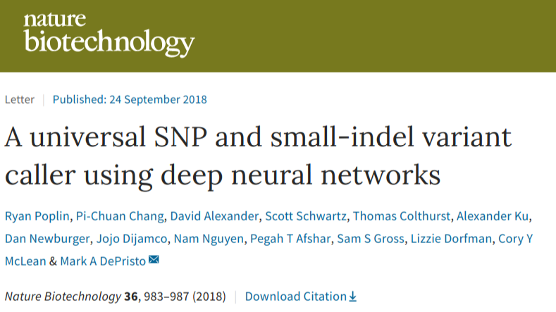
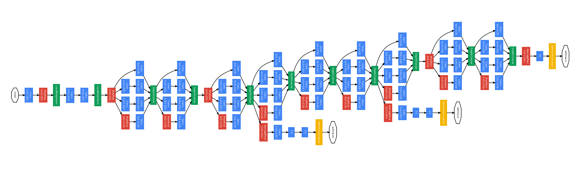

## GGI 901 Integrative Genetics 

### November 1, 2018 


<a href="https://www.nature.com/articles/nbt.4235" target=_new> </a>

<hr style="color:royalblue">

 **Hao Chen**, hchen@uthsc.edu, Department of Pharmacology, UTHSC

https://chen42.github.io/talks/deepvar.html

<small> Written using [Reveal.js](https://github.com/hakimel/reveal.js) and [markdown](https://help.github.com/categories/writing-on-github/) </small>

---

### outline

* NextGen sequencing
  * Platforms
  * GATK: calling SNP and Indel from NextGen data
* Deep Learning
  * <u>C</u>onvolutional <u>N</u>eural <u>N</u>et (CNN)
  * Google Inception network
* DeepVariant: Applying CNN (Inception) to NextGen Seq data  
  * Design
  * Training
  * Software
  * Validation
  
---
## DNA sequencing

### Sanger sequencing with ddNTP 


---
### NextGen Sequencing: SOLiD

<a href="http://seqanswers.com/forums/showthread.php?t=10">

</a>

---

### NextGen Sequencing: Illumina 


---

### NextGen Sequencing: Ion Torrent


---

### NextGen Seq data files 

Illumina, Ion Torrent: fasta


```
>cluster_2:UMI_ATTCCG             # record name; starts with '>'
TTTCCGGGGCACATAATCTTCAGCCGGGCGC   # DNA sequence

```

Illumina, Ion Torrent: fastq

```
@cluster_2:UMI_ATTCCG             # record name; starts with '@'
TTTCCGGGGCACATAATCTTCAGCCGGGCGC   # DNA sequence
+                                 # empty line; starts with '+'
9C;=;=<9@4868>9:67AA<9>65<=>591   # phred-scaled quality scores
``` 

SOLiD: csfasta

```
>2_14_26_F3
T110021221100310030120022032222111321022112223
```
---

## GATK: A topic for future class

<a href="https://software.broadinstitute.org/gatk/best-practices/workflow?id=11145" target=_new> 
</a>


---
## Neural Network
### one node at a time


---

## Deep Neural Network
### Fully connected


---

## Live demo of DNN

<a href="https://lecture-demo.ira.uka.de/neural-network-demo/?preset=Three%20classes%20test" target=_new ></a>

---


## Convolution


 


https://ujjwalkarn.me/2016/08/11/intuitive-explanation-convnets/

---

## Convolution as feature detector


https://ujjwalkarn.me/2016/08/11/intuitive-explanation-convnets/

---

## Convolutional Neural Net for Object Classification 


---

## Visual example of a ConvNet

<a href="http://scs.ryerson.ca/~aharley/vis/conv/"></a>


Author: [Adam Harley](http://www.cs.cmu.edu/~aharley/)

---

## Google InceptionNet



[InceptionNet](https://towardsdatascience.com/a-simple-guide-to-the-versions-of-the-inception-network-7fc52b863202)


---


## DeepVariant 

sources of info

* Dec 14 2016 [BioRxiv](https://www.biorxiv.org/content/early/2016/12/14/092890)
* Dec 04 2017 [Google Blog](https://ai.googleblog.com/2017/12/deepvariant-highly-accurate-genomes.html)
* Sep 24 2018 [Nature Biotechnology](https://www.nature.com/articles/nbt.4235)

