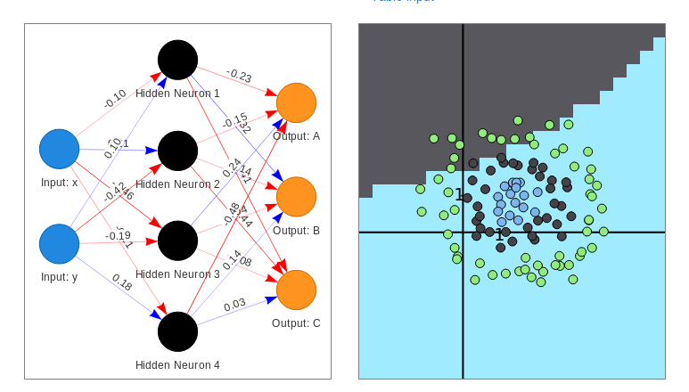

## GGI 901 Integrative Genetics 

### November 1, 2018 


<a href="https://www.nature.com/articles/nbt.4235" target=_new> </a>

<hr style="color:royalblue">

 **Hao Chen**, hchen@uthsc.edu, Department of Pharmacology, UTHSC

https://chen42.github.io/talks/deepvar.html

<small> Written using [Reveal.js](https://github.com/hakimel/reveal.js) and [markdown](https://help.github.com/categories/writing-on-github/) </small>

---

### outline

#### How to find genetic variations between individuals?

* NextGen sequencing
 * Platforms
 * GATK: calling SNP and Indel from NextGen data
* Deep Learning
 * <u>C</u>onvolutional <u>N</u>eural <u>N</u>et (CNN)
 * Google Inception network
* DeepVariant: Applying CNN (Inception) to NextGen Seq data 
 * Design
 * Training
 * Software
 * Validation

---
## DNA sequencing

### Sanger sequencing 


---
### NextGen Sequencing: SOLiD

<a href="http://seqanswers.com/forums/showthread.php?t=10">

</a>

---

### NextGen Sequencing: Illumina 


---

### NextGen Sequencing: Ion Torrent


---

### NextGen Seq data files 

Illumina, Ion Torrent: fasta


```
>cluster_2:UMI_ATTCCG # record name; starts with '>'
TTTCCGGGGCACATAATCTTCAGCCGGGCGC # DNA sequence

```

Illumina, Ion Torrent: fastq

```
@cluster_2:UMI_ATTCCG # record name; starts with '@'
TTTCCGGGGCACATAATCTTCAGCCGGGCGC # DNA sequence
+ # empty line; starts with '+'
9C;=;=<9@4868>9:67AA<9>65<=>591 # phred-scaled quality scores
``` 

SOLiD: csfasta

```
>2_14_26_F3
T110021221100310030120022032222111321022112223
```
---

## GATK: A topic for future class

<a href="https://software.broadinstitute.org/gatk/best-practices/workflow?id=11145" target=_new> 
</a>


---

## Challenges of variant discovery 
 from NextGen sequencing data

* Sequencing data contains errors (0.1-10%)
* Error has many sources
* Error is depend on technology used


---
## GATK statistical models
	* logistic regression for base errors
	* hidden Markov for read likelihood given the haplotypes
	* naive Bayes classifier for variant calling
		* Gaussian mixture model with hand-crafted feature to remove common false positive 
	* optimized for the Illumina platform
* <font color="darkorange">Can we use one single learning model to achieve better performance? </font>

---

## Neural Network
### one node at a time


---

## Deep Neural Network
### Fully connected


---

## Deep Neural network
### Loss Function

<table><tr><td>

</td><td>


</td></tr></table>

---

## Linear regresssion by iterative updates [R code](https://www.r-bloggers.com/linear-regression-by-gradient-descent/)


```
## theta is the parameter, alpha is learning rate
for (i in 1:num_iters) {
 error <- (X %*% theta - y)
 delta <- t(X) %*% error / length(y)
 theta <- theta - alpha * delta
}

```

---

## Deep Neural network
### gradient descent, learning rate

<table><tr><td width=50%>

<br>


</td><td width=50%>


</td></tr></table>

---

## Deep Neural network

### Training the network

<a href="https://theclevermachine.wordpress.com/tag/backpropagation/">


</a>


---
## Live demo of DNN

<a href="https://lecture-demo.ira.uka.de/neural-network-demo/?preset=Three%20classes%20test" target=_new ></a>

---


## Convolution


 


https://ujjwalkarn.me/2016/08/11/intuitive-explanation-convnets/

---

## Convolution as feature detector


https://ujjwalkarn.me/2016/08/11/intuitive-explanation-convnets/

---

## Deep Neural network

### ConvNet, CNN


---

## Visual example of a ConvNet

<a href="http://scs.ryerson.ca/~aharley/vis/conv/"></a>


Author: [Adam Harley](http://www.cs.cmu.edu/~aharley/)

---

## Google InceptionNet


[InceptionNet](https://towardsdatascience.com/a-simple-guide-to-the-versions-of-the-inception-network-7fc52b863202)


---


## DeepVariant 

sources of info

* Dec 14 2016 [BioRxiv](https://www.biorxiv.org/content/early/2016/12/14/092890)
* Dec 04 2017 [Google Blog](https://ai.googleblog.com/2017/12/deepvariant-highly-accurate-genomes.html)
* Sep 24 2018 [Nature Biotechnology](https://www.nature.com/articles/nbt.4235)

---

## DeepVariant

### workflow


---

## DeepVariant

### converting sequences to image

1.  local realign (GATK)   
1.  find candidate variants  
1.  construct one RGB image for each candidate  
    * each pixel represents one base position
    * image size can be  221 pixel (w) x 100 pixel (h)
        * for each SNP, consider 110 bases on each side
        * max 95 reads per images (first 5 rows reserved for the reference)


---

## DeepVariant

### coding read info in the image

```
def get_base_color(base):
 base_to_color = {'A': 250, 'G': 180, 'T': 100, 'C': 30}
 return base_to_color.get(base, 0)

def get_quality_color(quality):
 return int(254.0 * (min(40, quality) / 40.0))

def get_strand_color(on_positive_strand):
 return 70 if on_positive_strand else 240

def get_base_alpha(read_base, ref_base, read, call):
 alpha1 = 1.0 if read_supports_alt_allele(read, call.alt_allele) else 0.6
 alpha2 = 0.2 if read_base == ref_base else 1.0
 return alpha1 * alpha2

def make_pixel(red, green, blue, alpha):
 return RGB(int(alpha * red), int(alpha * green), int(alpha * blue))
```

---
## DeepVariant

### Visualizing examples 

* GitHub: online repository for code, with version control
* Python: programming language
* ipython notebook: an environment to run python code section by section
* Google colab: a cloud version of the ipython notebook

[example](https://github.com/chen42/deepvariant)

---

## DeepVariant

### Training 

* Using the Inception model with pre-trained weights
* Last layer is a three class (hom-ref, het, hom-alt) [softmax ]
<a href=https://medium.com/data-science-bootcamp/understand-the-softmax-function-in-minutes-f3a59641e86d>  </a>
* [DistBelief framework](https://research.google.com/pubs/pub40565.html?hl=no):  a method to use many CPUs cores, useful when RAM requirement is larger than what the GPU offer (e.g. 6GB).

---

## DeepVariant
###  results 


---

## DeepVariant

### Sequencing Platforms

|Data| Caller| Sensitivity |PPV| F1|
|---|---|---|---|---|
|Ion  AmpliSeq  exome | DeepVariant | 94.12% | 99.79% | 96.87%|
| | TVC | 96.47% | 98.11% | 97.28%|
|| GATK | 93.24% | 19.15% | 31.78%|
|Illumina  TruSeq  exome | DeepVariant | 93.01% | 99.39% | 96.09%|
| | Ensemble | 92.92% | 98.08% | 95.43%|
| |GATK | 91.02% | 99.30% | 94.98%|
|10X  Chromium  75x  WGS | DeepVariant | 98.73% | 99.91% | 99.32%|
| |Long-ranger | 98.13% | 98.26% | 98.19%|
|| GATK | 99.08% | 94.62% | 96.80%|
|PacBio  raw  reads  40x  WGS | DeepVariant | 88.51% | 97.25% | 92.67%|
|| samtools | 89.34% | 40.89% | 56.10%|
| SOLID  85x | DeepVariant | 76.62% | 99.01% | 86.39%|
| | GATK | 73.91% | 84.26% | 78.75%|

---

## DeepVariant

### recall vs precision 


---

## DeepVariant

### Genotype quality 


---

## Summary

* Deep learning (ConvNet) can be used to identify genetic variants from NextGen sequencing data
* Advantage over current state-of-the-art (GATK) is small (better at indels)
* Additional advantage is in adapting to identifying novel variants on non-illumina platform
  * All GATK results were obtained using 1000 genome known variants during indel Realign and dbSNP during base recalibration
* Disadvantage is the need to use GPU, maybe increased computation time.


---
## Similar approaches

* Clairvoyante:  [pdf](https://www.biorxiv.org/content/early/2018/09/26/310458) |  [GitHub](https://github.com/anfederico/Clairvoyant)
* VariantionAnalysis: [pdf](https://www.biorxiv.org/content/early/2016/12/30/097469) |  [GitHub](https://github.com/CampagneLaboratory/variationanalysis) 
* GenotypeTensor: [pdf](https://www.biorxiv.org/content/early/2018/06/05/338780) | [GitHub](https://github.com/CampagneLaboratory/GenotypeTensors)

