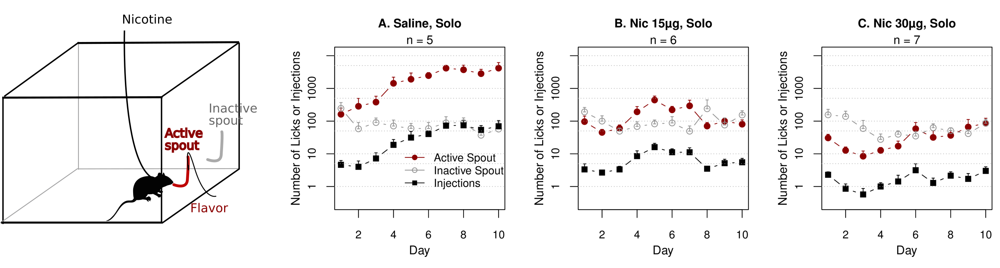
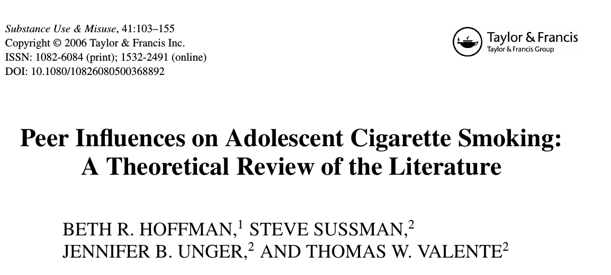
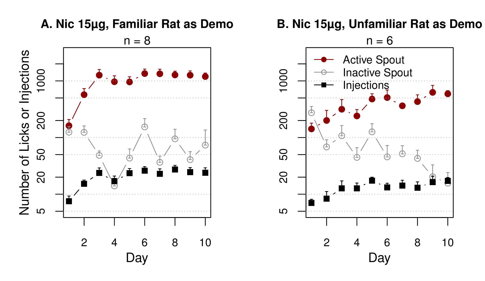
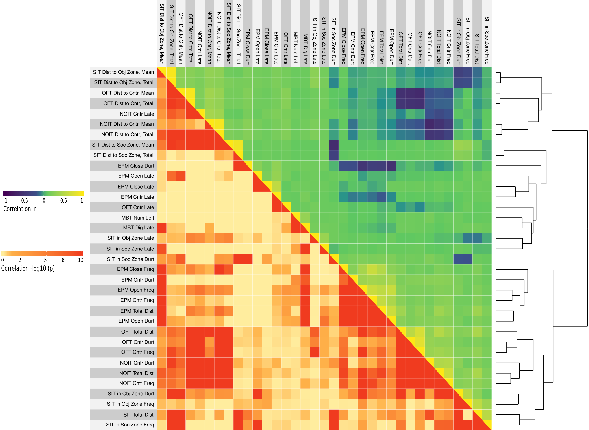

# Searching for genes associated with socially acquired nicotine 
# self-administration in rats

###	Hao Chen

#### Department of Pharmacology

#### University of Tennessee Health Science center

April 12, 2019 @ University of Memphis

---

## Outline

* A model of social learning enabled voluntary nicotine intake in rats
* A genetic association study on this trait
* A brief dive into the rat genome for a sanity check of our results

---
## Tobacco use is the leading preventable cause of death 

* Cigarette smoking is responsible for 90% of all lung cancers. 
* On average, smokers die 10 years earlier than nonsmokers.

---

## Does flavor play a role in tobacco addiction?

---

<section id ="cta">
## Flavor cue does <u>not</u> support nicotine self-administration

<cite> Chen, et al., Neuropsychopharmacology, 2011</cite>

---

## Does social environment play a role in tobacco addiction?

---

## Modeling social learning in rats

<table><tr><td width=50%>
 

<cite>Galef, Dev Psychobiol., 1982 </cite>

</td><td width=50%>

<cite> Wang, et al., Gene Brain Behav 2014 </cite>

</td></tr></table>

---
<section id="stfp">

## Social learning induces nicotine 
## self-administration

<cite> Chen, et al., Neuropsychopharmacology, 2011 </cite>

---

## Nicotine intake with appetitive vs aversive cues

<table width=100%><td width=50%>

	
	 
	

	

	<cite> Wang, et al., Psychopharmacology, 2016 </cite>
	

	</td>
<td width=50%>
	

</td></table>

---

## Familiar peers are more effective  

---

## Rats adjust to dose change; strains differ 

---

## Heterogeneous stock rats 

---
## Socially acquired nicotine self-administration

### HS rats, pilot data

<cite> Wang, et al., Gene Brain Behav, 2014</cite>

---

## What is the social signal?

	

	<cite> Wang, et al., Psychopharmacology, 2016 </cite>
	

---

## Timetable for behavioral tests
<table style="border-collapse: collapse;">
		<tr style="border-bottom:1px solid #000;"> 
			<th >Age</th>
			<th>Test</th>
		</tr>
			<tr><td>21</td><td>Wean </td></tr> 
			<tr><td>30</td><td>Open field: 1m x 1m x 0.5m (1 h)</td></tr>
			<tr><td>31</td><td>Novelty: a cylindrical cage in the center (20 min)</td></tr>
			<tr><td>32</td><td>Social interaction: an unfamiliar rat in the cage (20 min)</td></tr>
			<tr><td>33</td><td>Elevated plus maze (6 min)</td></tr>

			<tr ><td>34</td><td>Marble Bury</td></tr>
			<tr ><td>35-37</td><td>Surgery and recovery</td></tr>
			<tr><td>38-48</td><td>Nicotine SA </td></tr>
			<tr><td>49</td><td>Cotinine assay</td></tr>
			<tr style="border-bottom:1px solid #000;"><td>50-58</td><td>Extinction, Reinstatement </td></tr>
</table>

---

##  Open field test

---
## Novel object interaction 

---
## Social interaction 

---
## Elevated plus maze

---

## Marble bury

---

## Sex differences 

---

## Nicotine self-administration

<cite>Wang, et al., Sci Rep, 2018</cite>

---

## Behavior correlations

<cite>Wang, et al., Sci Rep, 2018</cite>

---

## Interesting insights

<cite>Wang, et al., Sci Rep, 2018</cite>

---
## Can behavioral traits predict nicotine SA? 

Loading of PCA

 

<cite>Wang, et al., Sci Rep, 2018</cite>

---
## PCA regression summary 

|Phenotype | Sex| Variance Explained| 
|---|---|---|---|
|Infusion, first 3 d| F| 0.16| 
|Infusion, first 3 d| M| 0.14| 
|Infusion, last 3 d | F | 0.09| 
|Infusion, last 3 d | M | 0.19| 
|Infusion, progressive ratio | F | 0.16| 
|Infusion, progressive ratio | M | 0.19| 
|Active spout lick, reinstatement | F | 0.10| 
|Active spout lick, reinstatement | F | 0.17| 
|||||

<cite>Wang, et al., Sci Rep, 2018</cite>

---

## Preliminary GWAS

<table width=90%><tr><td with=33%>
<h3> Infusion first 3 sessions </h3>

</td> <td width=33%>
<h3> Infusion all sessions </h3>

</td><td width=33%>
<h3> Prog. from session 1 to 10 </h3>

</td>
</tr>
</table>

---

## Progression of nicotine intake, locus zoom

Ncam2 cis-eQLT in orbitofrontal cortex: chr11	20230022 | adj. p = 4.73e-02

---

## Brain dissection for RNA purification

---
## Gene expression as a trait for genome wide association  

Total genes: 23,291 |  cis-eQLT: 3,606 | trans-eQTL: 1,656 

---

## Acknowledgements
* Current lab members 
	* **Tengfei Wang**, Research Associate 
	* **Angel Garcia Martinez**, Research Assistant 
	* **Hongyan Zhu**, Visiting Scholar
* Past lab members 
	* *Xia Hong* | *Jie Shen* | *Wenyan Han* | *Pawandeep Kaur* | *Yanyan Lin* | *Xinyu Fan* | *Guang Shi*
* Summer students 
	* Abigale Salinero (REHU 2015) | Cindy Tay (REHU 2016) | Raven David (REHU 2017) | Christian Hurt (REHU 2018) | Chiyu Zhang 
* P50 collaborators 
	* Abraham Palmer (UCSD) | Oksana Polaskaya (UCSD) | Apurva Chitre (UCSD) | Leah-Solberg Woods (Wake Forest) 
* P30 collaborators 
	* Rob Williams (UTHSC) | Saunak Sen (UTHSC) | Laura Saba (UC Denver) 
* U01 collaborators 
	* Rob Williams (UTHSC) | Saunak Sen (UTHSC) | Laura Saba (UC Denver) 

---

## Nicotine metabolism

---

## Phenotyping pipeline 
* Breed adolescent HS rats
	* Generate ~ 400 adolescent rats per year 
	* Use four rats (2 &#9794; + 2 &#9792;) in the behavioral studies and one rat for RNA-seq per litter 
* Phenotype social and emotional traits
	* Open field / Novel object / Social interaction / Elevated plus maze / Marble Bury
* Socially acquired nicotine self-administration
	* Acquisition, 10 daily sessions
	* Progressive ratio, 1 session
	* Cotinine assay, 1 time 
	* Extinction, 3-7 sessions
	* Reinstatement, 1 session

---

