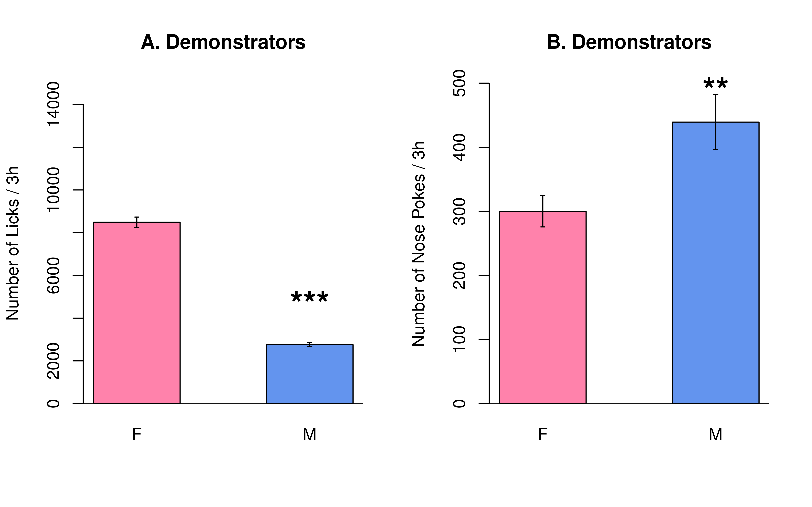
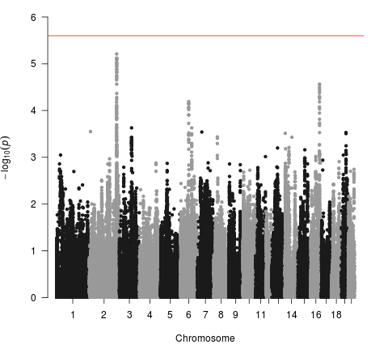
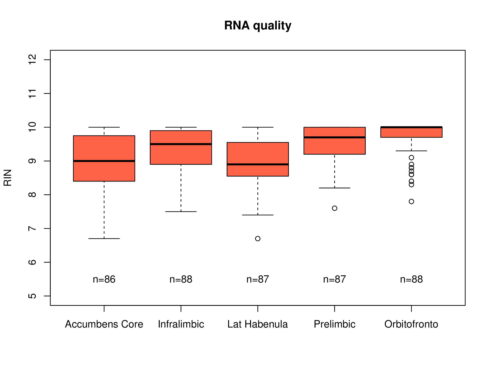

#  GWAS on Socially acquired nicotine 
# self-administration in  
# adolescent heterogeneous stock rats

##	Hao Chen
### University of Tennessee Health Science center

---

## Flavor cue does <a href="#/stfp">not</a> support nicotine self-administration

<cite> Chen, et al., Neuropsychopharmacology, 2011</cite>

---

## Modeling social learning in rats

 
 

<cite>Galef, Dev Psychobiol., 1982 </cite>

	 
	

	

	<cite> Wang, et al., Gene Brain Behav 2014 </cite>
	

---

## Social learning induces nicotine 
## self-administration

<cite> Chen, et al., Neuropsychopharmacology, 2011 </cite>

---

## Nicotine intake with appetitive vs aversive cues

	
	 
	

	

	<cite> Wang, et al., Psychopharmacology, 2016 </cite>
	

	

---

## Socially acquired nicotine self-administration in 12 isogenic strains of rats

---

## Socially acquired nicotine self-administration

### HS rats, pilot data

<cite> Wang, et al., Gene Brain Behav, 2014</cite>

---

## What is the social signal?

	

	<cite> Wang, et al., Psychopharmacology, 2016 </cite>
	

---

## Timetable for behavioral tests
<table style="border-collapse: collapse;">
		<tr style="border-bottom:1px solid #000;"> 
			<th >Age</th>
			<th>Test</th>
		</tr>
			<tr><td>21</td><td>Wean </td></tr> 
			<tr><td>30</td><td>Open field: 1m x 1m x 0.5m (1 h)</td></tr>
			<tr><td>31</td><td>Novelty: a cylindrical cage in the center (20 min)</td></tr>
			<tr><td>32</td><td>Social interaction: an unfamiliar rat in the cage (20 min)</td></tr>
			<tr><td>33</td><td>Elevated plus maze (6 min)</td></tr>

			<tr ><td>34</td><td>Marble Bury</td></tr>
			<tr ><td>35-37</td><td>Surgery and recovery</td></tr>
			<tr><td>38-48</td><td>Nicotine SA </td></tr>
			<tr><td>49</td><td>Cotinine assay</td></tr>
			<tr style="border-bottom:1px solid #000;"><td>50-58</td><td>Extinction, Reinstatement </td></tr>
</table>

---

##  Open field test

---
## Novel object interaction 

---
## Social interaction 

---
## Elevated plus maze

---

## Marble bury

---

## Sex differences 

---

## Nicotine self-administration

<cite>Wang, et al., Sci Rep, accepted</cite>

---

## Behavior correlations

<cite>Wang, et al., Sci Rep, accepted</cite>

---

## Interesting insights

<cite>Wang, et al., Sci Rep, accepted</cite>

---
## Can behavioral traits predict nicotine SA? 

Loading of PCA

 

<cite>Wang, et al., Sci Rep, accepted</cite>

---
## PCA regression summary 

|Phenotype | Sex| Variance Explained| 
|---|---|---|---|
|Infusion, first 3 d| F| 0.18| 
|Infusion, first 3 d| M| 0.17| 
|Infusion, last 3 d | F | 0.12| 
|Infusion, last 3 d | M | 0.20| 
|Infusion, progressive ratio | F | 0.14| 
|Infusion, progressive ratio | M | 0.18| 
|Active spout lick, reinstatement | F | 0.08| 
|Active spout lick, reinstatement | F | 0.19| 
|||||

<cite>Wang, et al., Sci Rep, accepted</cite>

---

## Preliminary GWAS

<table width=90%><tr><td with=33%>
<h3> Infusion first 3 sessions </h3>

</td> <td width=33%>
<h3> Infusion all sessions </h3>

</td><td width=33%>
<h3> Prog. from session 1 to 10 </h3>

</td>
</tr>
</table>

---

## Progression of nicotine intake, locus zoom

Ncam2 cis-eQLT in orbitofrontal cortex: chr11	20230022 | adj. p = 4.73e-02

---

## Brain dissection for RNA purification

---

total genes: 23,291 |  cis-eQLT: 3,606 | trans-eQTL: 1,656 

---

## Acknowledgements
* Current lab members 
	* **Tengfei Wang**, Research Associate 
	* **Angel Garcia Martinez**, Research Assistant 
* Past lab members 
	* *Xia Hong* | *Jie Shen* | *Wenyan Han* | *Pawandeep Kaur* | *Yanyan Lin* | *Xinyu Fan*  
* Summer students 
	* Abigale Salinero (REHU 2015) | Cindy Tay (REHU 2016) | Raven David (REHU 2017) | Christian Hurt (REHU 2018) 
* P50 collaborators 
	* Abraham Palmer | Oksana Polaskaya | Apurva Chitre | Leah-Solberg Woods  | Rob Williams | Laura Saba |

---

## Nicotine metabolism

---

## Phenotyping pipeline 
* Breed adolescent HS rats
	* Generate ~ 400 adolescent rats per year 
	* Use four rats (2 &#9794; + 2 &#9792;) in the behavioral studies and one rat for RNA-seq per litter 
* Phenotype social and emotional traits
	* Open field / Novel object / Social interaction / Elevated plus maze / Marble Bury
* Socially acquired nicotine self-administration
	* Acquisition, 10 daily sessions
	* Progressive ratio, 1 session
	* Cotinine assay, 1 time 
	* Extinction, 3-7 sessions
	* Reinstatement, 1 session

---

