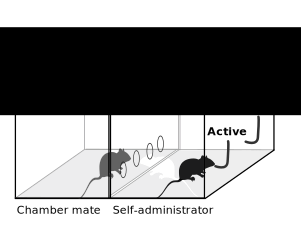

# Social behavior and nicotine 

--------

## Hao Chen, Ph.D

### Department of Pharmacology
### UTHSC

March 9th, 2018

---

## Outline 

* Social and genetic factors interact to influence addictive behavior
* Socially acquired nicotine self-administration
* GWAS using rats
* Using deep learning to analyze rat social behavior
* Nicotine withdrawal modulates social behavior in rats 

---

## Social factors influence smoking behavior

---

## Genetic factors influence smoking behavior

---

## G x E interaction also influences smoking behavior

---
## Animal models are useful  for studying the role of ...

<ul>
<li>  genetic factors
<li> social factors
<li> G x E
</ul>

---

## Heritability of Nicotine IVSA in rats

<cite> Chen, et al., PLoS ONE, 2012</cite>

---

## Nicotine self-administration with flavor cue

<table width=80%><tr>
<td width=50% align="center" valign="center">

</td><td align="center" valign="center">

</td></tr></table>

---
<section id="solo">

## Flavor cue does <a href="#/stfp">not</a> support nicotine self-administration

<cite> Chen, et al., Neuropsychopharmacology, 2011</cite>

---

## Nicotine is primarily aversive in non-smokers 
<table>
	<tr>
		<td width=50%>
			
		</td>
		<td width=90%>
			
		</td>
	</tr>
	<tr>
		<td>
		Coughing, nausea, dizziness, sickness, burning throat, headache.
		</td>
		<td>
		Nicotine induces drug high only in <em>significantly nicotine-deprived smokers</em>. 
		</td>
	</tr>
</table>

---

## Modeling social learning in rats

 
 

<cite>Galef, Dev Psychobiol., 1982 </cite>

---
<section id="social">
## Social learning induces nicotine self-administration

<cite> Chen, et al., Neuropsychopharmacology, 2011 </cite>

---

## Social context 

 <b>Neutral</b> 

<b>Inducing</b>

---

## Nicotine self-administration with an aversive  cue

 
 NSE: Neutral social environment | ISE: Inducing social environment 

<cite> Wang, et al., Psychopharmacology, 2016 </cite>

---

## Nicotine intake with appetitive vs aversive  cues

 

<cite> Wang, et al., Psychopharmacology, 2016 </cite>

---

## What is the social signal?

---

## Odor but not taste cue is required

<cite> Chen, et al., Neuropsychopharmacology, 2011</cite>

---

---
## Dose response to CS2 

 

<cite> Wang &amp; Chen, PLoS ONE, 2014</cite>

---

<small> NSE: Neutral social environment | ISE: Inducing social environment </small>

<cite> Wang &amp; Chen, PLoS ONE, 2014 </cite>

---

## Summary

<ul>
<li> Nicotine is both rewarding and aversive. </li>
<li> Flavor cues are associated with the aversive effect of nicotine. </li>
<li> Social learning facilitates the extinction of conditioned aversion and promote nicotine self-administration. </li>
<li> CS2 is a critical signal that mediates social learning and nicotine intake. </li>
<li> Operant behavior is driven by the rewarding effect of nicotine, and not by the subjective value of the flavor cue. </li>
<li> A key molecular mechanism is oxytocin receptor signaling in the infralimbic cortex.
</ul>

## Social factors influence smoking behavior

---

## Genetic factors influence smoking behavior

---

## Socially acquired nicotine IVSA in adolescent rats

---

## Olfactory but not gustatory cue mediates social learning 

---

## Carbon disulfide is part of the social signal

---

## Nicotine IVSA with an aversive flavor cue

---

## Socially acquired nicotine IVSA is heritable 

---

## Extinction 

---

## Infralimbic IEG  

---

## Oxytocine 

---

## Heterogenous stock rats 

---

## Phenotyping pipeline

---

## Genotyping method

---

## Behavior correlations

---

## GWAS preliminary results

---

## PheWAS 

---

## General method to analyze rodent social interactions 

---

## Image analysis

---

## Deep learning  

---

## Yolo

---

## YoRodents: Labeling images

---

## YoRodents: Training a neural net 

---

---

---

## Analyzing other image types   

### Optic nerve cross section 

---

## Analyzing other image types   

### Mice agressive behavior 

---

## Acknoledgements

---

