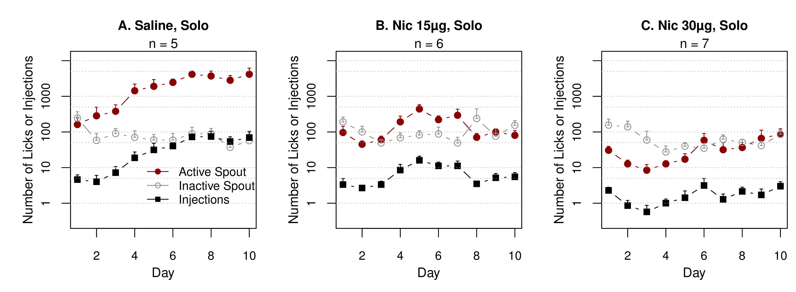
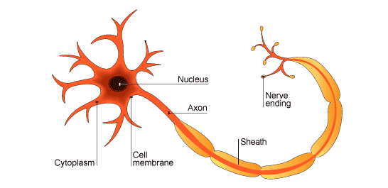

# Social behavior and nicotine 

--------

## Hao Chen, Ph.D

### Department of Pharmacology
### UTHSC

March 13th, 2018

---

## Acknowledgements

* Current lab members 
	* **Tengfei Wang**, Research Associate 
	* Angel Garcia, *Xinyu Fan*, Research Assistant 
* Past lab members 
	*  Reziwan Yimiti | Qinglin Wu |  Katie Hiler | Hongxiao Song |  Xia Hong |  Jie Shen | **Wenyan Han** | Pawandeep Kaur | Yanyan Lin
* P50 collaborators 
	* **Abraham Palmer** |  Oksana Polaskaya |  Apurva Chitre | **Leah-Solberg Woods** 
* UTHSC collaborators 
	* **Burt Sharp** | **Rob Williams** 
* Funding (current and past)
	* NIDA:  RC2 | NIDA R21 |  NIDA P50
	* UTHSC: MIPA | UTRF | VCR new grant support

---

## Outline 

* Social and genetic factors influencing nicotine intake 
 * Socially acquired nicotine self-administration
 * GWAS on socially acquired nicotine self-administration 
* Using deep learning to analyze rat social behavior

---

## Social factors influence smoking behavior

<div id="left50" >
 
</div>
<div id="right50">
 
</div>

---

## Genetic factors influence smoking behavior

<div id="left50" >

</div>

<div id="right50" >

</div>

---

## Animal models are useful for 

 studying the role of <font color="tomato"><b>social factors</b></font>

---

## Nicotine self-administration with flavor cue

<table width=80%><tr>
<td width=50% align="center" valign="center">

</td><td align="center" valign="center">


</td></tr></table>

---
<section id="solo">

## Flavor cue does <a href="#/stfp">not</a> support nicotine self-administration
<a href="#/social">
 
</a>

<hr align="left" width=15%> <p align=left>
<cite> Chen, et al., Neuropsychopharmacology, 2011</cite>


---


## Nicotine is primarily aversive in non-smokers 
<table>
 <tr>
 <td width=50%>
 
 </td>
 <td width=90%>
 
 </td>
 </tr>
 <tr>
 <td>
 Coughing, nausea, dizziness, sickness, burning throat, headache.
 </td>
 <td>
 Nicotine induces drug high only in <em>significantly nicotine-deprived smokers</em>. 
 </td>
 </tr>
</table>


---

## Modeling social learning in rats

<div id="left50">
 
<br>
<hr align="left" width=15%> <p align=left>
<cite>Galef, Dev Psychobiol., 1982 </cite>

</div>

<div id="right50">

<br>
<hr align="left" width=15%> <p align=left>
<cite>Wang, et al. Genes, Brain & Behav., 2013 </cite>
</div>

---

<section id="social">
## Social learning induces nicotine self-administration
<a href="#/solo">
 
</a>
<hr align="left" width=15%>
<p align=left>
<cite> Chen, et al., Neuropsychopharmacology, 2011 </cite>

---

## Social context 

<div id="left50">

 <b>Neutral</b> social environment
</div>

<div id="right50">

<b>Inducing</b> social environment
</div>

---

## Nicotine self-administration with an <span style="color:red">aversive </span> cue


<br>
 NSE: Neutral social environment <font color="grey">|</font> ISE: Inducing social environment 
<hr align="left" width=15%>
<p align=left>
<cite> Wang, et al., Psychopharmacology, 2016 </cite>
</p>


---

## Nicotine intake with <span style="color:royalblue">appetitive</span> vs <span style="color:darkred">aversive </span> cues

<br>
<hr align="left" width=15%>
<p align=left>

<cite> Wang, et al., Psychopharmacology, 2016 </cite>
</p>

---

## What is the social signal?


---

## Odor cue is required


<hr align="left" width=15%>
<p align=left>
<cite> Chen, et al., Neuropsychopharmacology, 2011</cite>


---


---
## Dose response to CS<sub>2</sub> 


<br>
<hr align="left" width=15%> <p align=left>
<cite> Wang &amp; Chen, PLoS ONE, 2014</cite>
</p>

---

## Social learning reduces conditioned aversion 


---

### Infralimbic cortex is preferentially activated during CFA test 


---

## RNA-seq of infralimbic cortex


---

## RNA-seq of infralimbic cortex


<hr align="left" width=15%> <p align=left>
<cite> Chen, et al., BMC Bioinformatics, 2015</cite>

---
## Gene sets enrichment in ISE 


---
## Chilibot identifies the functions of the differentially expressed genes


<hr align="left" width=15%> <p align=left>
<cite> Chen &amp; Sharp, BMC Bioinformatics, 2004</cite>
</p>

---

## <font color="darkblue">Modeling the role of social environment in nicotine intake </font>

#### Summary

<ul>
<li> Social learning results in reduced conditioned aversion and promote nicotine self-administration. </li>
<li> Operant behavior is driven by the rewarding effect of nicotine, and not by the subjective value of the flavor cue. </li>
<li> CS<sub>2</sub> is a critical signal that mediates social learning and nicotine intake. </li>
<li> Synaptic plasticity in inframlimbic cortex is critical for the effect of social learning.</li>
</ul>

---

## Animal models are useful for 

 studying the role of <font color="tomato"><b>genetic factors</b></font>

---

## Heritability of nicotine self-administration in rats


<hr align="left" width=15%> <p align=left>
<cite> Chen, et al., PLoS ONE, 2012</cite>

---

## Socially acquired nicotine self-administration is heritable


<hr align="left" width=15%u> <p align=left>
<cite> Han, et al., Sci Reports, 2017</cite>

---

## Heterogenous stock rats 


<hr align="left" width=15%> <p align=left>
<cite> Solberg Woods, Physiol. Genomics, 2014</cite>


---

## Socially acquired nicotine self-administration in HS rats 

#### Pilot Study


<hr align="left" width=15%> <p align=left>
<cite>Wang, et al. Genes, Brain & Behav., 2013 </cite>

---


## Socially acquired nicotine self-administration in HS rats 

#### Pilot Study


<hr align="left" width=15%> <p align=left>
<cite>Wang, et al. Genes, Brain & Behav., 2013 </cite>


---
## Phenotyping pipeline 


<hr align="left" width=15%> <p align=left>
<cite>Wang, et al., BioRxiv, 2018 </cite>

---
## Socially acquired nicotine self-administration in HS rats 


<hr align="left" width=15%> <p align=left>
<cite>Wang, et al., BioRxiv, 2018 </cite>

---

## Principal component analysis 


<hr align="left" width=15%> <p align=left>
<cite>Wang, et al., BioRxiv, 2018 </cite>

---

## Social and anxiety-like traits contribute to nicotine self-administration

PCA regression


<hr align="left" width=15%> <p align=left>
<cite>Wang, et al., BioRxiv, 2018 </cite>

---

## GWAS preliminary results


---


## <font color="darkblue">Modeling the role of genetic factors in nicotine intake </font>

#### Summary

* Both inbred and outbred strains of rats indicate there is a strong genetic influence on nicotine intake.
* These data further indicates social learning facilitates the extinction of conditioned aversion.
* Initial GWAS results are encouraging.
* Genes overlap between RNA-seq ang GWAS are priorities of future studies using in vivo genome editing tools.
* Rodent models are useful for studying G x E.

---

## Animal models are useful for 

 studying <font color="tomato"><b>social anxiety</b></font>

---

## Social interaction between rats have been used to study anxiety

<div id="left50"> 

</div>

<div id="right50"> 

</div>

---

## Social interaction among rats 

<iframe width="600" height="600" src="https://www.youtube.com/embed/mJglzLs3RNo" frameborder="0" allow="autoplay; encrypted-media" allowfullscreen></iframe>


---

## The resurgence of AI 

* AlphaGO beats human 
* Voice recognition on smartphones 
* Cars are driving themselves

---

## A neuron: biological model vs mathematical model 

<table><tr width=90%><td width=50%>

</td>
<td width=50%>

</td></tr>
</table>


---

## YOLO 

<iframe width="700" height="415" src="https://www.youtube.com/embed/yQwfDxBMtXg?start=420" frameborder="0" allow="autoplay; encrypted-media" allowfullscreen></iframe>

---

## YoRodents: Labeling images


---
## Training a custom YOLO network


```
darknet detector train rat12class.data yolo_12_class.cfg darknet19_448.conv.23 
```

---

## Detecting objects using the trained network


---

## Prediction probability of 9 classes


---

## Reconstructing behavior 

<iframe width=80% height="550" src="https://www.youtube.com/embed/Lwfg2t9nXcI?start=45" frameborder="0" allow="autoplay; encrypted-media" allowfullscreen></iframe>

---

## Visualization is good for detecting errors


---

## Time course of behaviors 


---

## Social complexity 


---

## Nicotine withdrawal


---

## <font color="darkblue">Using deep learing to analyze rodent social behavior </font>

#### Summary

* Deep learning, more specificially, convolutional neural network is an accessible technology. 
* Detailed social interaction data with high spacial and time resolution can be obtained. 
* On going analysis showed social complexity affects social behaivor.

---

##  VCR innovator lecture 

Dept Pharmacology | Genetics Genomics Informatics

### Tom Chittenden, PH.D. 

 Vice President  of Statistical Sciences 

Founding Director of the Advanced A.I. Research Laboratory 

WuXi NextCODE 

**Ensemble Computational Intelligence Reveals Novel Molecular Signatures of Cancer Biology and Pan-Cancer Survival**

Tue, April 3rd Noon

Freeman Auditorium

---

## Thank you !!  

## ??

---
## Extinction of conditioned flavor aversion is correlated with nicotine intake 


<hr align="left" width=15%> <p align=left>
<cite> Han, et al., Sci Reports, 2017</cite>

---

## Extinction of conditioned flavor aversion is correlated with nicotine intake 


<hr align="left" width=15%> <p align=left>
<cite> Han, et al., Sci Reports, 2017</cite>


---

