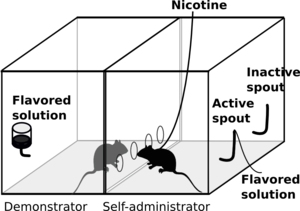
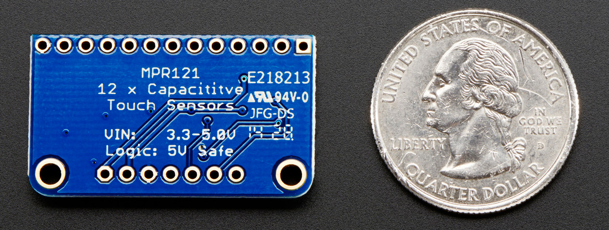
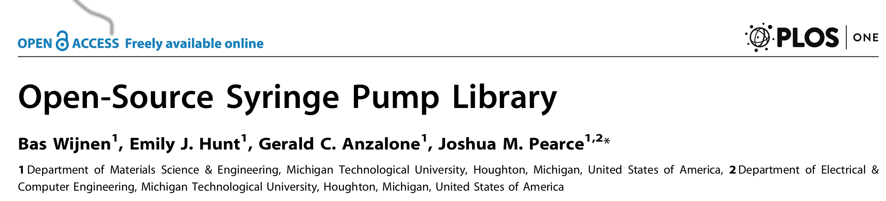
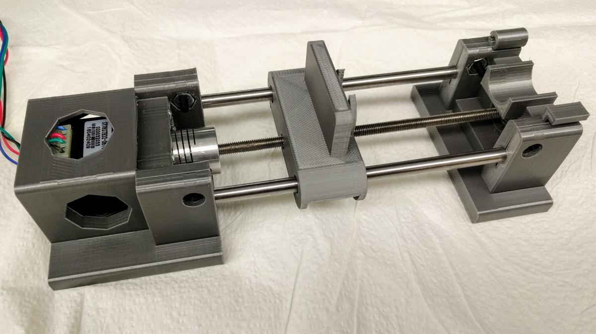
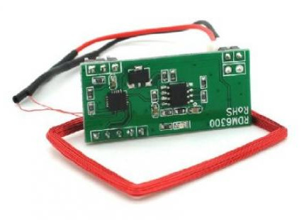
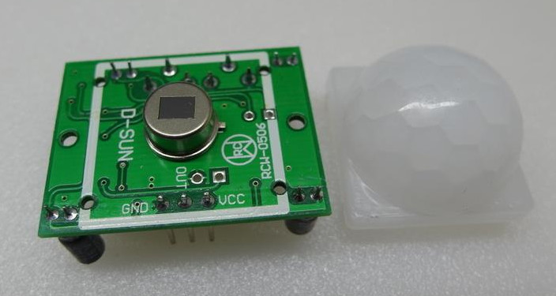
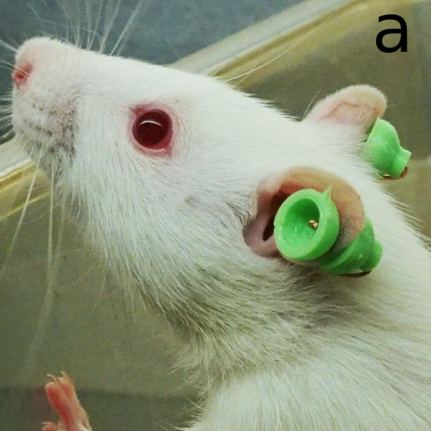

# An open source device for operant licking in rats

## Hao Chen, Ph.D.
hchen@uthsc.edu 
#### Assistant Professor
#### Department of Pharmacology, Uiversity of Tennessee Health Science Center 

Society for Neuroscience Annual Meeting

November 13th, 2017

---

## Socially acquired nicotine self-administration 

---

## Experiment setup

* One computer can control many (e.g., 16) stations via dedicated cables
* Requires dedicated space (even when not use)
* Expensive
* Older software does not have tight integration with RFID 

---

## Single Board Computers are now widely available

---

## Many sensors are available too

* Touch sensor
* Motion sensor
* Temperature, humidity, light, ... 

---

## Design of an operant licking device

[https://github.com/chen42/openbehavior](https://github.com/chen42/openbehavior)

---

## Touch sensor for lick detection

---

## Syringe pump

---

## Our version

---

## RFID reader 

---

## Motion sensor

---

## 3D Printed Frame

---

## Add wires

---

## Put everything together 

---

## Put it in a regular cage

---

## Look from the side  

---

## Licking for sucrose vs water

---

## Time course

---

## Lick microstructure 

---

## Locomotor  Activity 

---

## Alcohol self-administration 

---

## Environment condition sensors

---

## Environment data

---

## How can we do alcohol self-administration with more rats? 

* More sensitive RFID system

---

## Making rats visually identifiable 

---

## Using computer vision to identify rats 
<iframe width="560" height="315" src="https://www.youtube.com/embed/TzLVdf0jxwk" frameborder="0" allowfullscreen></iframe>

---

## GitHub

## [https://github.com/chen42/openbehavior](https://github.com/chen42/openbehavior)

---

## Acknowledgment
* Matthew Longley 
* Guang Shi 
* Cindy Tay (NIDA P50 Summer student) 

Fund in part by NIDA DA-037844
---
