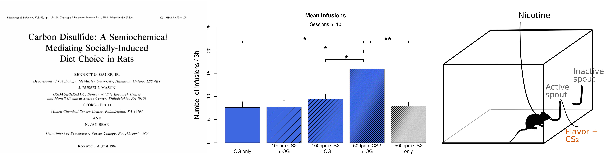
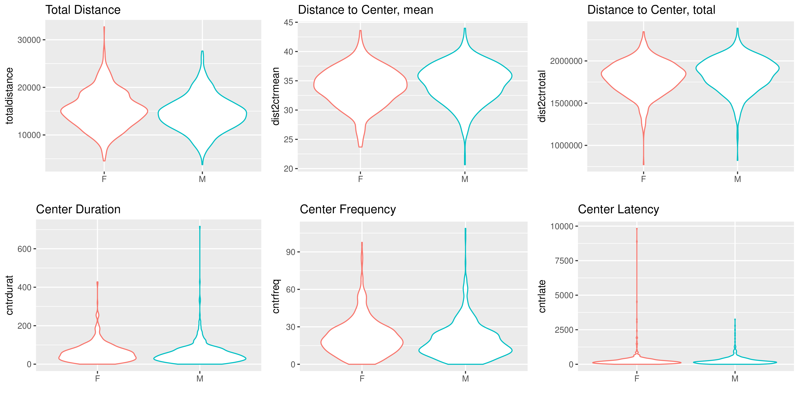
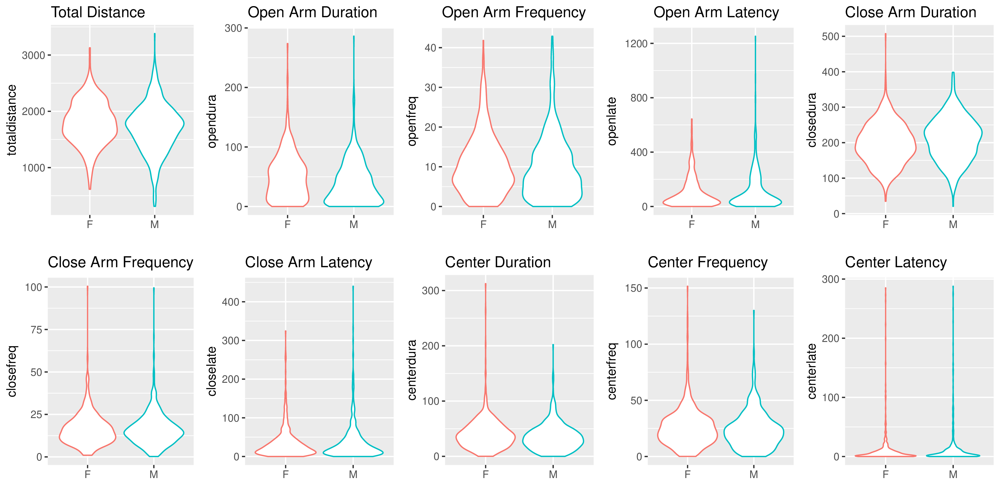
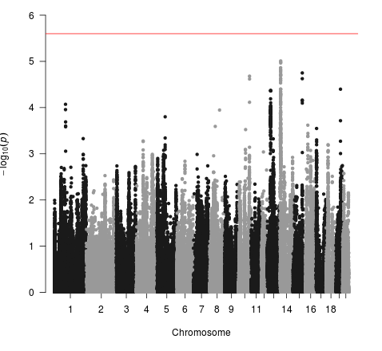
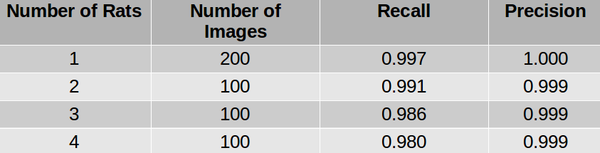

### Project 2 

# Socially acquired nicotine 
# self-administration 

##	Hao Chen
### University of Tennessee Health Science center

Rat GWAS retreat, June 15, 2018

---
## Specific Aims 

<h3 style="color:#069; text-align:left" >Aim 1. Breed adolescent HS rats at UTHSC </h3>
<h3 style="color:#069; text-align:left">Aim 2. Phenotype adolescent HS rats on socially acquired nicotine self-administration </h3>
<h4 style="text-align:left; text-indent:40px">2A. Phenotype HS rats on social and emotional traits </h4>
<h4 style="text-align:left; text-indent:40px">2B. Phenotype HS rats using the socially acquired nicotine self-administration paradigm </h4>
<h4 style="text-align:left; text-indent:40px">2C. Analyze the relationships between behavioral traits obtained in Aims 2A and 2B </h4>
<h3 style="color:#069; text-align:left">Aim 3. Extract RNA from five brain regions in naive HS rats for transcriptome sequencing </h3>

---

## Flavor cue does <a href="#/stfp">not</a> support nicotine self-administration

<cite> Chen, et al., Neuropsychopharmacology, 2011</cite>

---

## Modeling social learning in rats

 
 

<cite>Galef, Dev Psychobiol., 1982 </cite>

	 
	

	

	<cite> Wang, et al., Gene Brain Behav 2014 </cite>
	

---

## Social learning induces nicotine 
## self-administration

<cite> Chen, et al., Neuropsychopharmacology, 2011 </cite>

---

## Nicotine intake with appetitive vs aversive cues

	
	 
	

	

	<cite> Wang, et al., Psychopharmacology, 2016 </cite>
	

	

---

## Socially acquired nicotine self-administration in 12 isogenic strains of rats

---

## Socially acquired nicotine self-administration

### HS rats, pilot data

<cite> Wang, et al., Gene Brain Behav, 2014</cite>

---

## What is the social signal?

	

	<cite> Wang, et al., Psychopharmacology, 2016 </cite>
	

---

## Phenotyping pipeline 
* Breed adolescent HS rats
	* Generate ~ 400 adolescent rats per year 
	* Use four rats (2 &#9794; + 2 &#9792;) in the behavioral studies and one rat for RNA-seq per litter 
* Phenotype social and emotional traits
	* Open field / Novel object / Social interaction / Elevated plus maze / Marble Bury
* Socially acquired nicotine self-administration
	* Acquisition, 10 daily sessions
	* Progressive ratio, 1 session
	* Cotinine assay, 1 time 
	* Extinction, 3-7 sessions
	* Reinstatement, 1 session

---

## Timetable for behavioral tests
<table style="border-collapse: collapse;">
		<tr style="border-bottom:1px solid #000;"> 
			<th >Age</th>
			<th>Test</th>
		</tr>
			<tr><td>21</td><td>Wean </td></tr> 
			<tr><td>30</td><td>Open field: 1m x 1m x 0.5m (1 h)</td></tr>
			<tr><td>31</td><td>Novelty: a cylindrical cage in the center (20 min)</td></tr>
			<tr><td>32</td><td>Social interaction: an unfamiliar rat in the cage (20 min)</td></tr>
			<tr><td>33</td><td>Elevated plus maze (6 min)</td></tr>

			<tr ><td>34</td><td>Marble Bury</td></tr>
			<tr ><td>35-37</td><td>Surgery and recovery</td></tr>
			<tr><td>38-48</td><td>Nicotine SA </td></tr>
			<tr><td>49</td><td>Cotinine assay</td></tr>
			<tr style="border-bottom:1px solid #000;"><td>50-58</td><td>Extinction, Reinstatement </td></tr>
</table>

---

## Project progress 

|Batch|Arrival Date | Status|Batch|Arrival Date | Status|
|---|---|---|---|--|---|
| 00 | 2014-07-14| Completed |09 | 2016-11-30| Completed |
| 01 | 2014-10-27| Completed |10 | 2017-02-08| Completed |
| 02 | 2015-02-25| Completed |11 | 2017-05-10| Completed |
| 03 | 2015-06-01| Completed |12 | 2017-08-09| Completed |
| 04 | 2015-08-05| Completed |13 | 2018-11-07| Completed |
| 05 | 2015-10-27| Completed |14 | 2018-02-04| In progress |
| 06 | 2016-02-02| Completed |15 | 2018-05-08| Released from quarantine |
| 07 | 2016-06-07| Completed |16 | 2018-08-10| To be shipped |
| 08 | 2016-08-16| Completed | |||
||||||

---

Aim 2A

##  Open field test

---
## Novel object interaction 

---
## Social interaction 

---
## Elevated plus maze

---

## Marble bury

---

## Sex differences 

---

Aim 2B

## Nicotine self-administration

---

Aim 2C

## Behavior correlations

---

## Interesting insights

---
## Can behavioral traits predict nicotine SA? 

Loading of PCA

 

---
## PCA regression summary 

|Phenotype | Sex| Variance Explained| 
|---|---|---|---|
|Infusion, first 3 d| F| 0.18| 
|Infusion, first 3 d| M| 0.17| 
|Infusion, last 3 d | F | 0.12| 
|Infusion, last 3 d | M | 0.20| 
|Infusion, progressive ratio | F | 0.14| 
|Infusion, progressive ratio | M | 0.18| 
|Active spout lick, reinstatement | F | 0.08| 
|Active spout lick, reinstatement | F | 0.19| 
|||||

---

## Preliminary GWAS

<table width=90%><tr><td with=33%>
<h3> Infusion first 3 sessions </h3>

</td> <td width=33%>
<h3> Infusion all sessions </h3>

</td><td width=33%>
<h3> Prog. from session 1 to 10 </h3>

</td>
</tr>
</table>

---

## Nicotine metabolism

---

Aim 3

## Brain dissection for RNA purification

---

## Accomplishments 

* Tengfei Wang, Wenyan Han, Bin Wang, Qing Jiang, Leah C Solberg-Woods, Abraham A Palmer, Hao Chen. Propensity for social interaction predicts nicotine-reinforced behaviors in outbred rats. Genes Brain Behav. 2014 Feb;13(2):202. 

* Tengfei Wang, Wenyan Han, Hao Chen. Socially acquired nicotine self-administration with an aversive flavor cue in adolescent female rats. Psychopharmacology. 2016 May;233(10):1837

* Matthew Longley, Ethan L Willis, Cindy X Tay, Hao Chen. An open source device for operant licking in rats. PeerJ 2017 Feb 14;5:e2981. 

* Wenyan Han, Tengfei Wang, Hao Chen. Extinction of conditioned aversion contributes to socially acquired nicotine self-administration in isogenic strains of adolescent rats. Sci Rep 2017 Aug 14;7(1):8052. 

* Tengfei Wang, Wenyan Han, Apurva Chitre, Oksana Polesskaya, Leah C. Solberg-Woods, Abraham A. Palmer, and Hao Chen. Social behavior and anxiety contributes to nicotine self-administration in adolescent outbred rats. Sci Rep. 2018 Resubmission

---

## Acknowledgements
* Current lab members 
	* **Tengfei Wang**, Research Associate 
	* **Xinyu Fan**, Research Assistant
	* **Angel Garcia Martinez**, Research Assistant 
* Past lab members 
	* *Xia Hong* | *Jie Shen* | *Wenyan Han* | *Pawandeep Kaur* | *Yanyan Lin* 
* Summer students 
	* Abigale Salinero (REHU 2015) | Cindy Tay (REHU 2016) | Raven David (REHU 2017) | Christian Hurt (REHU 2018) 
* P50 collaborators 
	* Abraham Palmer | Oksana Polaskaya | Apurva Chitre | Leah-Solberg Woods | Barry Aprison 

---

## Yorodent: using ConvNet to quantify rat social interactions

---

## Yorodent Method

* Recognizes five body parts per rat
	* Heads are labeled based on the color of the ear tag
	* Five colors trained, more can be added
* Training data
	* 8,000 manually labeled images
* Network Training
	* 16,000 epocs using dual NVIDIA GTX 1080 Ti GPUs
	* about 3 days
* Validation using new images

---

## Putting everything together 

<iframe width=80% height="550" src="https://www.youtube.com/embed/Lwfg2t9nXcI?start=45" frameborder="0" allow="autoplay; encrypted-media" allowfullscreen></iframe>

---

## Recording home cage behavior under infrared light

<iframe width="520" height="345" src="https://www.youtube.com/embed/bqu2IaS6RSA?rel=0" frameborder="0" allow="autoplay; encrypted-media" allowfullscreen></iframe>

<iframe width="520" height="345" src="https://www.youtube.com/embed/QPuth-mTEOs?rel=0" frameborder="0" allow="autoplay; encrypted-media" allowfullscreen></iframe>

---

## Significant PCs
<table width=80%>
<tr ><td width=80%>  </td>
<td align="left" width=20%> 

<table><tr><td><b>PC</b></td><td> <b>Counts</b></td></tr>
<tr><td>PC2</td><td>2</td></tr>
<tr><td>PC5</td><td>3</td></tr>
<tr><td>PC6</td><td>4</td></tr>
<tr><td>PC8</td><td>2</td></tr>
<tr><td>PC12</td><td>2</td></tr>
<tr><td>PC19</td><td>4</td></tr>
<tr><td>PC25</td><td>3</td></tr>
<tr><td>PC26</td><td>2</td></tr>
<tr><td>PC29</td><td>2</td></tr>
</table>

</td></tr>
</table>

---

