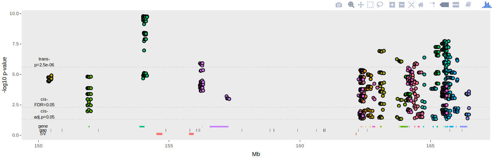

## Project 2 

# Socially acquired nicotine 
# self-administration 

##	Hao Chen
### University of Tennessee Health Science center

Rat GWAS retreat, June 12, 2019

---

## Specific Aims 

<h3 style="color:#069; text-align:left" >Aim 1. Breed adolescent HS rats at UTHSC </h3>
<h3 style="color:#069; text-align:left">Aim 2. Phenotype adolescent HS rats on socially acquired nicotine self-administration </h3>
<h4 style="text-align:left; text-indent:40px">2A. Phenotype HS rats on social and emotional traits </h4>
<h4 style="text-align:left; text-indent:40px">2B. Phenotype HS rats using the socially acquired nicotine self-administration paradigm </h4>
<h4 style="text-align:left; text-indent:40px">2C. Analyze the relationships between behavioral traits obtained in Aims 2A and 2B </h4>
<h3 style="color:#069; text-align:left">Aim 3. Extract RNA from five brain regions in naive HS rats for transcriptome sequencing </h3>

---

## Flavor cue does <a href="#/stfp">not</a> support nicotine self-administration

<cite> Chen, et al., Neuropsychopharmacology, 2011</cite>

---

## Modeling social learning in rats

 
 

<cite>Galef, Dev Psychobiol., 1982 </cite>

	 
	

	

	<cite> Wang, et al., Gene Brain Behav 2014 </cite>
	

---

## Social learning induces nicotine 
## self-administration

<cite> Chen, et al., Neuropsychopharmacology, 2011 </cite>

---

## Nicotine intake with appetitive vs aversive cues

	
	 
	

	

	<cite> Wang, et al., Psychopharmacology, 2016 </cite>
	

	

---

## Socially acquired nicotine self-administration

### HS rats, pilot data

<cite> Wang, et al., Gene Brain Behav, 2014</cite>

---

## What is the social signal?

	

	<cite> Wang, et al., Psychopharmacology, 2016 </cite>
	

---

## Timetable for behavioral tests
<table style="border-collapse: collapse;">
		<tr style="border-bottom:1px solid #000;"> 
			<th >Age</th>
			<th>Test</th>
		</tr>
			<tr><td>21</td><td>Wean </td></tr> 
			<tr><td>30</td><td>Open field: 1m x 1m x 0.5m (1 h)</td></tr>
			<tr><td>31</td><td>Novelty: a cylindrical cage in the center (20 min)</td></tr>
			<tr><td>32</td><td>Social interaction: an unfamiliar rat in the cage (20 min)</td></tr>
			<tr><td>33</td><td>Elevated plus maze (6 min)</td></tr>

			<tr ><td>34</td><td>Marble Bury</td></tr>
			<tr ><td>35-37</td><td>Surgery and recovery</td></tr>
			<tr><td>38-48</td><td>Nicotine SA </td></tr>
			<tr><td>49</td><td>Cotinine assay</td></tr>
			<tr style="border-bottom:1px solid #000;"><td>50-58</td><td>Extinction, Reinstatement </td></tr>
</table>

---

Aim 2B

## Nicotine self-administration

---

Aim 2C

## Behavior correlations

---

## Can behavioral traits predict nicotine SA? 

Loading of PCA

 

---
## PCA regression summary 

|Phenotype | Sex| Variance Explained| 
|---|---|---|---|
|Infusion, first 3 d| F| 0.18| 
|Infusion, first 3 d| M| 0.17| 
|Infusion, last 3 d | F | 0.12| 
|Infusion, last 3 d | M | 0.20| 
|Infusion, progressive ratio | F | 0.14| 
|Infusion, progressive ratio | M | 0.18| 
|Active spout lick, reinstatement | F | 0.08| 
|Active spout lick, reinstatement | F | 0.19| 
|||||

---

## GWAS 

* Sample size is about 1,000
* Almost 20 Genes shared with human smoking GWAS 
* The Chrna5-Chrna3-Chrnb4 cluster is not significant

---

## GWAS: Reinstatement of nicotine seeking

 

---

## GWAS: Reinstatement of nicotine seeking  

 

---

## PheWAS on Chr1:157.9MB 

---

---

## GWAS: Reinstatement of nicotine seeking  

 

---

## cis-eQTL of Dlg2 

---

## Literature on  Dlg2

---

## Example 1 summary 

* A loci significant for both nicotine reinstatement and sign tracking
* Sign trackers have stronger nicotine reinstatement than controls 
* Dlg2 located in this loci has cis-eQTL, interesting biology,  
* Dlg2 has been found in human GWAS for Schizophrenia and COPD, both associated with cigarette smoking

---

## GWAS: total nicotine infusion during 10 sessions 

---

## PheWAS: total nicotine infusion during 10 sessions 

---
## Mef2c trans-eQTL 

<table><tr><td>brain region</td><td>eQTL top SNP </td><td>eQTL -log10P</td><td>r2 with trait top SNP</td><td>dprime with trait topSNP</td></tr> 
<tr><td>orbitofrontal cortex</td><td>chr5:56419529 </td><td>5.586</td><td>0.606</td><td>0.87</td></tr> 
</table>

---
## Mef2C literature

* Does Mef2c interact with other addiction related genes? 

---

## Example 2 summary 

* A loci is significant for total nicotine intake 
* This loci is also significant for multiple other measures of nicotine intake  
* This loci does not have many genes but it regulates the expression of a transcription factor  
* This transcription factor is associatd with smoking and psychiatric disease in humang GWAS
* This transcription factor interacts with many other addiction related genes

---

## The Tenm4-Nars2-Gab2-Usp35-Alg8 cluster on Chr1

Ratio of **active/inactive** lick during reinstatement

---

## Alg8 cis-eQTL 

---
## Alg8  function

* 8x10-6 in human smoking GWAS [PMID: 30219690]
* Alg8 encodes a glucosyltransferase, which catalyzes the addition of a glucose residue to the lipid-linked oligosaccharide precursor for N-linked glycosylation of proteins. 
* All subunits of the nicotinic AChR contain N-linked glycans. These sites are important for receptor assembly [PMID:16091366] and stability [PMID:15626708]. 
* Chronic nicotine exposure is known to upregulate its receptor at the protein level in both smokers and animals. This effect has been shown to be mediated via intracellular maturation, which involves glycosylation at multiple steps [PMID:15944128].

---

## Example 3 summary

* A loci is significant for reinstatement of nicotine seeking 
* This loci has many genes found in human GWAS 
	* Hypothesis: there is high LD in this region in both species
	* But examine genes shared between species eliminates the candidates.
* One of the genes (Alg8) has very interesting biology related to the regulation of nicotinic receptor

---

## GWAS: Day 9 inactive lick 

---

## PheWAS: Day 9 inactive lick 

---

## GWAS: Social interaction

---
## Cacna family of genes

---
## Annotation discrepency of Cacna1c 

---

## Potential chromosomal swap in the reference genome 

---

## Example 4 summary 

* A loci on Chr16 is significant for inactive licks on day 9 
* This association is also supported by inactive licks on 10 and 11.   
* The peak looked a little odd  but it overlaps with a calcium channel gene 
* A loci on Chr4 is significant for social interaction  
* The loci also overlap with calcium channel genes.
* There is some potential errors in the reference genome between these two regions. The annotation of these genes are  not consistent.
* Hypothesis 
	* The SNP associated with the inactive licks on day 9 actually belong to Cacna1c on Chr4
	* Cacna1c is associated with sociability, facilitates social learning of nicotine self-administration, which is manifested in reduction in the number of inactive licks during late self-administration.

---

Aim 3

## Brain dissection for RNA purification

---

## cis- vs trans- eQTLs
### Five brain regions combined

<a href="https://chen42.shinyapps.io/shiny" target=_new> https://chen42.shinyapps.io/shiny </a>

---

## Changes proposed in the renewal 

<iframe width=80% height="550" src="https://www.youtube.com/embed/Lwfg2t9nXcI?start=45" frameborder="0" allow="autoplay; encrypted-media" allowfullscreen></iframe>

---

## Acknowledgements
* Current lab members 
	* **Tengfei Wang**, Research Associate 
	* **Angel Garcia Martinez**, Research Assistant 
* Past lab members 
	* *Xia Hong* | *Jie Shen* | *Wenyan Han* | *Pawandeep Kaur* | *Yanyan Lin* | *Xinyu Fan*  
* Summer students 
	* Abigale Salinero (REHU 2015) | Cindy Tay (REHU 2016) | Raven David (REHU 2017) | Christian Hurt (REHU 2018) 
* P50 collaborators 
	* Abraham Palmer | Oksana Polaskaya | Apurva Chitre | Leah-Solberg Woods | Barry Aprison 
* P30 collaborators
 * Laura Saba | Rob Williams  

---

## GWAS: Day 7 infusion 

---

## PheWAS: Day 7 infusion 

---

## Col4a1 cis-eQTL

Col4a1 has mis-sense mutation 

---

## GWAS: Day 9 inactive lick

The Tmem190-IL11-Kmt5c-Fam71e2-Cox6b2-Tmem238 cluster on Chr1

---

## Nicotine metabolism

---

