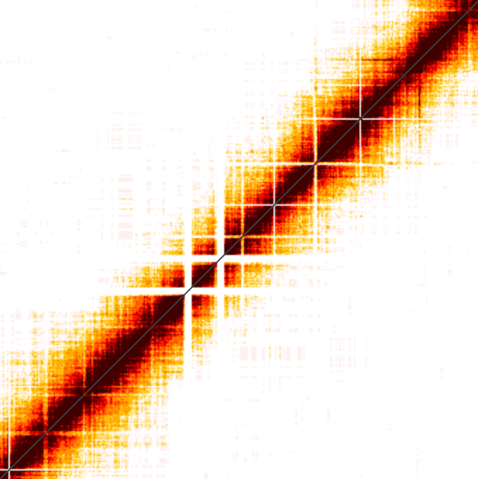
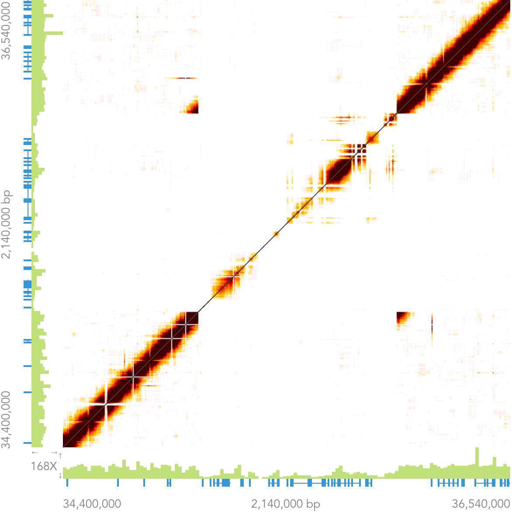
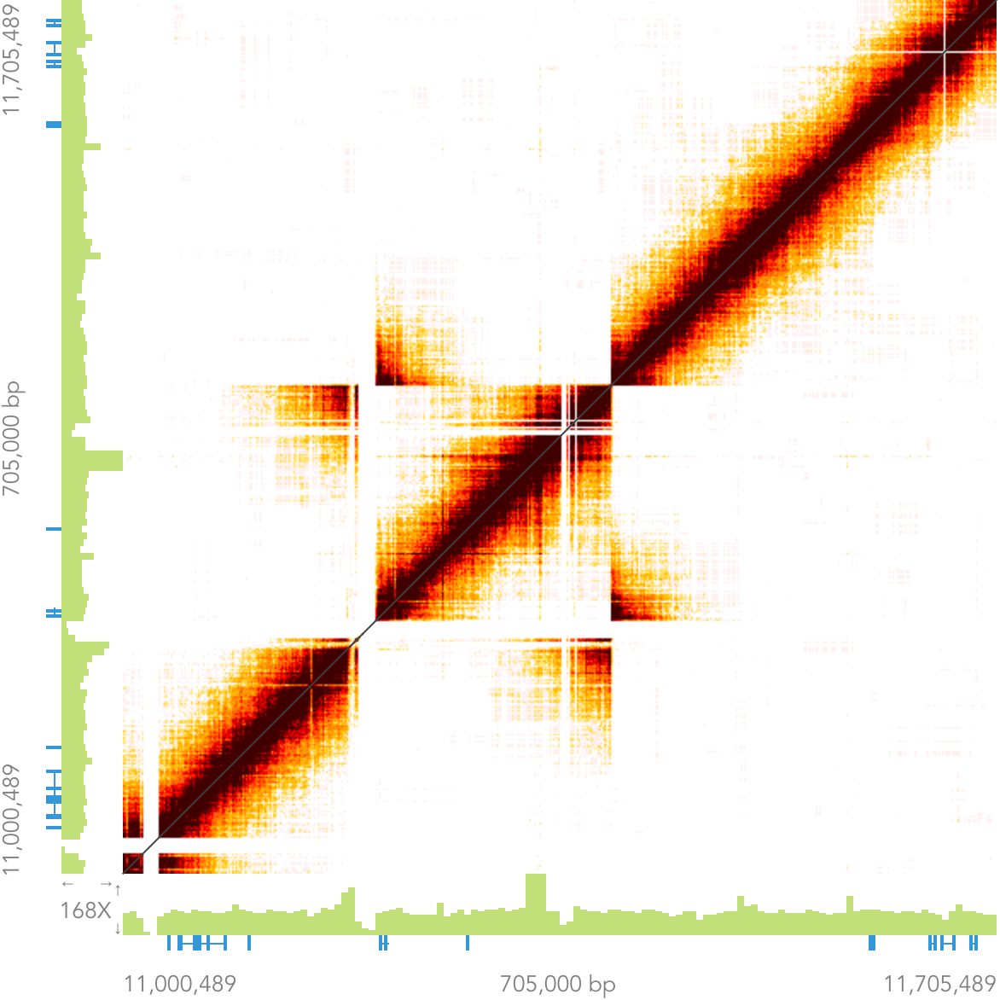
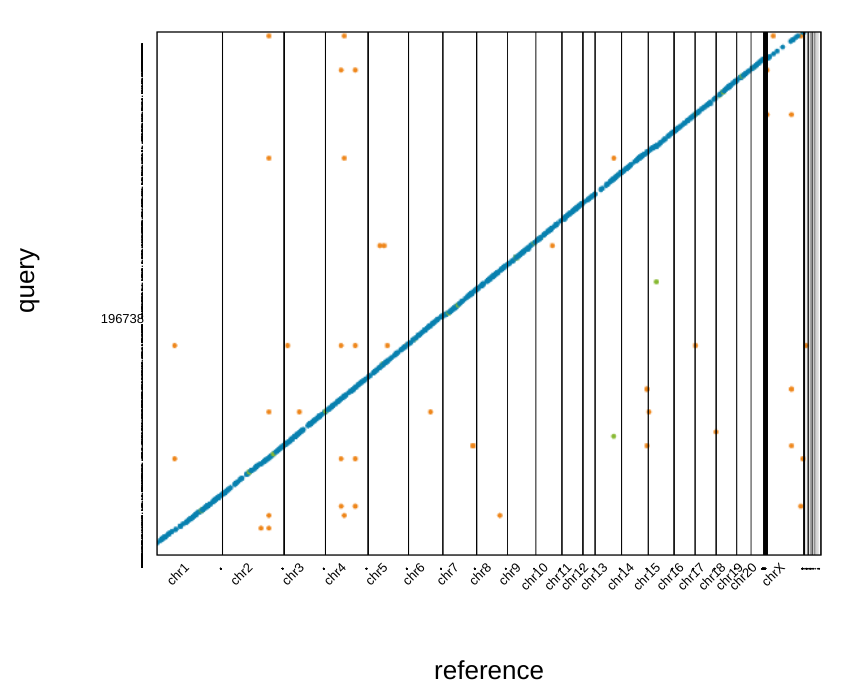

# Improving rn6

Jan 22 2019, Zoom meeting

* recap goals discussed at IROC
* recent activity of reaching other groups 
* brief review of existing data
* discuss technical approaches for moving forward and participation 

---

## Short term goals

* fixing base-level and structural variants
* annotate genes that are affected
* document the changes in a paper 
* make the improved version available to the public
---

## Long term  goals

* Sequence the BN-Eve using Bionano, etc.
	* fix low complexity regions and transposable elements.
* Multiple strains
* Genome graph 

---

## Working with other groups

* [Vertebrate Genome Project](https://vertebrategenomesproject.org/)
* [Genome Reference Consortium](https://www.ncbi.nlm.nih.gov/grc)
* [European Variant Archive](https://www.ebi.ac.uk/eva/)

---

## Chromium linked-reads 
#### by 10X GENOMICS 

---

## Summary statistics of 9 rat genomes 
generated using LongRanger software ver 2.2.2

---

## Distribution of SV found in both BN samples  

---

## Matrix view of linked-reads 

<table><tr><td width=70%>

</td><td width=30%>
- Both axes are chromosomal locations

- <b>Plotting overlapping BARCODES
</b>
- Expecting a symmetric image alone x = y 

- Expecting color fade away from the diagonal line

- Highlighting the distance between genomic locations

</td></tr></table>

[10x Genomics help page](https://support.10xgenomics.com/genome-exome/software/visualization/latest/structural-variants)
---

## Small deletions

---

## Large deletion on chr18
#### BN (Eve + male) vs rn6

---

## An erroneous insertion on chr18 in rn6

---

## Duplication & Inversion
#### BN (Eve + male) vs rn6 

<table><tr><td>

</td>
<td>

</td><tr></table>

---

## Translocation
#### BN (Eve + male) vs rn6

<table><tr><td width=33%>
<b> chr4: proximal vs distal </b>

</td>
<td width=33%>

<b> chr4 vs chr9 </b> 

</td>

<td width=33%>

<b> chr4 vs chrUn </b>

</td></tr></table>

---

## Messy beginning of chr1
#### BN (Eve + male) vs rn6

---

## Phased de Novo Assembly of BN

<table><tr><td width=70%>

</td>
<td width=30%>
<pre>
INPUT
- 1200.03 M = READS 
- 139.50 b = MEAN READ LEN 
- 53.98 x = RAW COV 
- 32.24 x = EFFECTIVE COV 
- 80.59 % = READ TWO Q30 
- 295.00 b = MEDIAN INSERT 
- 90.70 % = PROPER PAIRS 
- 1.00 = BARCODE FRACTION 
- 3.36 Gb = EST GENOME SIZE 
- 11.99 % = REPETITIVE FRAC 
- 0.07 % = HIGH AT FRACTION 
- 41.18 Kb = MOLECULE LEN 
- 138.53 = P10 
- 36.31 Kb = HETDIST 
- 9.52 % = UNBAR 
- 562.00 = BARCODE N50 
- 30.86 % = DUPS 
- 48.97 % = PHASED 

OUTPUT
- 6.23 K = LONG SCAFFOLDS
- 8.81 Kb = EDGE N50 
- 34.38 Kb = CONTIG N50 
- 405.00 b = PHASEBLOCK N50 
- 6.62 Mb = SCAFFOLD N50 
- 3.79 % = MISSING 10KB 
- 2.37 Gb = ASSEMBLY SIZE 
</pre>
</td></tr></table>

---

## Filling the missing

---

## Moving forward: systematically

* fixing SNPs and small indels 
	* iCORN2 [software](http://icorn.sourceforge.net/)

---

## Moving forward: systematically

---
## Moving forward: systematically
* take a chr, cut out the error-laden region, use the rest as scaffolds, use the de novo contigs to close the gap 
	* may not always overlap 
	* need paired-end or mate-pair data 
	* SGA assembler: conservative and high accuracy [paper](https://genome.cshlp.org/content/22/3/549.long),[comparison](https://www.ncbi.nlm.nih.gov/pubmed/24581555), [software](https://github.com/jts/sga)
	* GapFiller [paper](https://www.pubmedgov/22731987), [software](https://sourceforge.net/projects/gapfiller/)
	* ABACAS: contiguate contigs from a de novo assembly against a closely related reference. [software](https://www.sanger.ac.uk/science/tools/pagit)
	* REAPR: genome assembly quality eval [paper](https://genomebiology.biomedcentral.com/articles/10.1186/gb-2013-14-5-r47), [software](https://www.sanger.ac.uk/science/tools/reapr)
	* QUAST: Quality assessment of genome [paper](https://academic.oup.com/bioinformatics/article/29/8/1072/228832), [software](http://quast.sourceforge.net/quast)
	* Pilon: Genome assembly improvement [paper](https://journals.plos.org/plosone/article?id=10.1371/journal.pone.0112963), [software](https://github.com/broadinstitute/pilon)
* Annotation
	* RATT: transfer annotation from one assembly to another [software](https://www.sanger.ac.uk/science/tools/pagit)

---

## Moving forward: case-by-case

* examining the large SV one at a time 
  * maybe working with one chr at a time 
  * confirm with other strains
    * https://github.com/chen42/save_loupe_matrixView
	* barcode overlap data can be exported from Loupe as csv
  * create a bug-tracking ticket
  * fix ref, rerun longranger
* pros vs cons  
	* labor intensive
	* location in VCF is assigned to the nearest 10k for some CNV. 
  * manually inspected

---

## Other ideas  

# ?

---

## Refs

* Hunt M, Kikuchi T, Sanders M, Newbold C, Berriman M, Otto TD. REAPR: a universal tool for genome assembly evaluation. Genome Biol. 2013 May 27;14(5):R47. PMCID: PMC3798757
* Simpson JT, Durbin R. Efficient de novo assembly of large genomes using compressed data structures. Genome Res. 2012 Mar;22(3):549–556. PMCID: PMC3290790
* Otto TD, Sanders M, Berriman M, Newbold C. Iterative Correction of Reference Nucleotides (iCORN) using second generation sequencing technology. Bioinformatics. 2010 Jul 15;26(14):1704–1707. PMCID: PMC2894513
* Boetzer M, Pirovano W. Toward almost closed genomes with GapFiller. Genome Biol. 2012 Jun 25;13(6):R56. PMCID: PMC3446322
* Hunt M, Newbold C, Berriman M, Otto TD. A comprehensive evaluation of assembly scaffolding tools. Genome Biol. 2014 Mar 3;15(3):R42. PMCID: PMC4053845
* Del Angel VD, Hjerde E, Sterck L, Capella-Gutierrez S, Notredame C, Pettersson OV, Amselem J, Bouri L, Bocs S, Klopp C, Gibrat J-F, Vlasova A, Leskosek BL, Soler L, Binzer-Panchal M, Lantz H. Ten steps to get started in Genome Assembly and Annotation. F1000Res [Internet]. 2018 Feb 5 [cited 2019 Jan 20];7. Available from: https://f1000research.com/articles/7-148/v1/pdf
* Gurevich A, Saveliev V, Vyahhi N, Tesler G. QUAST: quality assessment tool for genome assemblies. Bioinformatics. Oxford University Press; 2013 Apr 15;29(8):1072–1075.
* Walker BJ, Abeel T, Shea T, Priest M, Abouelliel A, Sakthikumar S, Cuomo CA, Zeng Q, Wortman J, Young SK, Earl AM. Pilon: An Integrated Tool for Comprehensive Microbial Variant Detection and Genome Assembly Improvement. PLoS One. Public Library of Science; 2014 Nov 19;9(11):e112963.
* Chin C-S, Alexander DH, Marks P, Klammer AA, Drake J, Heiner C, Clum A, Copeland A, Huddleston J, Eichler EE, Turner SW, Korlach J. Nonhybrid, finished microbial genome assemblies from long-read SMRT sequencing data. Nat Methods. Nature Publishing Group, a division of Macmillan Publishers Limited. All Rights Reserved.; 2013 May 5;10:563.
* Rakocevic G, Semenyuk V, Lee W-P, Spencer J, Browning J, Johnson IJ, Arsenijevic V, Nadj J, Ghose K, Suciu MC, Ji S-G, Demir G, Li L, Toptaş BÇ, Dolgoborodov A, Pollex B, Spulber I, Glotova I, Kómár P, Stachyra AL, Li Y, Popovic M, Källberg M, Jain A, Kural D. Fast and accurate genomic analyses using genome graphs. Nat Genet [Internet]. 2019 Jan 14; Available from: http://dx.doi.org/10.1038/s41588-018-0316-4 PMID: 30643257
* Sarsani VK, Raghupathy N, Fiddes IT, Armstrong J, Thibaud-Nissen F, Zinder O, Bolisetty M, Howe K, Hinerfeld D, Ruan X, Rowe L, Barter M, Ananda G, Paten B, Weinstock GM, Churchill GA, Wiles MV, Schneider VA, Srivastava A, Reinholdt L. The genome of C57BL/6J “Eve”, the mother of the laboratory mouse genome reference strain [Internet]. bioRxiv. 2019 [cited 2019 Jan 19]. p. 517466. Available from: https://www.biorxiv.org/content/early/2019/01/11/517466
</a>
