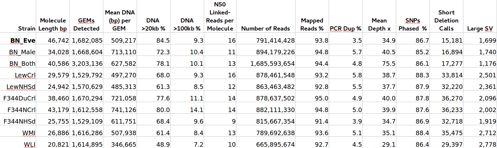

##  Summary statistics of 8 rat genomes 

10X Chromium high molecular weight library

---

---

##  Large structural variants shared among three strains  

---

## de novo assembly of BN

<table><tr><td width=50%>

</td>
<td>
<pre>
INPUT
- 1200.03 M  = READS            
-  139.50  b = MEAN READ LEN    
-   53.98  x = RAW COV          
-   32.24  x = EFFECTIVE COV    
-   80.59  % = READ TWO Q30    
-  295.00  b = MEDIAN INSERT    
-   90.70  % = PROPER PAIRS     
-    1.00    = BARCODE FRACTION 
-    3.36 Gb = EST GENOME SIZE  
-   11.99  % = REPETITIVE FRAC  
-    0.07  % = HIGH AT FRACTION 
-   41.18 Kb = MOLECULE LEN     
-  138.53    = P10            
-   36.31 Kb = HETDIST          
-    9.52  % = UNBAR            
-  562.00    = BARCODE N50      
-   30.86  % = DUPS             
-   48.97  % = PHASED           

OUTPUT
-    6.23 K  = LONG SCAFFOLDS
-    8.81 Kb = EDGE N50     
-   34.38 Kb = CONTIG N50  
-  405.00  b = PHASEBLOCK N50 
-    6.62 Mb = SCAFFOLD N50  
-    3.79  % = MISSING 10KB 
-    2.37 Gb = ASSEMBLY SIZE 
</pre>
</td></tr></table>

