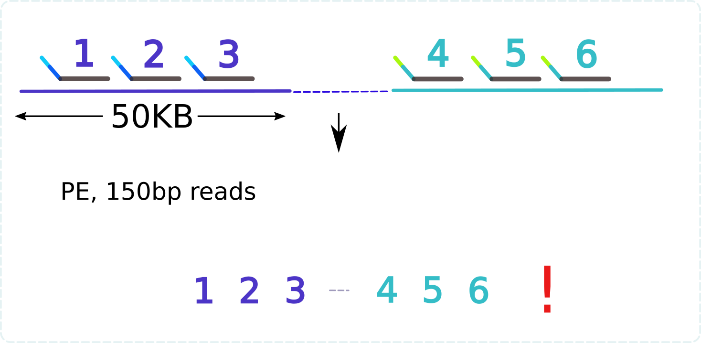
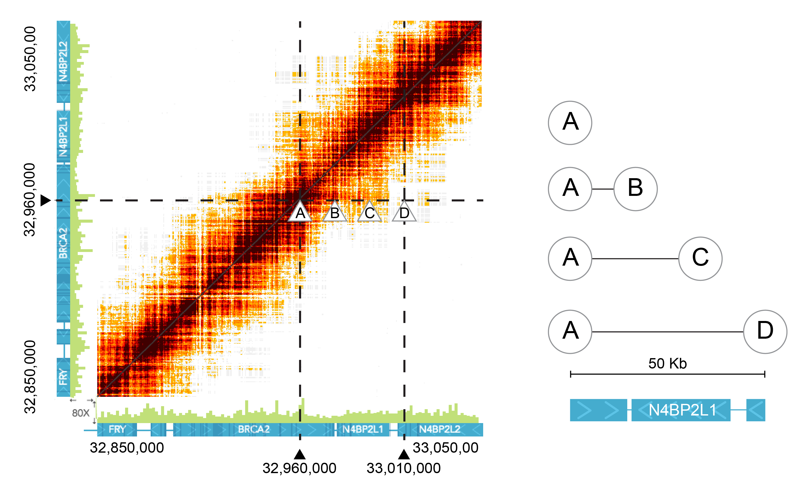
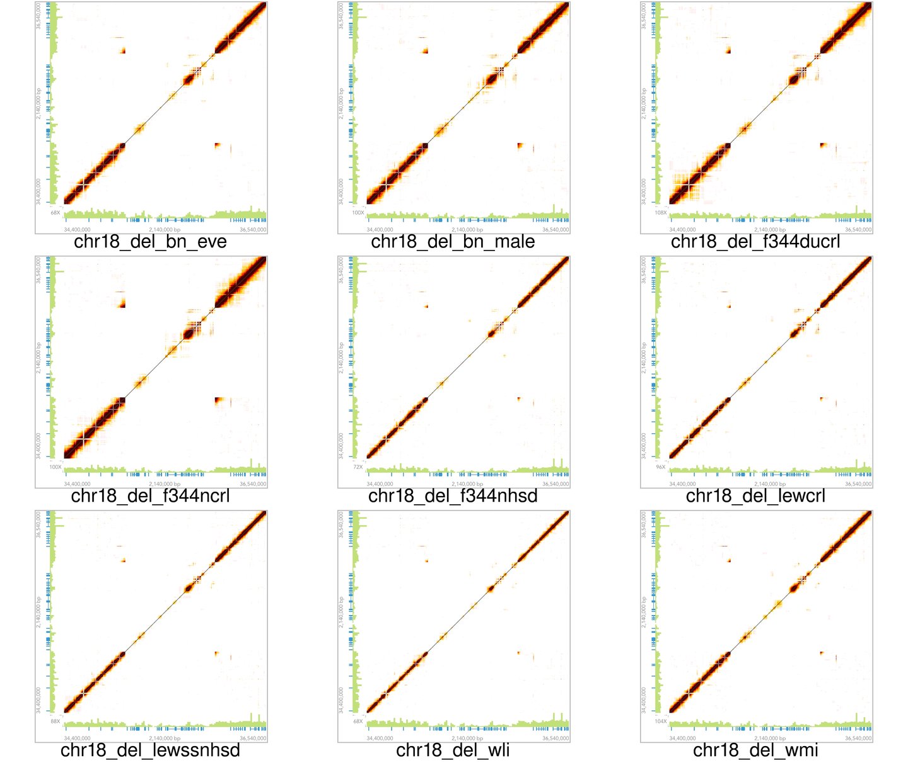
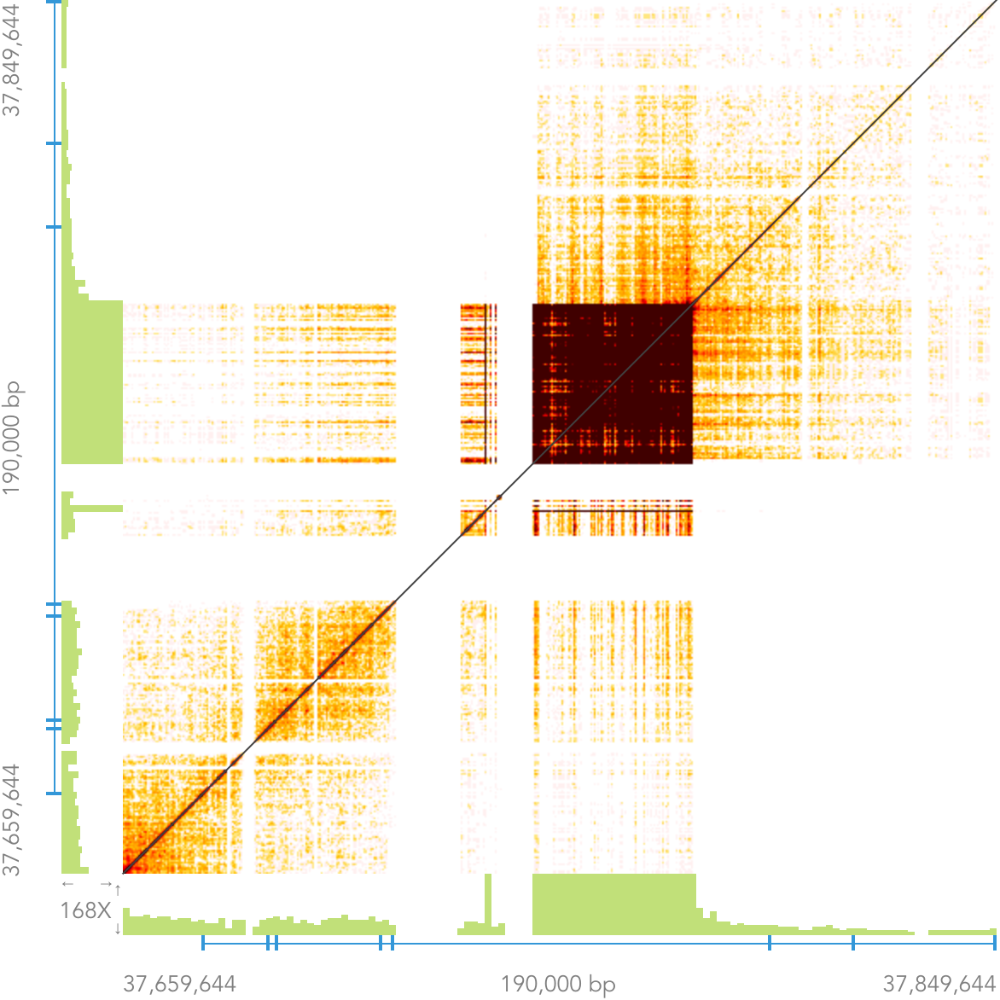
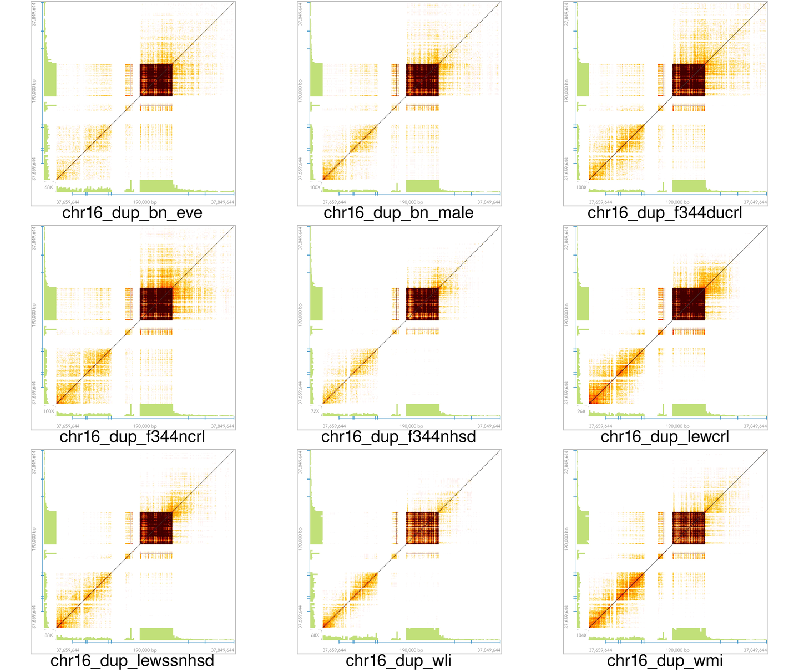

# Whole Genome Sequencing of Nine Rats Using Linked-Reads Technology 

## Hao Chen, Ph.D.

### Department of Pharmacology
### University of Tennessee Health Science Center, Memphis, TN

Jan 13, 2019, IROC

---

## Mapping of short reads to similar genomic regions

---

## The Idea of Linked-Reads

---

## Chromium Linked-Reads 
#### by 10X GENOMICS 

---

## Advantages of Linked-Reads

* Haplotype phasing
* Improve the confidence of SNP-calls 
* Better mapping of repetitive regions 
* Detect large structural variants 

---

## Summary statistics of 9 rat genomes 
generated using LongRanger software ver 2.2.2

---

## Common structural variants
### shared between BN-eve and BN-male vs rn6

Total: 434 (26 on chr?_random)

---

## Large SV shared among three strains 

---

## Matrix View 
#### of Linked-Reads in Loupe

<table><tr><td width=70%>

</td><td width=30%>

- <b>Plotting overlapping BARCODES
</b>
- Expecting a symetric image alone x = y 

- Expecting lighter color away from the diagnal line

- Highlighting the distance between genomic locations

</td></tr></table>

---

## Small deletions

---

## Large Deletions
#### BN (Eve + male) vs rn6

---

## Large Deletions
#### Nine strains vs rn6

---

## Duplications
#### BN (Eve + male) vs rn6 

---

## Duplications
#### Nine strains vs rn6 

---

## Inversions 
#### BN (Eve + male) vs rn6

---

## Inversions 
#### Nine strains vs rn6

---

## Proximal vs Distal chr4
#### BN (Eve + male) vs rn6

---

## Proximal vs Distal chr4
#### Nine strains vs rn6

---

## Between chr4 and chr9 
#### BN (Eve + male) vs rn6

---

## Between chr4 and chr9 
#### Nine strains vs rn6

---

## Between chr4 and chrUn 
#### BN (Eve + male) vs rn6

---

## Between chr4 and chrUn 
#### Nine strains vs rn6

---

## Messy beginning of chr1
#### BN (Eve + male) vs rn6

---

## Messy beginning of chr1
#### Nine strains vs rn6

---
## Phased de Novo Assembly of BN
#### by supernova

<table><tr><td width=70%>

</td>
<td width=30%>
<pre>
INPUT
- 1200.03 M = READS 
- 139.50 b = MEAN READ LEN 
- 53.98 x = RAW COV 
- 32.24 x = EFFECTIVE COV 
- 80.59 % = READ TWO Q30 
- 295.00 b = MEDIAN INSERT 
- 90.70 % = PROPER PAIRS 
- 1.00 = BARCODE FRACTION 
- 3.36 Gb = EST GENOME SIZE 
- 11.99 % = REPETITIVE FRAC 
- 0.07 % = HIGH AT FRACTION 
- 41.18 Kb = MOLECULE LEN 
- 138.53 = P10 
- 36.31 Kb = HETDIST 
- 9.52 % = UNBAR 
- 562.00 = BARCODE N50 
- 30.86 % = DUPS 
- 48.97 % = PHASED 

OUTPUT
- 6.23 K = LONG SCAFFOLDS
- 8.81 Kb = EDGE N50 
- 34.38 Kb = CONTIG N50 
- 405.00 b = PHASEBLOCK N50 
- 6.62 Mb = SCAFFOLD N50 
- 3.79 % = MISSING 10KB 
- 2.37 Gb = ASSEMBLY SIZE 
</pre>
</td></tr></table>

---
## Total missing bases: 130.3 Mb 

---

## Filling the missing

---

## Summary

* Linked-reads identifies many structural variants that are likely errors in rn6.
* De novo assembly will be useful for reorganizing regions with large number of errors and fill in some missing pieces in rn6. 

---
## Thanks to .. 

* Mindy Dwinell (BN-Eve, BN-male)
* Eva E Redei (WLI/WMI strains)
* Victor Guryev (Genome alignment, SNP) 
* Tristan de Jong (Genome analysis) 
* Arthur Centeno (Data archive)
* Robert W Williams (Mastermind, and $)
* Advanced Computing Facility, Joint Institute of Computational Sciences, UTK/Oak Ridge National Lab.

