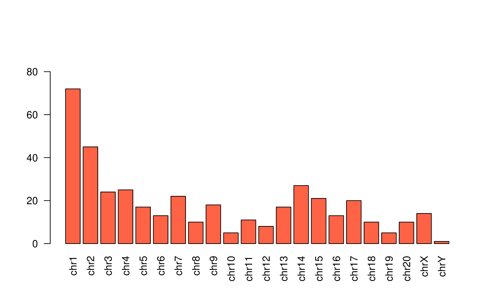

##  Summary statistics of 8 rat genomes 

10X Chromium high molecular weight library

---

---

##  Large structural variants shared among three strains  

---

## de novo assembly of BN

<table><tr><td width=50%>

</td>
<td>
<pre>
INPUT
- 1200.03 M  = READS            = number of reads; ideal 800M-1200M for human
-  139.50  b = MEAN READ LEN    = mean read length after trimming; ideal 140
-   53.98  x = RAW COV          = raw coverage; ideal ~56
-   32.24  x = EFFECTIVE COV    = effective read coverage; ideal ~42 for nominal 56x
-   80.59  % = READ TWO Q30     = fraction of Q30 bases in read 2; ideal 75-85
-  295.00  b = MEDIAN INSERT    = median insert size; ideal 0.35-0.40
-   90.70  % = PROPER PAIRS     = fraction of proper read pairs; ideal >= 75
-    1.00    = BARCODE FRACTION = fraction of barcodes used; between 0 and 1
-    3.36 Gb = EST GENOME SIZE  = estimated genome size
-   11.99  % = REPETITIVE FRAC  = genome repetitivity index
-    0.07  % = HIGH AT FRACTION = high AT index
-   41.18 Kb = MOLECULE LEN     = weighted mean molecule size; ideal 50-100
-  138.53    = P10              = molecule count extending 10 kb on both sides
-   36.31 Kb = HETDIST          = mean distance between heterozygous SNPs
-    9.52  % = UNBAR            = fraction of reads that are not barcoded
-  562.00    = BARCODE N50      = N50 reads per barcode
-   30.86  % = DUPS             = fraction of reads that are duplicates
-   48.97  % = PHASED           = nonduplicate and phased reads; ideal 45-50

OUTPUT
-    6.23 K  = LONG SCAFFOLDS   = number of scaffolds >= 10 kb
-    8.81 Kb = EDGE N50         = N50 edge size
-   34.38 Kb = CONTIG N50       = N50 contig size
-  405.00  b = PHASEBLOCK N50   = N50 phase block size
-    6.62 Mb = SCAFFOLD N50     = N50 scaffold size
-    3.79  % = MISSING 10KB     = % of base assembly missing from scaffolds >= 10 kb
-    2.37 Gb = ASSEMBLY SIZE    = assembly size (only scaffolds >= 10 kb)
</pre>
</td></tr></table>

