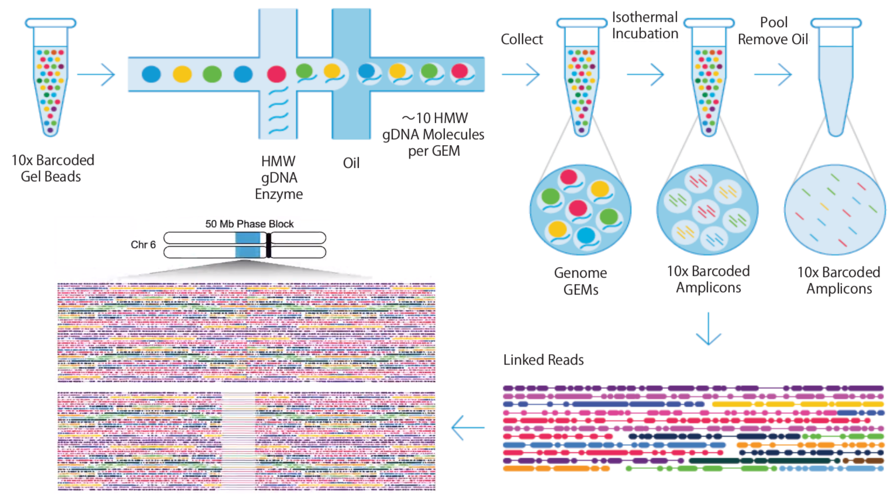
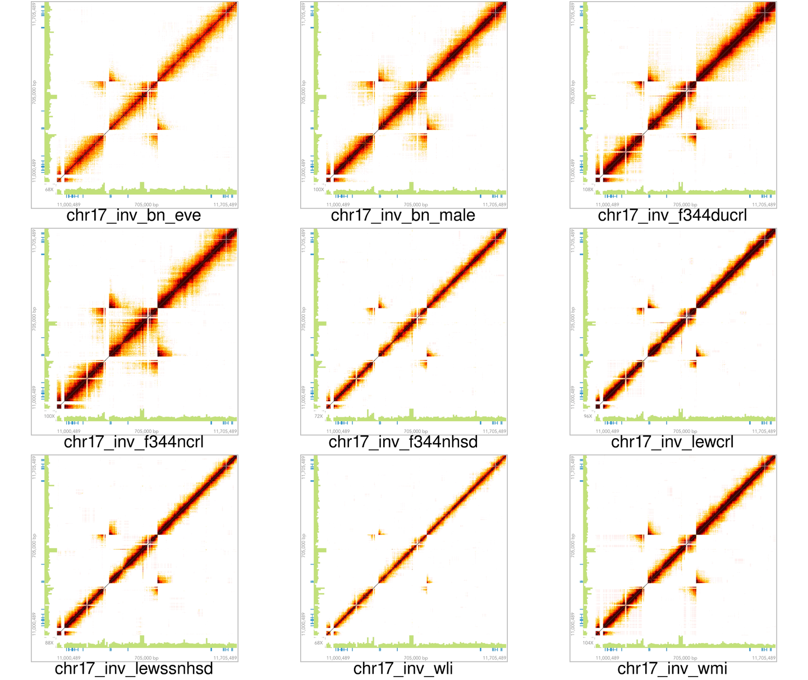
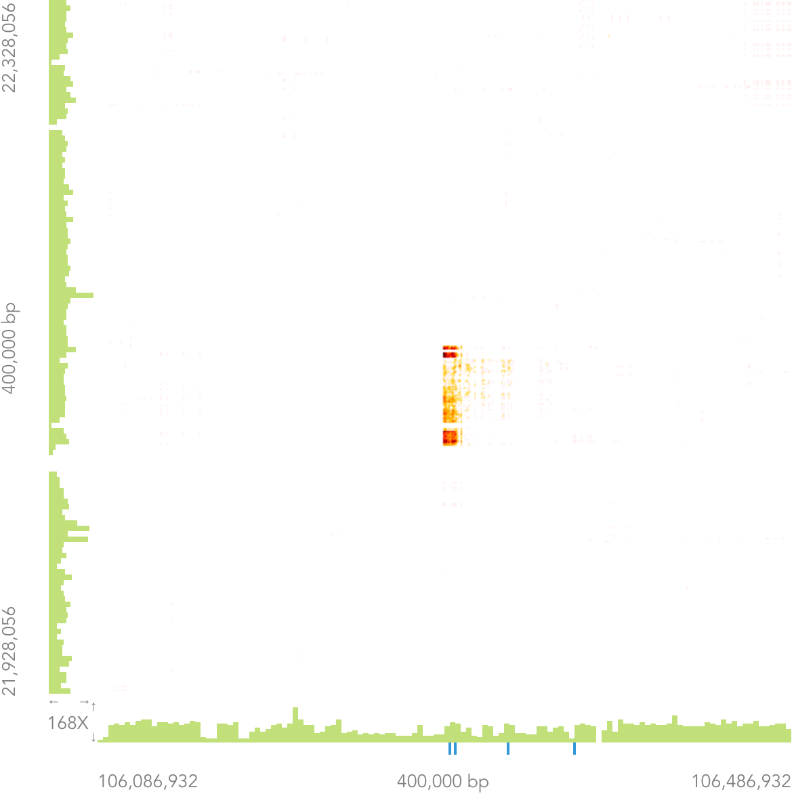

# Whole Genome Sequencing of Nine Rats Using Linked-Reads Technology 

## Hao Chen, Ph.D.

### Department of Pharmacology
### University of Tennessee Health Science Center, Memphis, TN

Jan 13, 2019, IROC

---

## Mapping of short reads to similar genomic regions

---

## The Idea of Linked-Reads

---

## Chromium Linked-Reads 
#### by 10X GENOMICS 

---

## Advantages of Linked-Reads

* Haplotype phasing
* Improve the confidence of SNP-calls 
* Better mapping of repetitive regions 
* Detecting large structural variants 

---

## Summary statistics of 9 rat genomes 
generated using LongRanger software ver 2.2.2

---

## SV: (BN-eve vs rn6) & (BN-male vs rn6)

---

## Large SV shared among three strains 

---

## Matrix View of Linked-Reads 

<table><tr><td width=70%>

</td><td width=30%>
- Both axes are chromosomal locations

- <b>Plotting overlapping BARCODES
</b>
- Expecting a symmetric image alone x = y 

- Expecting color fade away from the diagonal line

- Highlighting the distance between genomic locations

</td></tr></table>

---

## Small deletions

---

## Large deletion
#### BN (Eve + male) vs rn6

---

## Same large deletion in nine strains?
## rn6 has an erroneous insertion on chr18?

---

## Duplication
#### BN (Eve + male) vs rn6 

---

## Same large duplication in nine strains?
## rn6 missed a duplication event on chr16? 

---

## Inversion 
#### BN (Eve + male) vs rn6

---

## rn6 has a large inversion on chr17? 

---

## Proximal vs distal chr4
#### BN (Eve + male) vs rn6

---

## Proximal to distal translocation on chr4 in rn6

---

## chr4 vs chr9 
#### BN (Eve + male) vs rn6

---

## Translocation between chr4 and chr9 in rn6 

---

## chr4 vs chrUn 
#### BN (Eve + male) vs rn6

---

## Some sequences in chrUn belong to chr4 in rn6 

---

## Messy beginning of chr1
#### BN (Eve + male) vs rn6

---

## How do we fix this in rn6?

---
## Phased de Novo Assembly of BN

<table><tr><td width=70%>

</td>
<td width=30%>
<pre>
INPUT
- 1200.03 M = READS 
- 139.50 b = MEAN READ LEN 
- 53.98 x = RAW COV 
- 32.24 x = EFFECTIVE COV 
- 80.59 % = READ TWO Q30 
- 295.00 b = MEDIAN INSERT 
- 90.70 % = PROPER PAIRS 
- 1.00 = BARCODE FRACTION 
- 3.36 Gb = EST GENOME SIZE 
- 11.99 % = REPETITIVE FRAC 
- 0.07 % = HIGH AT FRACTION 
- 41.18 Kb = MOLECULE LEN 
- 138.53 = P10 
- 36.31 Kb = HETDIST 
- 9.52 % = UNBAR 
- 562.00 = BARCODE N50 
- 30.86 % = DUPS 
- 48.97 % = PHASED 

OUTPUT
- 6.23 K = LONG SCAFFOLDS
- 8.81 Kb = EDGE N50 
- 34.38 Kb = CONTIG N50 
- 405.00 b = PHASEBLOCK N50 
- 6.62 Mb = SCAFFOLD N50 
- 3.79 % = MISSING 10KB 
- 2.37 Gb = ASSEMBLY SIZE 
</pre>
</td></tr></table>

---
## Total missing bases: 130.3 Mb 

---

## Filling the missing

---

## Summary
* Linked-reads  provide opportunities for improving rn6.
	* Identifies many structural errors.
	* De novo assembly can help when a large number of structural changes are needed.
	* De novo assembly can recover unknown bases. 
* Linked-reads also improve variant discovery for individual strains.

---

<marquee behavior="alternate" scrolldelay="60" scrollamount="2">
<h2>Thanks to ..</h2> 
</marquee>
<ul>
<marquee behavior="scroll" scrolldelay="200" direction="right">

<li> Mindy Dwinell (BN-Eve, BN-male)</marquee>

</marquee>

<marquee behavior="scroll" scrolldelay="200" direction="left">

<li> Eva E Redei (WLI/WMI strains)

</marquee>

<marquee behavior="scroll" scrolldelay="200" direction="right">

<li> Victor Guryev (Genome alignment, SNP) 

</marquee>

<marquee behavior="scroll" scrolldelay="200" direction="left">

<li> Tristan de Jong (Genome analysis) 

</marquee>

<marquee behavior="scroll" scrolldelay="200" direction="right">

<li> Arthur Centeno (Data archive)

</marquee>

<marquee behavior="scroll" scrolldelay="300" direction="left">

<li> Robert W Williams (Mastermind, and $)

</marquee>

<marquee behavior="alternate" scrolldelay="500" direction="right">

<li> Advanced Computing Facility, JICS at UTK/Oak Ridge National Lab.

</marquee>

</ul>

<b> Data and results are available! </b>

