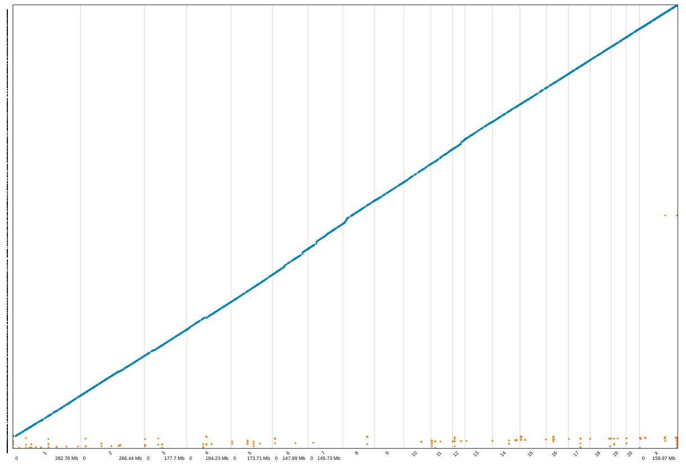

## Updates on  using linked-reads to improve rn6

<hr>

## Hao Chen
## 0219, 2019

#### Department of Pharmacology
#### University of Tennessee Health Science Center


---
## Outline

1. Sequencing
2. Identifying assembly errors using Matrix View
3. Attempting to fix assembly errors using the Tigmint/ARCS/Sealer pipeline

---
## Section 1. Sequencing 
* Rat genome in the Sanger Darwin Tree of Life Project
  - Sanger (Kerstin Howe) / MCW (Mary Shimoyama)
  - 60x PacBio sequencing
  - 10x Genomics linked-reads
  - BioNano 
  - HiC
* New Linked read data
  - DSS/Mcwi
  - FHH/Mcwi
* TAGC
  - BN Eve HudsonAlpha library
  - BN male kidney

---

## Main motivations for the analysis
  * Improve the rn6 in the short run
  * Establish a pipeline for de novo assembly of other strains

---

## Section 2. Matrix view of linked-reads 

<table><tr><td width=70%>

</td><td width=30%>
- Both axes are chromosomal locations<p>
- <b>Plotting overlapping <font color="tomato">BARCODES</font><p></b>
- Expecting a symmetric image alone x = y <p>
- Expecting color fade away from the diagonal line<p>
- <font color="royalblue">Highlighting the distance between genomic locations</font><p>

</td></tr></table>

---

## SV of BN indicate assembly errors in rn6
### (shared with other strains)


---

## Rotated matrix view with annotation


Overlay of structural variants from all nine samples. Each strain is set at 20% transparency.

---

## Rotated matrix view, chromosome 20

<iframe src="./rotated_matrixView_chr20.pdf" width="100%" height=600px>

---

## Rotated matrix view

###  <a href="https://drive.google.com/drive/folders/1UmUlWdmmF0ZWbJlugug_6TDUxulKXei4?usp=sharing">All Chromosomes</a>

Maybe publish this as a <a href="https://www.nature.com/sdata/"> Scientific Data </a> paper

---
<h2 style="color:white">Section 3. Workflow of correcting assembly errors</h2>
<section class="fig-container"
		 data-fig-id="fig-diagram2"
		 data-file="workflow.html"
		 data-background-color="#333333"
		 >

</section>

---

## Tigmint

<iframe src="https://www.ncbi.nlm.nih.gov/pmc/articles/PMC6204047/pdf/12859_2018_Article_2425.pdf" width="100%" height=600px>

---

## Jupiter plot


---

## Tigmint


```
n       n:500   L50     min     N75     N50     N25     E-size  max     name
680     593     15      500     926789  2502701 5780252 3773982 11.2e6  rn6.tigmint.n2.fa
10513   9587    295     500     1168797 2842496 4794530 3297760 11.5e6  rn6.tigmint.n5.fa
```
<small>
**n**: Total number of sequences, **n:500**: Number of sequences at least 500 bp, **L50**: Number of sequences at least the N50 size, **min**: The size of the smallest sequence, **N75**: At least 75% of the assembly is in sequences of the N75 size or larger, **N50**: At least half the assembly is in sequences of the N50 size or larger, **N20**: At least 20% of the assembly is in sequences of the N20 size or larger, **E-size**: The sum of the square of the sequence sizes divided by the assembly size, **max**: The size of the largest sequence,  **name**: The file name of the assembly.
</small>

---

## ARCS

<iframe src="https://www.ncbi.nlm.nih.gov/pmc/articles/PMC6030987/pdf/btx675.pdf" width="100%" height=600px>

---

## ARCS

```
# first round with BN male data
n       n:500   L50     N75     N50     N25     E-size  max     name
9591    8665    147     2485089 5633332 9239000 6680894 23.96e6 rn6_tigmint_n5_c5_m50-4000_e30000_a0.9
9467    8541    127     2659798 6120218 12.33e6 7547593 23.96e6 rn6_tigmint_n5_c5_m50-3000_e60000_a0.7
9433    8507    125     2738066 6236892 12.33e6 7648607 23.96e6 rn6_tigmint_n5_c5_m50-3000_e90000_a0.7
9425    8499    124     2743539 6418296 12.33e6 7666199 23.96e6 rn6_tigmint_n5_c5_m50-3000_e90000_a0.9
9454    8528    107     2833768 7374994 13.18e6 8937965 41.66e6 rn6_tigmint_n5_c5_m50-5000_e400000_a0.9
9454    8528    107     2833768 7374994 13.18e6 8937965 41.66e6 rn6_tigmint_n5_c5_m50-8000_e400000_a0.9
9396    8470    123     2851010 6494858 12.50e6 7736074 23.96e6 rn6_tigmint_n5_c5_m50-3000_e120000_a0.9
9382    8456    119     2898994 6585270 12.51e6 7967942 23.96e6 rn6_tigmint_n5_c5_m50-3000_e150000_a0.9
9368    8442    117     2937271 7005113 12.61e6 8115889 23.96e6 rn6_tigmint_n5_c5_m50-3000_e180000_a0.9
9384    8458    105     3054903 7191172 13.43e6 9813238 54.55e6 rn6_tigmint_n5_c5_m50-3000_e300000_a0.9
9455    8529    108     2838875 7196867 13.09e6 8995813 41.66e6 rn6_tigmint_n5_c5_m50-3000_e400000_a0.9
9549    8623    116     2566031 6641320 12.39e6 8408902 30.19e6 rn6_tigmint_n5_c5_m50-3000_e500000_a0.9
# second round with BN Eve using the largest N50 as input
9267    8341    55      4513636 12.09e6 26.37e6 18.69e6 69.18e6 rn6_arc_stage1_c5_m50-3000_e600000_a0.9
9276    8350    51      4337565 12.75e6 27.35e6 20.51e6 87.46e6 rn6_arc_stage1_c5_m50-3000_e700000_a0.9
9316    8390    63      3943546 10.64e6 22.13e6 17.97e6 107.5e6 rn6_arc_stage1_c5_m50-3000_e800000_a0.9
# second round with BN Eve using the default setting as input
9568    8642    143     2564965 5706095 9522946 6867201 23.96e6 rn6_arc_stage1_c5_m50-3000_e30000_a0.7
9568    8642    143     2564965 5706095 9522946 6867201 23.96e6 rn6_arc_stage1_c5_m50-3000_e30000_a0.9

```

ARCS parameters: **c**: number of read pairs aligned between two sequences; **m**: range for multiplicity (i.e. frequency of barcode); **e**: window size on the sequences used in the analysis
**a**: ratio of barcode links of the second-most to top-most supported edge.


---
## Sealer

<iframe src="https://www.ncbi.nlm.nih.gov/pmc/articles/PMC4515008/pdf/12859_2015_Article_663.pdf" width=100% height=600px>

---
## Sealer

```
# round 1 using BN male data 
146706 gaps found
Gaps closed = 16806
11.4556%

# round 2 using BN Eve data
129900 gaps found
Gaps closed = 2644
2.03541%
```
---
## Chromonomer


---

## Chromonomer assembled genome 


---

## Skipping ARCS in the pipeline
#### Y-axis: rn6_Tigmint_n5 -->Chromonomer with 10k markers 
#### X-axis: rn6 



---

## rn6_Tigmint_n5_ARCSx2_Sealerx2_Chromonomer
### 10k or 283k markers


---

## Skipping ARCS in the pipeline
### vs BN de novo


---

## rn6_Tigmint_n5_ARCSx2_Sealerx2_Chromonomer 
### vs BN de novo


---

## Next steps

* Generate a marker set with varying density 
* Run LongRanger of rn6 alternates vs 10x chromium BN data
* Use iCORN2 to fix small indels and SNPs
* Additional data from TAGC

