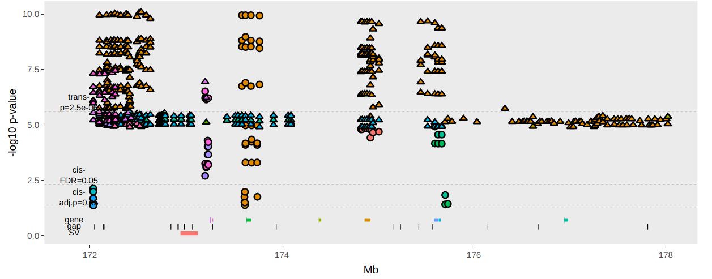
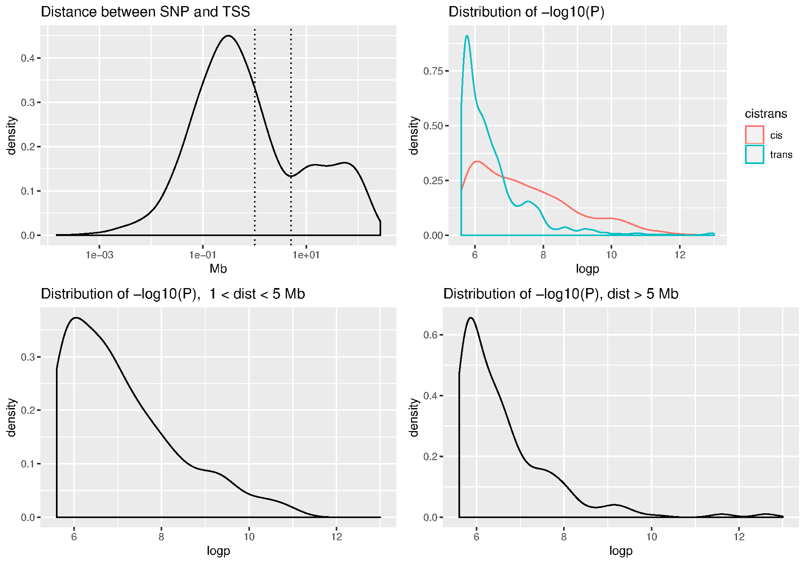

# Rat Genome Analysis  

<hr>

## Hao Chen
### March 28, 2019

#### Department of Pharmacology
#### University of Tennessee Health Science Center


---
## Outline

1. Updates on sequencing
2. Estimate the impact of potential rn6 assembly 
3. Attempting to fix assembly errors by local reassembly (on going)

---

## Section 1. Sequencing 
* DSS and FHH have been analyzed  (60x coverage) (Chen)
 - long ranger for variant calling
 - supernova de novo assembly
* Leah Solberg Woods  (Wake Forest) to ship tissues from 8 HS founders to TAGC
  - 10X chromium
* Chen Shipped HXB parentals to Feng Yue (Penn State) (via Jun Li)
  - BioNano
* Data and other material to be shared via Dropbox (again) 

---

##  Section 2. Estimate the impact of potential rn6 assembly 
#### Rotated matrix view, chromosome 20, rn6

<iframe src="./pdf/rotated_matrixView_chr20.pdf" width="100%" height=600px>

---

## Rotated matrix view
#### chromosome 19, mouse genome  (C57BL/6)
David Ashbrook
<iframe src="./pdf/compiled_chr19_B6.pdf" width="100%" height=600px>

---

## Overlapping of SV with genes and exons
(SV = assembly error in this context)
#### High quality calls (1,133)


---

## Overlapping of SV with genes and exons
(SV = assembly error in this context)
#### All calls (17,288)


---
## expression QTL 


---
## eQTL of five brain regions from 88 HS rats


<a href="https://chen42.shinyapps.io/shiny/" target=_new>  </a>

https://chen42.shinyapps.io/shiny/

---

## cis- vs trans- eQTLs
### five brain regions


---
## Distribution of the distance between SNP and TSS 




---
## Summary

* rn6 assembly error does seem to affect analysis results.
* but the scope appear to be limited based on High Quality SV calls and eQTL results.
* it will be useful to compare mouse eQTL (especially brain) data.

---

##  Section 3. Correcting Assembly Errors

* Genome-wide approach
  * Tigmint-ARCS-Sealer--
* Local approach
  * identify SV
  * extract reads associated with the SV
  * reconstruct region using de novo assembly  
  * assess quality
  * <a href="https://github.com/grocsvs/grocsvs">GROC-SVs</a> (<a href="https://www.nature.com/articles/nmeth.4366">Nature Methods 2017</a>) 

---

## GROC-SVs  analysis

* Input  data
  * BN eve and BN male 10X chromium data (joint calling SV is supported)
* Run time: Feb 21 -- March 11 on ACF using one node with up to 80 threads (with several interruptions) 
* Results
  * Assembled 3217 SVS, most with multiple contigs
  
```
total breakpoints       3713
breakpoints
               n=1      3484
               n=2      99
               n=3      5
               n=4      4
assembled       93 (3%)
intrachromosomal        3110 (84%)
 - median distance      111 kb
 -    min distance      16 kb
 -    max distance      231,298 kb
private 641 (17%)
 - pintrachromosomal    450 (70%)
shared  3072 (83%)
 - sintrachromosomal    2660 (87%)
BN_eve  3398
BN_son  3387
```
---

## Next steps

* Generate a high density genetic marker set from HS data  (Tristan, Hao)
* Examine GROC-SVS results (Hao)
* Fix GC bias then try tigmint-arcs-pipeline again (Tristan) 
* Working on manuscript describing rn6 assembly issues (Tristan, Hao, team)

