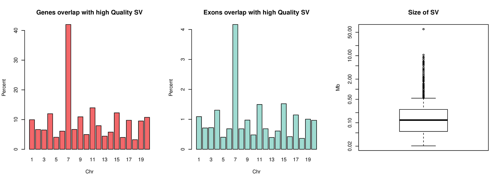
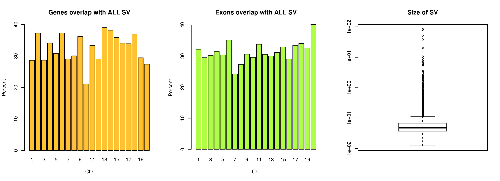

# Rat Genome Analysis  

## Hao Chen
## March 28, 2019

#### Department of Pharmacology
#### University of Tennessee Health Science Center

---
## Outline

1. Updates on sequencing
2. Estimate the impact of potential rn6 assembly 
3. Attempting to fix assembly errors by local reassembly (on going)

---

## Section 1. Sequencing 
* DSS and FHH have been analyzed  (60x coverage) (Chen)
 - long ranger for variant calling
 - supernova de novo assembly
* Leah Solberg Woods  (Wake Forest) to ship tissues from 8 HS founders to TAGC
  - 10X chromium
* Chen Shipped HXB parentals to Feng Yue (Penn State) (via Jun Li)
  - BioNano
* Data and other material to be shared via Dropbox (again) 

---

##  Section 2. Estimate the impact of potential rn6 assembly 

#### Rotated matrix view, chromosome 20, rn6

<iframe src="./pdf/rotated_matrixView_chr20.pdf" width="100%" height=600px>

---

## Rotated matrix view, chromosome 20, mouse genome 

<iframe src="./pdf/rotated_matrixView_mm_chr20.pdf" width="100%" height=600px>

---

## Overlapping of SV with genes and exons
(SV = assembly error in this context)
#### High quality calls

---

## Overlapping of SV with genes and exons
(SV = assembly error in this context)
#### All calls

---
## expression QTL 

---
## eQTL of five brain regions from 88 HS rats

https://chen42.shinyapps.io/shiny/

---

## cis- vs trans- eQTLs

---
 
## Distribution of p values for cis- vs trans- eQTL

---

## Summary

* Matrix View plus SV calls from LongRanger indicate rn6 has many assembly errors.
* Tigmint/ARCS/Sealer/Chromonomer appears to be able to fix some of the assembly errors.
* Dense marker set will force SV to reappear in the final assembly. 
* Highly repetitive regions are likely excluded from the final assembly with lower marker density

---

## Next steps

* Generate a marker set with varying density 
* Examine the LongRanger of rn6 alternates vs 10x chromium BN data
* Use iCORN2 to fix small indels and SNPs
* Additional data from TAGC
* Maybe write a software for local re-assembly based on the idea of minimizing barcode spread.

