## Project 2 

# Socially-acquired nicotine self-administration 

##	Hao Chen
### University of Tennessee Health Science center

Rat GWAS retreat 

Feb 7 2017

---

## Nicotine self-administration with flavor cue
<table width=90%><tr><td width=50% align="center" valign="center">
		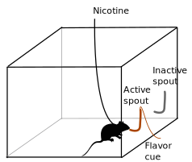
	</td><td align="center" valign="center">
	
</td><tr></table>

---

## Flavor cue does <a href="#/stfp">not</a> support nicotine self-administration

<cite> Chen, et al., 2011, Neuropsychopharmacology</cite>

---

## Nicotine is primarily aversive in non-smokers 
<table>
	<tr>
		<td width=50%>
			
		</td>
		<td width=90%>
			
		</td>
	</tr>
	<tr>
		<td>
		Coughing, nausea, dizziness, sickness, burning throat, headache.
		</td>
		<td>
		Nicotine induces drug high only in <em>significantly nicotine-deprived smokers</em>. 
		</td>
	</tr>
</table>

---

## Social environment influences smoking behavior

		

	

---

## Modeling social learning in rats

	

	

---

## Social context 

 <b>Neutral</b> 

<b>Inducing</b>

---

## Social learning induces nicotine self-administration

<cite> Chen, et al., 2011, Neuropsychopharmacology</cite>

---

## Nicotine self-administration with an aversive  cue

 
 NSE: Neutral social environment | ISE: Inducing social environment 

<cite> Wang, et al., Psychopharmacology 2016 </cite>

---

## Nicotine intake with appetitive vs aversive  cues

 

<cite> Wang, et al., Psychopharmacology 2016 </cite>

---

## What is the social signal?

---

## Odor but not taste cue is required

<cite> Chen, et al., 2011, Neuropsychopharmacology</cite>

---

---
## Dose response to CS2 

 

<cite> Wang &amp; Chen, 2014, PLoS ONE</cite>

---

## Context-induced reinstatement 

<small> NSE: Neutral social environment | ISE: Inducing social environment </small>

<cite> Wang &amp; Chen, 2014, PLoS ONE</cite>

---

## Summary

<ul>
<li> Nicotine is both rewarding and aversive. </li>
<li> Flavor cues are associated with the aversive effect of nicotine. </li>
<li> Social learning reverses conditioned aversion and facilitate nicotine self-administration. </li>
<li> CS2 is a critical signal that mediates social learning and nicotine intake. </li>
<li> Operant behavior is driven by the rewarding effect of nicotine, and not by the subjective value of the flavor cue. </li>
</ul>

---
## The plan 
* Breed adolescent HS rats
	* Generate ~ 400 adolescent rats per year 
	* Use four rats (2 &#9794; + 2 &#9792;) in the behavioral studies and one rat for RNA-seq per litter 
* Phenotype social and emotional traits
	* Open field /   Novel object /  Social interaction /  Elevated plus maze /  Marble bury 
* Socially-acquired nicotine self-administration
	* Acquisition, 10 daily sessions
	* Progressive ratio, 1 session
	* Cotinine assay, 1 time 
	* Extinction, 3-7 sessions
	* Reinstatement, 1 session

---

## The plan, <em> cont. </em> 

* Data analysis 
	* Principle component analysis 
	* Multiple Regression
* Laser capture microdissection 	
	* Collect 72 rats (36 &#9794; + 36 &#9792;) 
	* Four brain regions: AcbC, LHb, IL, OFC

---

## Time table for behavioral tests
<table style="border-collapse: collapse;">
		<tr style="border-bottom:1px solid #000;"> 
			<th >Age</th>
			<th>Test</th>
		</tr>
			<tr><td>21</td><td>Wean </td></tr> 
			<tr><td>30</td><td>Open field: 1m x 1m x 0.5m (1 h)</td></tr>
			<tr><td>31</td><td>Novelty: a cylindrical cage in the center (20 min)</td></tr>
			<tr><td>32</td><td>Social interaction: a stranger rat in the cage (20 min)</td></tr>
			<tr><td>33</td><td>Elevated plus maze (6 min)</td></tr>

			<tr ><td>34</td><td>Marble Bury</td></tr>
			<tr ><td>35-37</td><td>Surgery and recovery</td></tr>
			<tr><td>38-48</td><td>Nicotine SA </td></tr>
			<tr><td>49</td><td>Cotinine assay</td></tr>
			<tr style="border-bottom:1px solid #000;"><td>50-58</td><td>Extinction, Reinstatement </td></tr>
</table>

---

## Progress so far ...

|Batch|Arrival Date | Status|
|---|---|---|
| 00 | 2014-07-14| Completed |
| 01 | 2014-10-27| Completed |
| 02 | 2015-02-25| Completed |
| 03 | 2015-06-01| Completed |
| 04 | 2015-08-05| Completed |
| 05 | 2015-10-27| Completed |
| 06 | 2016-02-02| Completed |
| 07 | 2016-06-07| Completed |
| 08 | 2016-08-16| Nearly Finished |
| 09 | 2016-11-30| Breeding Started |
|||

---
## Open field
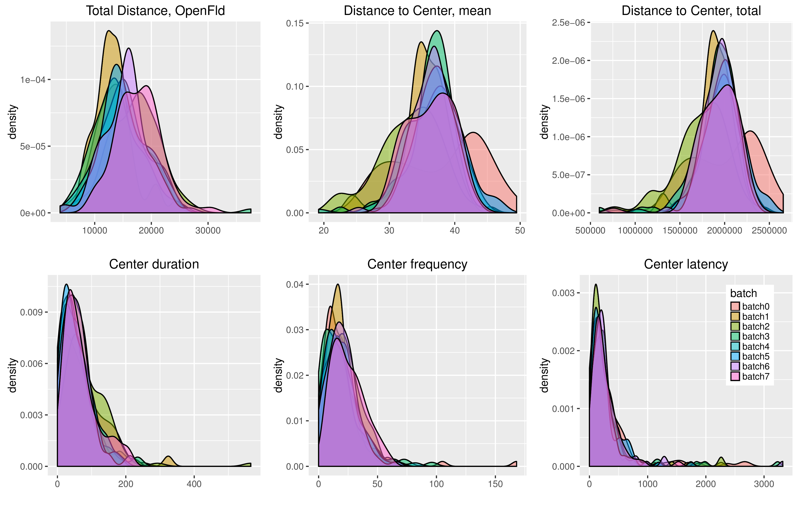

---
## Novel object interaction
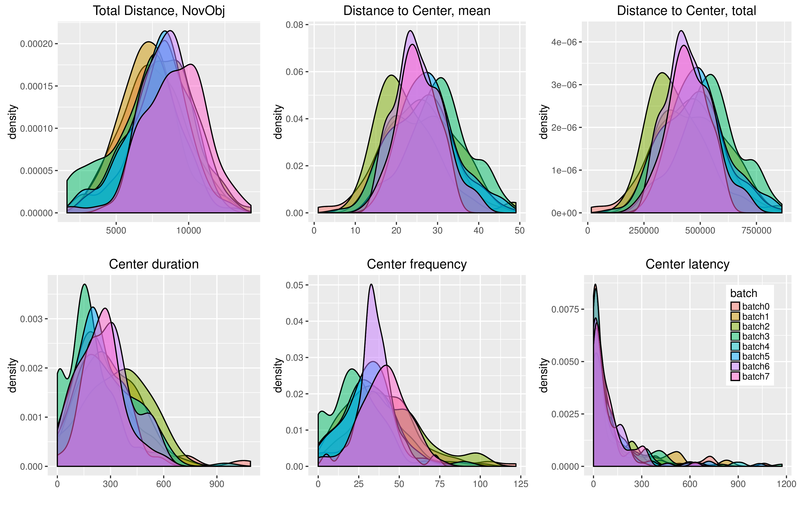

---
## Social interaction
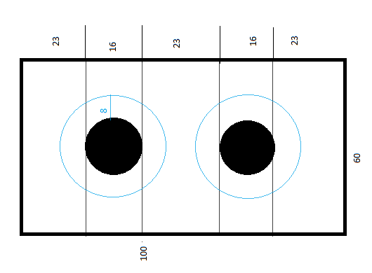	

---
## Social interaction

---
## Elevated plus maze
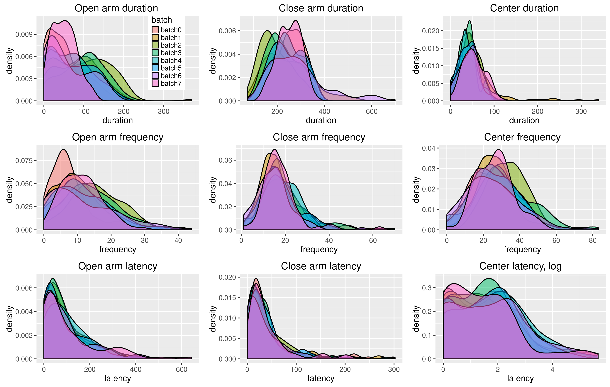

---
## Nicotine self-administration

#### Pilot data, adults

<cite> Wang, et al., 2014, Gene, Brain and Behavior</cite>

---
## Demonstrator behavior

<cite> Wang, et al., 2014, Gene, Brain and Behavior</cite>

---
## Socially-acquired nicotine self-administration with CS2

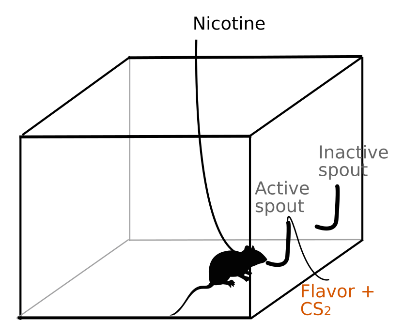

---

## Nicotine self-administration
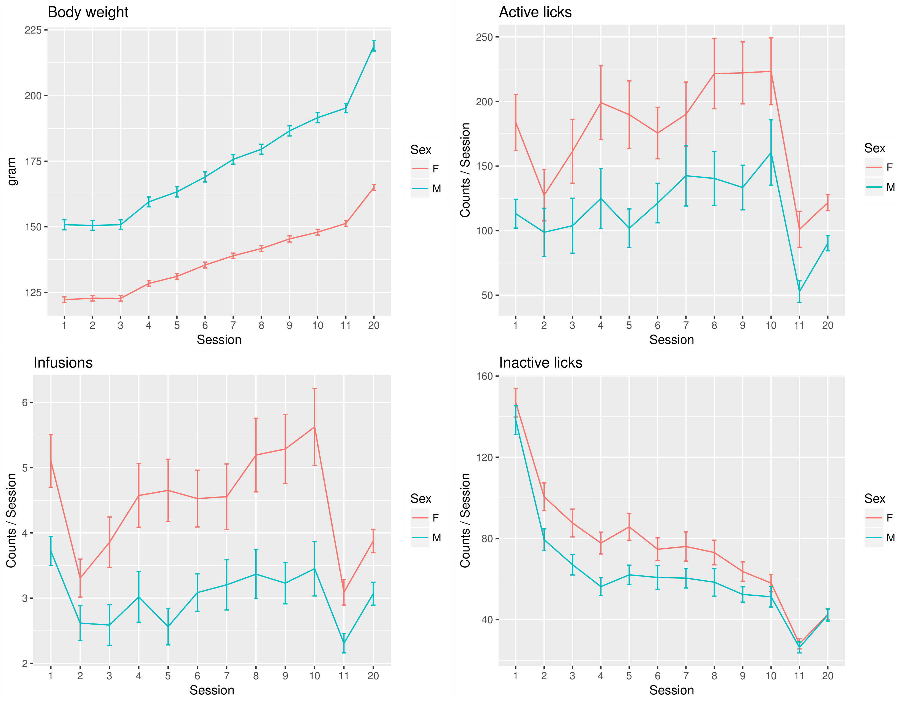

---
## Nicotine self-administration
#### Sessions 1-10
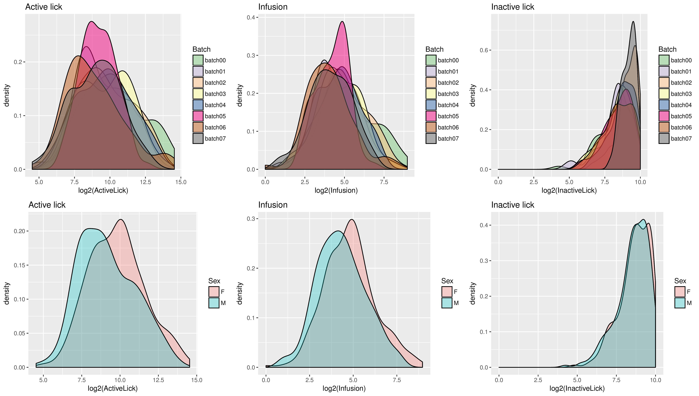

---
## Nicotine self-administration
#### Progressive ratio 
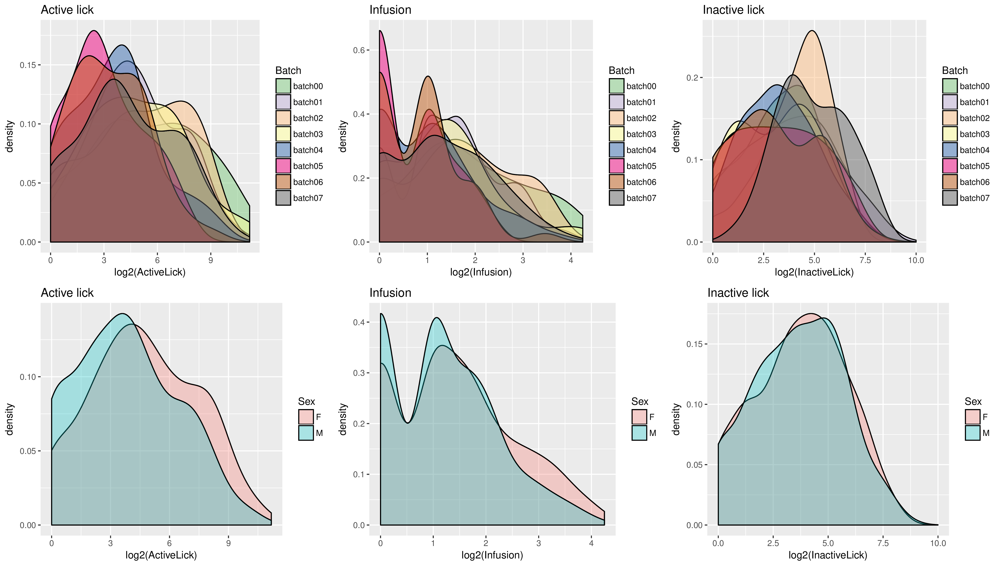

---
## Nicotine self-administration
#### Reinstatement 
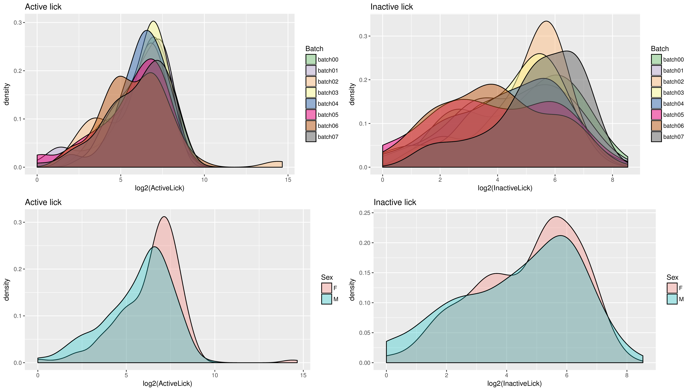

---

## Sex differences 

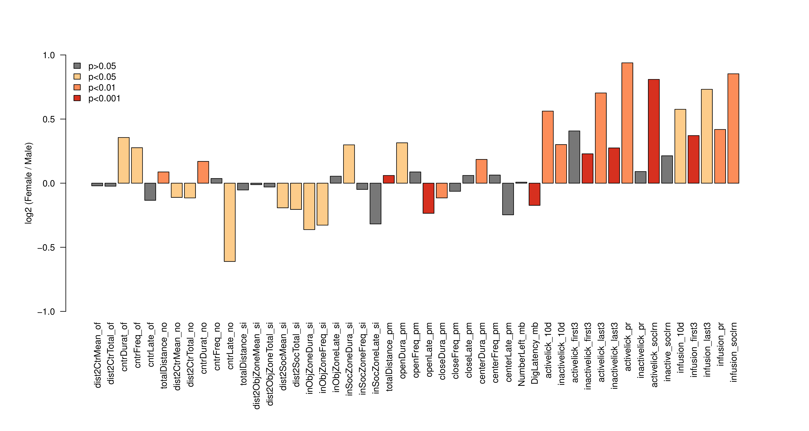

---

## Correlation 
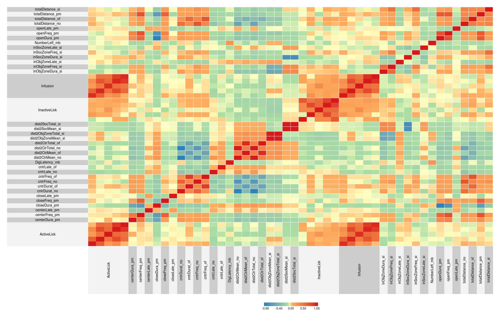

---

## Regression 

	<b> Pilot data </b>
	 
	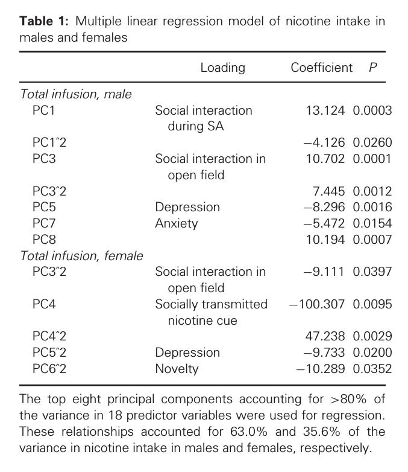
	 
<small> Wang, et al., 2014, Gene, Brain and Behavior</small>

	<b>Current data</b>
	<ul>
	<li>Batch is the most significant factor
	<li> No measure of social behavior during IVSA
	<li> Less than 10% variance of infusion explained by other factors
	</ul>

---
## Nicotine metabolism

---

## Micro dissection of brain tissue
<table>
	<tr><td width=50%>
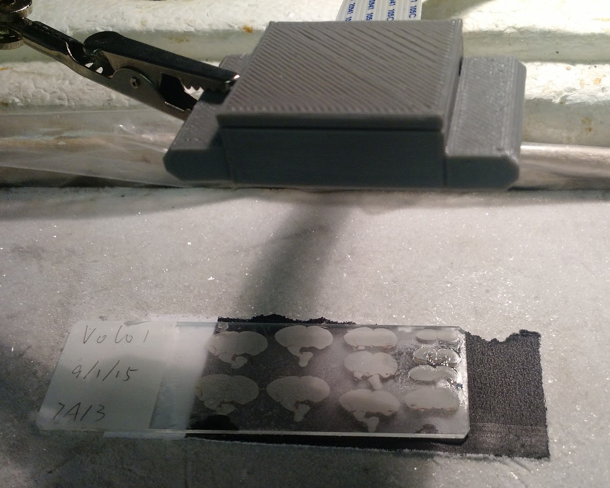
		</td><td>
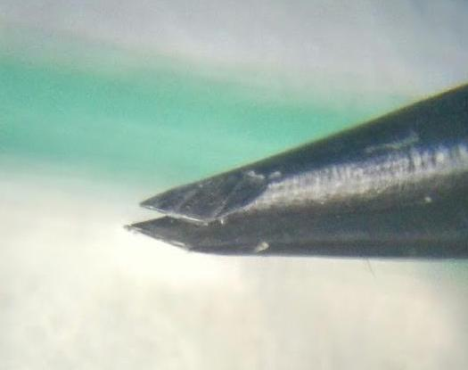
</td></tr>
</table>

---
## Dissecting brains using a DIY setup	

---

## Quality of RNA 

---

## Brain metablomics

* Similar dissection method as for RNA 
* Collect brain and serum sample from the same rat
	* Prefrontal cortex (infralimbic + prelimbic ) 
	* Orbitofrontal cortex 
	* Accumbens core
	* These brain regions have approx. 10 mg wet tissue

---
####  Spin off 1 
## Menthol flavored cigrettes
<table><tr><td width=62%>

</td><td width=38%> 

		</td></tr></table>

---

## Modeling the effect of menthol

---
## Menthol facilitates nicotine intake

---
## Extinction and Reinstatement

				
---

## Menthol as a cue for nicotine
#### Heritability = 0.67

---

####  Spin off 2 

<h3> <a href="https://github.com/chen42/openbehavior"> An open source device for operant licking </a></h3>

---

## Publications

### partially supported by the P50

* Tengfei Wang, Wenyan Han, Hao Chen. Socially acquired nicotine self-administration with an aversive flavor cue in adolescent female rats. Psychopharmacology. 2016 May;233(10):1837–1844. PMCID: PMC4846487

* Matthew Longley, Ethan L Willis, Cindy X Tay, Hao Chen.  An open source device for operant licking in rats. PeerJ. Accepted for Publication.

* Wenyan Han, Tengfei Wang, Hao Chen. Extinction of conditioned aversion contributes to socially acquired nicotine self-administration in isogenic strains of adolescent rats. Ready for submission. 

---

## Acknowledgements
* Current lab members 
	* Tengfei Wang, Research Associate 
	* Pawandeep Kaur, Research Assistant  
	* Yanyan Lin, Research Assistant  
* Past lab members 
	*  Reziwan Yimiti | Qinglin Wu |  Katie Hiler | Hongxiao Song |  Xia Hong |  Jie Shen | Wenyan Han 
* Summer students 
	* Abigale Salinero  (REHU 2015) |  Cindy Tay (REHU 2016) |  Ethan Willis (UoM) | Mathew Longley (UoM) 
* P50 collaborators 
	* Abraham Palmer |  Barry Aprison | Oksana Polaskaya |  Apurva Chitre | Leah-Solberg Woods 

