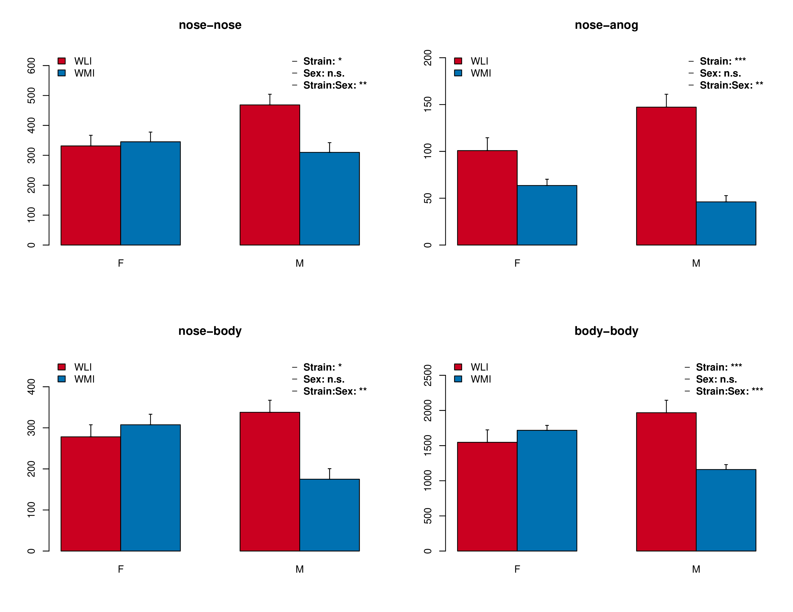
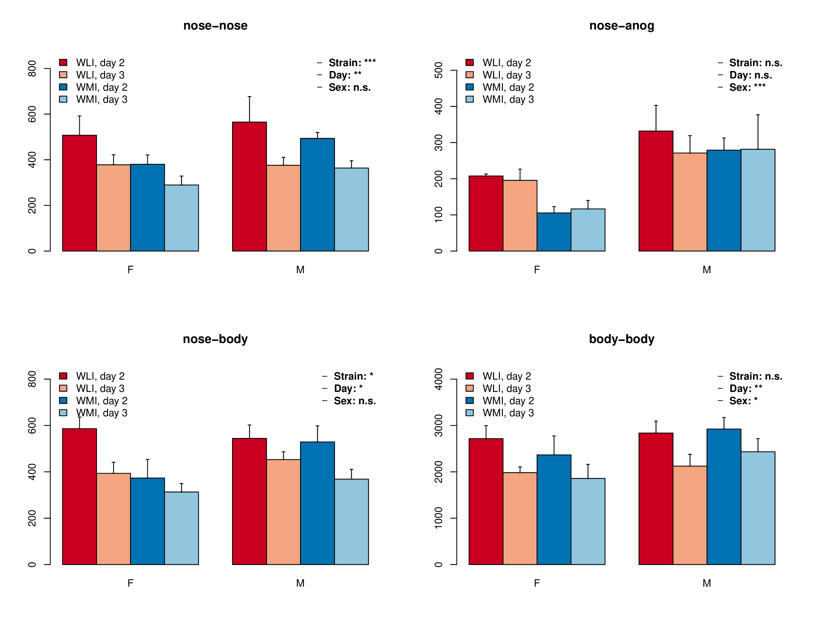
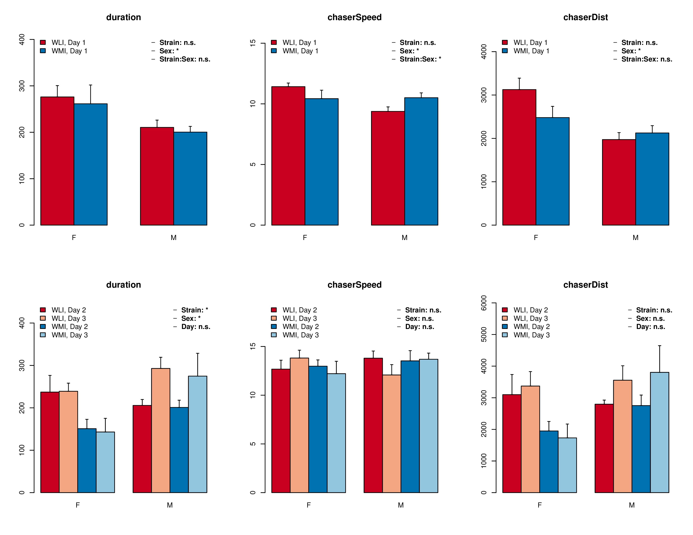
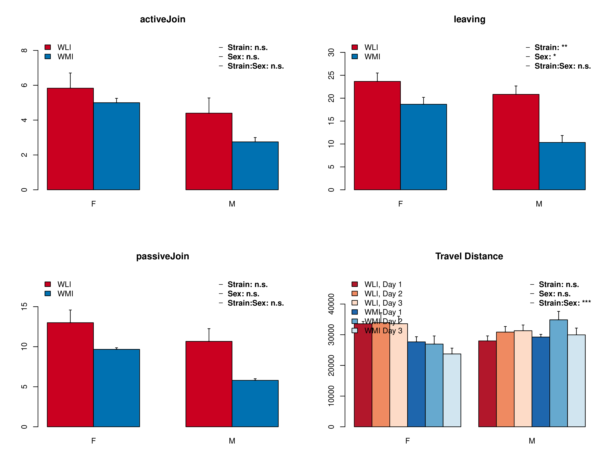

# Social behavior differences between WLI and WMI  

## preliminary analysis 

#### Hao Chen, Department of Pharmacology, UTHSC

June 3rd, 2018

---
## Experiment design

* Animals: young adult WMI (6F, 6M)  and WLI (6F, 6M) 
* Housing condition: three per cage (same sex, same strain)
* Test arena: circular 
* Video recording: 1080p 30fps, 15 min, room light was on 
* Day 1: cage mates 
	* social interaction among familiar rats
* Day 2: each rat is paired with an unfamilar Long Evans rat of the same sex
* Day 3: repeat day 2, but with a different unfamilar Long Evans rat 
	* Day 2/3 was social interaction with unfamiliar rats

---

## Data analysis

* Yorodent
	* git commit 7727c3a47c86ba89b925ea9cf9636e97321169dc (June 2nd)
	* has good object recognition (i.e., "event" detection) 
	* but follow and  grouping has not been fully validated

---

## Events on Day 1, familiar rats 

anog = anogenital area

---

## Events on Day 2 and 3, unfamiliar rats 

---

## Follow 

---

## Grouping and Travel Distance 

---

That's it fow now 
