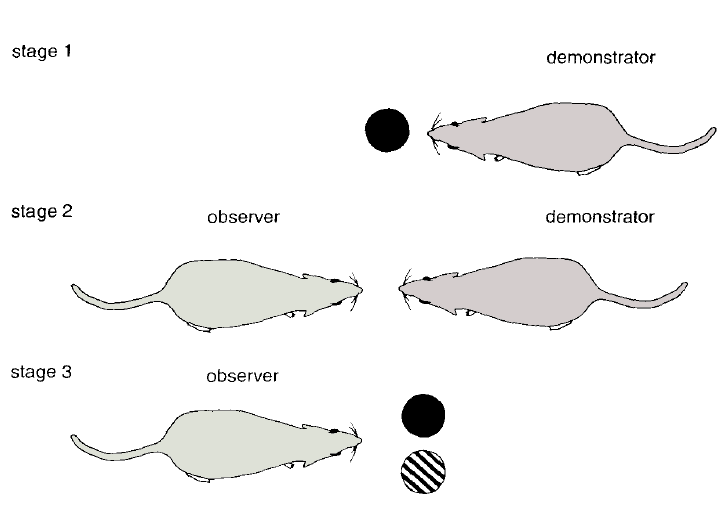
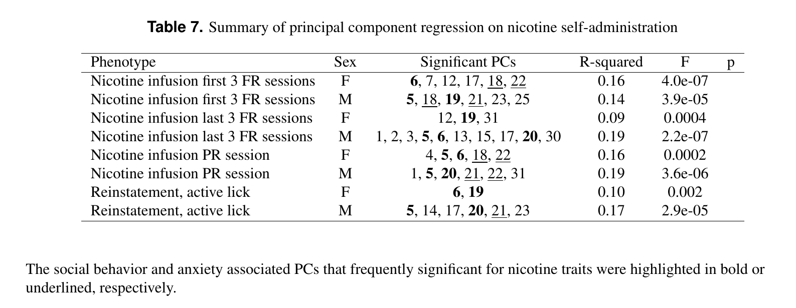
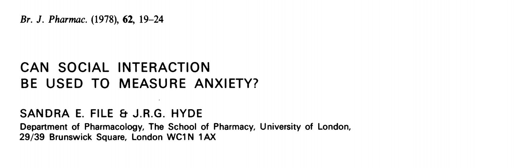
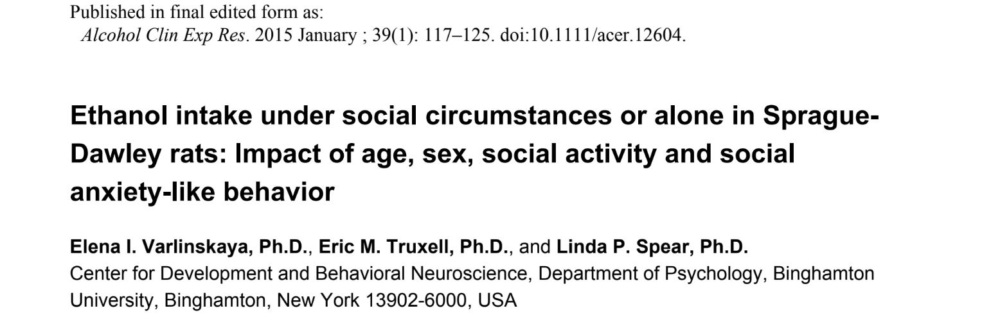
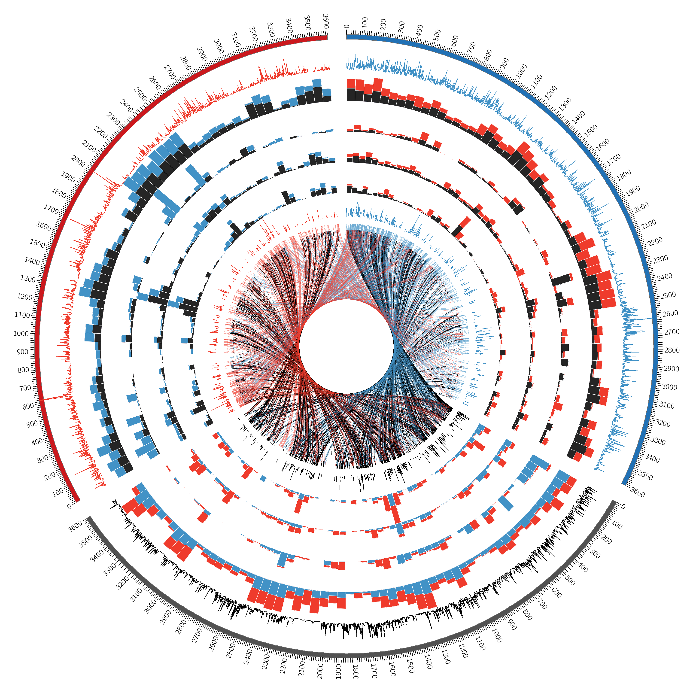

# Yorodent: using AI to study social interaction among a group of rats


--------

## Hao Chen, Ph.D

### Department of Pharmacology
### UTHSC

May 09th, 2018

---

## Social learning promotes nicotine self-administration in rats

<div id="left50">
 
<br>
<hr align="left" width=15%> <p align=left>
<cite>Galef, Dev Psychobiol., 1982 </cite>

</div>

<div id="right50">

<br>
<hr align="left" width=15%> <p align=left>
<cite> Chen, et al., Neuropsychopharmacology, 2011, Wang, et al. Genes, Brain & Behav., 2013, Wang &amp; Chen, PLoS ONE, 2014, Han, et al., Sci Reports, 2017</cite>

---

## Social and anxiety-like traits contribute to nicotine self-administration

PCA regression


<hr align="left" width=15%> <p align=left>
<cite>Wang, et al., BioRxiv, 2018 </cite>

---

## Social interaction between rats have been used to study anxiety

<div id="left50"> 

</div>

<div id="right50"> 

</div>

---

## Social interaction among rats 

<iframe width="600" height="600" src="https://www.youtube.com/embed/mJglzLs3RNo" frameborder="0" allow="autoplay; encrypted-media" allowfullscreen></iframe>


---
## Deep Neural Network


---
## Let's play

https://lecture-demo.ira.uka.de/neural-network-demo/

---

## Use genetic variation to predict skin color in rats

<pre><code data-trim data-noescape>
#python
from keras.models import Sequential
from keras.layers import Dense, Dropout, Activation, Flatten

# read in the data, split training vs testing 
dataset=pd.read_csv("./hs_snps.csv",delimiter=",", dtype="float", na_filter=True)
X = dataset[:,1:18571] #chr1 SNPs
Y = dataset[:,0] #coat color
X_train, X_test, y_train, y_test = train_test_split(X, Y, test_size=0.25, random_state=42)

# construct the network
model = Sequential()
model.add(Dense(200, input_dim=18570, init='uniform', activation='relu'))
model.add(Dense(200, init='uniform', activation='relu'))
model.add(Dense(5, init='uniform', activation='softmax'))

# compile the model
model.compile(loss='categorical_crossentropy', optimizer='adam', metrics=['accuracy'])

# fit the model
model.fit(X_train, y_train, nb_epoch=100, batch_size=200)

#evaluate the model and print results
scores = model.evaluate(X_test, y_test)
print("%s: %.2f%%" % (model.metrics_names[1], scores[1]*100))
</code>
</pre>

---


## Convolutional Neural Net for Object Classification 


---
## Four main Features of the ConvNet 

* Convolution (feature extraction)
* Non Linearity (ReLU)
* Pooling or Sub Sampling
* Classification (Fully Connected Layer)

---
## Convolution


 


https://ujjwalkarn.me/2016/08/11/intuitive-explanation-convnets/

---

## Convolution as feature detector


https://ujjwalkarn.me/2016/08/11/intuitive-explanation-convnets/
---
## Visual example of a ConvNet


https://ujjwalkarn.me/2016/08/11/intuitive-explanation-convnets/
---
## Let's play

http://scs.ryerson.ca/~aharley/vis/conv/

http://www.cs.cmu.edu/~aharley/

---

## Object detection: Region-based CNN (2014)


[towardsdatascience.com](https://towardsdatascience.com/deep-learning-for-object-detection-a-comprehensive-review-73930816d8d9)


---

## Fast R-CNN 


[towardsdatascience.com](https://towardsdatascience.com/deep-learning-for-object-detection-a-comprehensive-review-73930816d8d9)

---
## Faster R-CNN


[tryolabs](https://tryolabs.com/blog/2018/01/18/faster-r-cnn-down-the-rabbit-hole-of-modern-object-detection/)


---

## YOLO


S x S grid, each grid predict a few bounding boxes. Each bounding box has x, y, w, h, confidence, and class probability. 

---

## YOLO agaion


---

## YOLO Features

* Fast
* Encodes contextual information, makes less mistakes on background
* Generalizable
* Struggle with small objects

---

## YOLO v3


[towarddatascience.com](https://towardsdatascience.com/yolo-v3-object-detection-53fb7d3bfe6b)

---
## Performance comparison**S**

<a href="https://medium.com/@jonathan_hui/object-detection-speed-and-accuracy-comparison-faster-r-cnn-r-fcn-ssd-and-yolo-5425656ae359"></a>

---

## Mask R-CNN (2017)


---

## YoRodents: Labeling images


### 8093 images so far

---


## Training a custom YOLO network


```
darknet detector train rat12class.data yolo_12_class.cfg darknet19_448.conv.23 
```

---

## Detecting objects using the trained network


---

## Prediction probability of 9 classes


---

## Reconstructing behavior 

* Re-assemble bounding boxes into **individuals** based on ear tag color in python
* Slightly compress time course (30fps -> 10fps) by taking the median 
* Imput missing body parts using Amelie package in R
* Smooth the imputed data using Lowess in R 

---

## From bounding box to behavior 

* Distance and velocity 

	* Calculate distances between different objects (nose-nose, nose-anog, etc)
	* Calculate speed and direction of travel

* Social behavior

	* Nose-nose 
	* Nose-body
	* Nose-anogenital 
	* Follow 
	* Grouping (active join, passive joing, leaving) 
	* Huddle 
 
---

## Putting everything together 

<iframe width=80% height="550" src="https://www.youtube.com/embed/Lwfg2t9nXcI?start=45" frameborder="0" allow="autoplay; encrypted-media" allowfullscreen></iframe>

---

## Visualization is good for detecting errors


---

## Time course of behaviors 



---

## Social complexity 


---

## Nicotine withdrawal


---

## Short term social memory in Chrnb4 null rats


---

## Recording home cage behavior under infrared light

<iframe width="520" height="345" src="https://www.youtube.com/embed/bqu2IaS6RSA?rel=0" frameborder="0" allow="autoplay; encrypted-media" allowfullscreen></iframe>

<iframe width="520" height="345" src="https://www.youtube.com/embed/QPuth-mTEOs?rel=0" frameborder="0" allow="autoplay; encrypted-media" allowfullscreen></iframe>

---

# Thank you! 

---

# This happened yesterday  ..


https://youtu.be/ogfYd705cRs?t=1h55m50s


---

